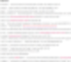

# 삼각형 공부
**Date:** 2026. 1. 6. 14:31
**Category:** 다이어리
**Original URL:** https://blog.naver.com/xpfkwh56/224136387526
---

**1. 넓이 × 1/2 = 삼각형 넓이 (x)**

​

2. 알고 싶은 것은?

​

**'도형의 넓이'**

​

**\* 편의상 축약한 것이지, 실제로는**

**우리집은 몇 평이지? 내가 산 물건이**

**진짜 규격에 맞게 만들어진 것인가?**

**같은 계기로 시작하는 경우가 더 많음**

**​**

**여행을 가야 되는데 내 파우치 안에**

**몇 개의 치약을 넣을 수 있는가 같은**

**​**

도형이 뭐고, 넓이가 뭐임?

​

**1) 혼자 생각하기**

​

어떤 구조를 갖고 있으면

일단 도형 인 것 같다

​

**\* 추측**

​

구조가 뭐지?

​

정확히는 설명할 수 없지만 무언가로

둘러 쌓인 것을 의미하는 것 같음

​

그 둘러 쌓인 것이 뭔데?

​

선 (x)

점 (o)

​

아주 미세한 점들로

둘러 쌓인 어떤 영역을

직관적으로 구조라고 정의해도

일단 괜찮을 것 같다

​

**\* 찝찝하지만 패스**

**​**

구조가 없는 도형은 존재할 수 있나?

​

없는 것 같다

​

**\* 일단, 논리 적용**

​

넓이는 어떻게 정의하지?

​

구조 안에서 영역이 포함하고 있는 곳

그럼 영역이 포함되지 않은 넓이도 존재할 수 있나?

​

존재할 순 있지만, 그게 도형의 넓이는 아님

​

**\* 대단한 직관 필요 X**

**근데 벌써 집합 아이디어 생김**

**​**

**여기까지 한 다음에, 이제 찾아봄**

​

남들은 어떻게 했지?

남들은 어찌 정의했지?

​

이렇게 하면 **'해상도'** 가 다름

​

2) 도형에 관계없이 가로축과 세로축의

한 좌표면을 **'넓이'** 라고 할 수 있구나

​

그 좌표면은 (x.y) 로 표현할 수 있네

그럼 (x.y.z.a.b.c) 로 **'할 수도'** 있겠네

​

→ 그러네, 진짜 이게 되네

​

일단 x.y 부터 해보자

​

그럼 정확한 **'구조'** 의 가로축,

세로축을 어떻게 파악하지?

​

○ 이거는 곡선 부분을 못 따겠다

​

**\* 단, 개념적으로 무엇이 더 크다**

**무엇이 더 작다 정도는 가능하겠다**

**​**

**→ 결국 구분구적법으로 연결될 필연**

**​**

□ 이거는 정확히 알 수 있겠다

​

다 더하는 것이 아니라,

가로랑 세로만 곱하면 된다

​

□ = △ + ▽

​

**사각형 넓이 × 1/2**

**= 삼각형 넓이 (o)**

**​**

2. 반복

​

<https://archive.lib.msu.edu/crcmath/math/math/t/t285.htm>

[**Triangle**

Triangle A triangle is a 3-sided Polygon sometimes (but not very commonly) called the Trigon . All triangles are convex. An Acute Triangle is a triangle whose three angles are all Acute . A triangle with all sides equal is called Equilateral . A triangle with two sides equal is called Isosceles . ...

archive.lib.msu.edu](https://archive.lib.msu.edu/crcmath/math/math/t/t285.htm)

​

구글링

​

​

raw data 탐색

​

더 엄밀한 증명 없나?

지금 내 생각에서 틀린 부분 없나?

​

**왜 why?**

​

내 목표는 **'삼각형 넓이'** 가 아니고,

**'도형의 넓이'** 가 궁금했기 때문

​

**\* 불규칙한 곡선으로 이루어진**

**곡선 도형의 넓이는 어떻게 하지?**

**​**

**2차원이 아니라 3차원은? 삼각형도**

**삼각형의 종류가 생각보다 많이 있군**

**​**

근데 학습하면서 내가 알고 싶던 것이

도형의 넓이가 아니라 2차원 평면 상에

​

존재하는 가로축, 세로축이 존재하는

사각형 구조 내의 영역면을 계산하는

방법이라는 것을 알았던 것처럼

​

하면 할수록, 내가 무엇을 아는지, 모르는지

할 수 있는지, 없는지 더 정밀하게 알 수 있음

​

3. 삼각형 넓이 어떻게 재요?

​

**'어디 있는'**, **'무슨, 어떤 삼각형'** 요?

라는 질문이 생길 수 밖에 없는 것

​

비법이 따로 있는 것이 아니구,

​

고깃집 모기가 빛을 따라가는 것처럼

내 호기심이 이끄는 방향을 좇으면 됨