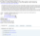
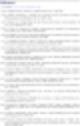

# 영업 비밀이랄 것도 없음요
**Date:** 2026. 1. 6. 14:19
**Category:** 다이어리
**Original URL:** https://blog.naver.com/xpfkwh56/224136369341
---

<https://github.com/davidsandberg/facenet?tab=readme-ov-file>

[**GitHub - davidsandberg/facenet: Face recognition using Tensorflow**

Face recognition using Tensorflow. Contribute to davidsandberg/facenet development by creating an account on GitHub.

github.com](https://github.com/davidsandberg/facenet?tab=readme-ov-file)

​

1. 깃 들어간다

​

**\* 뭐든 상관 X**

**​**

​

2. 설명 읽는다

​

​

3. 링크 들어간다

​

​

4. 링크 들어간다

​

5. 10년 전에 이거 했던 애들이,

지금은 뭐 하고 있지? 이거 영향 받아서

지금 어떤 기술을 개발하고 있는 중이지?

​

내가 모르는 사이에 뭐가 나왔지?

지금 이 내용의 가치/한계는 뭐지?

​

​

6. 레퍼런스들은 왜 인용했지?

어떤 부분에서 그렇지? **진짠가?**

​

7. 화려하기만 한가?

아니면 내용이

완결성 있고, 정합한가?

​

​

8. 아이디어를 어떻게 구현했나?

어떤 부분에서 맞고, 틀린가?

개발자 의도에 맞게 잘 짜여졌나?

​

9. 나는 이렇게 생각하는데,

다른 사람들은 이걸 어떻게 봤지?

**​**

**이걸 기반으로 뭐가 나왔지?**

를 순서대로 계속 하면 됩니다

​

**\* 공부법을 알려줄 수 없는 이유,**

**이게 방법이 문제가 아니고 본인의 정체성,**

**욕구, 관심에 따라 전혀 다르니까**

**논리는 똑같아도, 상황이 전부 다름**

**​**

모르는 비밀스러운 방식이나,

어딘가에 숨겨진 지식이 아니고

​

있는 정보를 그냥 갖다 쓰는 것이라

이걸 뭐 방법이라고 하기도 좀 애매함

​

저만 하는 것이 아니고, 다들 하고

있는 것을 저도 똑같이 하고 있을 뿐임