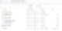
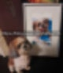

# 요즘 하는 포스팅 갈피가 안 잡힙니다!
**Date:** 2026. 1. 6. 12:23
**Category:** 다이어리
**Original URL:** https://blog.naver.com/xpfkwh56/224136220041
---

​

1. 복잡하고 -ing 상태인 이야기에다가,

​

제가 특별히 어떤 목적을 갖고 하기보다는

혼자 그냥 재미/취미용 운영에 가까운 편이라

​

친절하게 설명하려고 해도, 애매할 수 있지만

나름대로 최근에 있던 이야기들을 정리하겠음

​

중간에 갈피 없이 지워진 포스트들의

내용을 대부분 반영한 내용으로 보심 됨

​

당연히 개인 활동이나, 신상이랑

관련된 내용은 전부 생략되었지만

얼개를 파악하는 것엔 충분할 듯요

​

**2. 인공지능을 시작하게 된 프리비어슬리**

​

즈이 신랑은 제조업 종사자고,

저는 무수리 답게 종종 일을 도움

​

당연히 실무 전반을 맡는 것은 아니고,

잔심부름 같은 수준에 지나지 않지만

​

**\* 아주 올려치면 비서**

**조금 내려치면 그냥 시녀**

**​**

**뭐를 어디에 보내놔라, 뭐 사놔라**

**어디에 뭐 갖다놔라, 뭐 전달해라**

​

특정 서비스를 사용해야 될 때가 있었는데

제가 두 가지 문제에 부딪히게 되었음

​

**1) 나는 코딩, 개발을 전혀 모름**

​

저는 초봉 300 언더 웹디자이너로

취직하면 1인분은 할 수 있을 정도,

​

예전에 모바일 게임 회사에서

유니티 엔진 그래픽 디자이너로

무급으로 지인 통해서 잠깐 같이

일을 봤던 경력이 있는 정도임

​

중간에 개발자들이랑 말을 할 때가 있었는데

인테리어 회사에선 개발자랑 **'엮일'** 일이 없었고

​

쇼핑몰 했을 땐, 나도 백엔드는 할 줄 아니까

사실 내 돈 주고 맡기는 일이긴 했지만,

​

**'요청'** 한 내용을 **'지시'** 받아서 하는 형태였고,

​

게임 회사 갔을 때는, 말이 좋아 취직이지

경험 삼아서 했던 것에 불과했기 때문에

상당히 배려 받으면서 일을 하는 상태 였음

​

그런데 명함 떼고, 일을 보니까

이 사람들이 자꾸 내가 **'모른다고'**

답답하게 여기는 것이 조금 그랬음

**​**

**\* 당연히 이해는 합니다, 나라도 그럴 것**

​

2) IT, 특히 인공지능 서비스를 이용하면

100만원 써야 될 문제가 **5만원으로** 끝남

​

이게 제일 **크리티컬** 했는데,

​

신랑 통해서 어떤 일을 보고 있었음

​

근데 A 회사에 맡기면 x 만원인데,

B 회사에 맡기면 **x\*0.y** 원이니까

이걸 안 쓸래야 안 쓸수가 없었단 말임?

​

문제는 할 줄 아는 사람도 **거의** 없는 데다가

있어도 얘네가 콧대가 장난이 아니었음

​

**\* 콧대가 높다는 말은 과장이 아님**

**​**

전화도 잘 안 받고, 회신도 잘 안 오고

일감이 많아서 그런가?

​

**\* 솔직히 얘네 말고 맡길 곳도 없음**

​

간신히 고생해서 이걸 마무리하고 든 생각이,

더럽고 치사해서**나도 저거 배워야겠다** 였음

​

3. 저는 막 **부지런한** 성격이 아님

​

그렇다고 돈을 쓰는 것을

딱히 좋아하지도 않는 편임

​

기본적으로 미니멀리스트에다가,

**​**

**\* 내일 당장에도 야반도주**

**가능한 살림을 지향하는 편**

​

막 여유가 너무 없는 편은 아니지만,

마트 가면 봉투값 나가는 것 싫어하고

​

**\* 쓸데없는 곳에 돈 쓰거나,**

**손해 보는 것이 극심히 싫음**

​

편의점 갔을 때도, 가격표 안 보고 캔 잡았는데

1700원 부르길래 내려놓고 나온 적도 있었음

​

**\* 800원 이상 낼 생각이 없었기 때문**

​

당시에 제가 집에 있던 컴퓨터는

gpu 1660ti, 6년 정도 된 노트북인데

​

**\* 한성 보스몬스터 tfg 시리즈**

​

부업, 겸 업무적인 목적으로 돌리는

노트북도 몇 대 더 있기는 했지만

이 역시 10만원 내외 저가형 이었음

​

**\* 딱 인터넷만 돌아가는**

​

제일 처음 했던 것은, 내 인프라 상태에서

**'가장 불편했던 문제'** 를 해소하는 것이었음

​

내 경험에 의하면, 개발 언어는 **'외국어'** 랑

가장 비슷한 속성을 갖고 있는 것 같았는데

​

**알면 알고, 모르면 모른다는 것** 이 그러했음

​

예를 들어보겠음

​

아마도 제 블로그를 보는 분들 중에는

한국어에 불편이 있는 분은 없을 것이고,

​

리트나, 피셋 같은 레벨이라면 몰라도

일상에서 어려움을 겪을 확률은 걍 없음

​

**'원어민급'** 으로 한국어를 구사함에도,

​

**'머리를 올린다'** 라는 말을 일반적인 경우는

적합하게 해석할 가능성이 그리 많지 않을 것임

​

그냥 대부분은 **'헤드'** 를 **'위로'** 드는 행위를

말하는 것 아니냐? 정도로 이해한다는 것임

​

영어도 마찬가지인데,

엄청 어려운 말이 아니라

​

He really did cook

​

라고 했을 때, 이걸 요리하다

라고 읽을 **'수도'** 있지만

​

다른 뜻으로 읽을 수도 있음

​

개발은 대가리 많이 박아본 놈이,

예전에 박아봐서 다음에는 안 박거나

​

비슷하게 박을 때, 아 이거는 15도 각도로

대가리를 박으면 덜 아퍼, 같은 것을 아는 것이

내가 해보니까 **'많이'** 중요한 것 같았는데

​

이런 부분이 나한테 **굉장히** 잘 맞았음

​

저사양 컴퓨터로, 먼저 최대한 다양하고 많은

인공지능에 대한 배경지식을 쌓아가기 시작했고,

​

**\* 내가 불편한 문제에서 확장하는 형태**

​

**'지금 내 수준에서 장애, 불편'** 을 겪을 수 있는

한계치까지 최대로 해보려고 노-오력을 했었음

​

모닝으로 서킷 나가면, 아무리 내가 운전을

잘 하고 자동차에 대한 이해가 높다고 해도

​

무지성 엑셀 밟고 직진하는 포르쉐랑

**'엔진'** 차이가 당연히 발생하게 될 건데

​

1:1 은 아니더라도 0.8:1 까지만 따라가도

**'진짜'** 포르쉐를 들게 되면 질 수가 없단 것임

​

**\* 결과적으로 내가 해봤던 대부분의 영역은,**

**이런 논리가 통했는데 개발은 조금 달랐음**

**​**

**저사양 최적화 지식만 풍족해졌을 뿐,**

**고사양 운용은 아예 다른 영역이었기 때문**

**​**

**물론 최적화 논리는 비슷했기 때문에**

**훨씬 성능을 안정적으로 굴릴 수 있게 됨**

​

4. 그렇게 온갖 서비스, 아키텍처를 쓰면서,

​

컴퓨터 하드웨어, 소프트웨어 지식들을 익히고

**'충분하다'** 라는 생각이 들기까지 5-6개월 걸림

​

일반 용도라면 노트북으로 충분했지만,

​

**\* 노트북을 10년 넘게 쓴 이유 자체가**

**늘 좁은 집에만 살아서 살림이 많아지면**

**불편했기 때문에 데탑 넘어가는 과정에서**

**심리적으로 저항이 있었지만, 같은 성능의**

**노트북을 구하려면 2배로는 턱도 없었음**

​

아무리 계산을 쳐도, 발열이나 퍼포먼스에서

비교를 아예 할 수가 없었기 때문에 데탑 감

​

단순 지표로 쌈마이 컴퓨터 하나 사서,

조립해 보면서 gpu 3xx 시리즈 중고를 썼고

​

**\* 연습용**

**​**

4090 넘어가서, 가동 돌려본 다음에

클라우드랑 연결해서 서버도 돌려보고

​

이 시점에서 **'조립이나 하드웨어 지식'** 은

어지간히 컴퓨터 좋아하는 남자 수준은 찍음

​

지인 컴퓨터 산다고 하면 견적 내줄 수 있고,

조립도 대행해 줄 수 있는 정도까지는 도달함

​

하드웨어 지식 + 소프트웨어 지식 쌓아놨고,

​

**\* 내 수준에서**

​

아, 내가 드라이버 조금만 더 좋은 것을 쓰면

**지금보다 더 잘 칠 수 있을 것 같은데?** 라는

느낌이 들었을 시점에 워크스테이션을 장만함

​

제가 사양 줄줄 써놓으면,

​

자기 목적이랑 관계없이

그대로 똑같이 사거나

​

이거 쓸 돈 없으면 나는 못하겠네?

라고 생각하실 것 같아서

​

몇 번 썼다 지웠는데,

​

**'본인 목적'** 에만 맞으면 충분하고,

늘 그렇듯 이게 단순 돈이 문제는 아님

​

댓글에 보면 인공지능 한다고 알아보신 분들이

아마? 알아보셨으면 **기본 500** 은 쓰셨을 것임

​

**\* 5090 달았으면, 최소 800 스타트**

​

​

근데 그걸 **'혼자'** 해냈으면 바로 알 수 있는데,

이게 ㄹㅇ 돈만 있다고 **때려 죽어도** 될 일이 아님

​

**\* 5090 커널 지원 다 되는 것 아니니까,**

**걍 돌아간다고 돌아가나보다 하지 마시고,**

**​**

**드라이버나 소프트웨어 호환 세심히 해야**

**이거 맡긴다고 남이 절대 안, 못 해줍니다**

​

5. 제가 인공지능에서 **'무척이나'**

흥미 갖고 있는 파트는 **'렌더링'** 임

​

**\* 개인 활용은 장난감+옵션 이고,**

**상업성, 실무성, 현실성 감안 했을 때**

​

렌더링이 뭐냐면,

​

​

이게 모델링 이고,

​

​

이게 렌더링 임

​

얼핏 비슷한 것 같지만,

​

전자는 **'딸깍'** 이 가능하지만

후자는 **'장인정신'** 이 더 요구됨

​

쉽게 말해, 더 **비싸다는** 것임

​

하이 퀄리티로 넘어가면, 저거를

**'인간'** 이 직접 깎아내야만 하는데

​

이 기술이 3D 업계에서는 내가 아는 한,

**굉장히** 비싸고, **굉장히** 가성비 안 나오고

하는 사람도 무척 고된 일이라 알려져 있음

​

근데 제가 이걸 **간소하게**

개인 좋소 수준에서

해결하는 방법을 찾아냄

​

최소 직원 3-5명 정도는 써야 하는

회사 수준에서, 무인으로 굴려도

**충분한** 상황까지 도달한 시점이구,

​

**\* 기술보다 제 도메인 지식이 더 큼**

**​**

그림을 **'입히는'** 것도 재밌게 하고 있음

​

**나는 언리얼도 할 줄 알고,**

**포토샵도 다룰 수 있기 때문!**

​

**\* 캐드는 할 줄 알아도 인테리어 쟁이가**

**언리얼을 만질 일도, 필요도 당연 없지만**

**겜순이는 이거 둘을 혼용해서 쓸 수 있다**

**​**

6. 3D 렌더링, 생성형 인공지능 분야는

**'서양권'** 이 대표적인 주류라고 할 수 있음

​

근데 이 사람들은 **'샌님'** 메타 가 강한 편임

​

생성형 인공지능 누를 때마다, 전기 많이 쓰고

대기업 중심으로 시장이 재편되고 있으니까

​

ESG 경영해야 된다는 이야기도 많이 나오고,

이런저런 규제, 검열 같은 것도 제법 많이 나옴

​

제 메이저 영역 이야기는 부담스러우니,

최근에 겪었던 사례 하나를 꼽아보자면

​

제가 중국 쪽에서 활동하는 이유

​

재미 삼아서 만들었던 모델이 있는데,

그거 서양권 웹 사이트에 올려놨더니

​

저런 문구 받아서 지워졌던 경우가 있음

​

**\* 아기 얼굴을 성인 몸에 붙인 것도**

**그렇게 쓰란 것이 아니라 이거도**

**된다는 것을 보여준 맥락이었는데다**

**​**

**당연히 공개 모델로 올린 것은**

**내가 쓰는 것보다 최소 2세대 이상**

**더 낮은 기술을 활용한 내용이었음**

**​**

**즉, 6개월 이상 지난 기술만 썼는데도**

**온라인 검열/규제 대상이었다는 소리**

​

**내가 올린 모델은 뭐였냐면**,

​

생후 6개월 된 아기 사진만 있으면

그 사진으로 **딥페이크** 기능 활용해서

얼마든지 사람 만들 수 있는 기술이었음

​

**\* 내가 해보니까, 신생아도 가능**

**딱 아기 태어났을 때 사진만 갖고도**

**그 얼굴 합성해서 다 만들어 냈었음**

**​**

지금 내가 쓰고 있는 모델의 경우,

​

온라인에 종종 보이는 싸구려

데이트앱에 나오는 그런 퀄도 아니고,

**'진짜'** 인간처럼 **'똑같이'** 만들어 냄

​

**흐음 그거 오픈소스 쓰거나,**

**유료 서비스 쓴 것 아닌가요?**

​

직접 해보시면 압니닼ㅋㅋ

퀄리티 **죽어도** 안 나옵니다

​

그럼 님이 만든 모델은

지금 수준이 어느정돈데요?

​

**90-00년대생 남자들**한테

본인들 사진으로 돌린

사진/영상 보여줬고,

​

**\* 목소리 입히는 것은 제가**

**기술이 없어서 입만 뻥긋거림**

**소리 입히는 것은 너무 어려움**

​

그렇게 해서 나온 결과가 이거임

​

​

**\* 당연히 본인들 허락 다 받고 테스트한 것**

**​**

질감, 빛, 산란, 물리법칙 다 적어도

**'내가 아는 선'** 에서 구현된 상태고,

​

뎃생에선 기본인데, 모르는 개발자도 많더라

​

메이플, 바람의 나라 같은 곳에서

질리도록 사기 당해봤던 나이대에서도

**'전혀'** 분간할 수 없다고 판정 나왔고,

​

내가 쓰는 아이디어는

LLM 모델이랑 결합해서,

​

특징값 랜드마크 유사도를

비교하는 방식인데,

​

이거 썼을 때, 원래 얼굴이랑

생성형 얼굴의 유사성도

**산술적으로** 비교할 수 있음

​

즉, 내 얼굴의 상안부/중안부/하안부가

​

**'내가 기준한, 절대 미인값'** 에서

얼마나 오차가 있는 것인지 라던가

​

표본 대비 얼마나 떨어져 있고,

**'무엇을 보완해야 되는 것인지'** 까지

도출하는 것이 가능하다는 것임

​

7. 이걸 정말 쉽게 말하면

**딥페이크 기술** 을 얻은 건데,

​

사람들이 자꾸 이거 그냥

야한 사진 만들거나,

​

벗은 여자들 뽑는 것에만 써서 그렇지

​

1) 만약 부모님 사진/영상 많으면 그거

학습 돌려서 부모님 사진 무한 생성 가능

​

**\* 엄마 40대, 아빠 30대 이렇게도 가능,**

**두 분이 지금 25년에 어디 존재하냐도 가능**

**​**

2) 내 10대, 20대 시절을 **'앨범'** 이 아니라,

**모듈** 로 만들어서 그 시절에 있을 법한 장면이나

사진을 원하는 만큼 만들어내는 것도 가능

​

**\* 중고등학생 시절의 내가, 지금 우리 아기랑**

**같이 찍은 사진도 가능하고, 학창 시절 남편과**

**내가 같이 팔짱 끼고 아기랑 찍은 사진도 가능**

**​**

**3) 아기 돌잔치할 때, 울고 있어도 상관없고**

**무슨 옷을 입고 있든, 어디 배경에서 찍든 상관 X**

​

쿠팡에서 명절마다 한복 따로 구입 안 해도,

이거 있으면 사진에 다 합성해서 쓰는 것 가능

​

아기 옷 사기 전에 아기한테 직접 입혀보고

다양한 각도, 사진 찍어본 다음에 입히기 가능

​

같은 **'무한한 것'** 들이 가능함

​

엘사랑 같이 찍은 사진 만들어줘,

티니핑이랑 같이 모험하는 사진 만들어줘,

​

기사 옷 입고 엘더 드래곤이랑

싸우는 영상 만들어줘 같은 것도 가능

​

**이미 존재하고 있는 영화에**

**내 얼굴, 신랑 얼굴 넣어서**

**바꾸는 것도 가능했음**

​

**\* 사진은 확실한데, 영상은 살짝 불안정**

**근데 장난감으로 보기에는 충분한 정도고,**

**소리는 아예 미흡해서 싱크는 아예 안 맞음**

**​**

**소리 입히는 것은 매우매우 어려운 기술에,**

**내가 아는 것이 하나도 없어서 할 수가 없음**

​

​

최근에 열심히 연구하고 있는 분야는,

​

이미 죽은 내 강아지 사진, 영상들을 통해서

**'인간 모델'** 급 퀄리티로 만들어내는 건데,

​

이게 가능하면, **'순간'** 을​ **'영원'** 으로

만들고 싶다는 내 **'불편'** 을 해소하는 것에

한 걸음 더 나아갈 수 있을 것임

​

**\* 내 마음의 찜찜한 법적인 문제만 없다면,**

**오늘 당장에라도 팔 서비스가 한 둘이 아님**

**​**

**몇 가지는 지인들 통해서**

**진행하고 있는 것들도 있음**

**​**

**8. 중국덕을 보고 있는 두 가지**

​

1) 네트워크 시장

​

중국 **'로컬 인공지능 시장'** 규모가 **장난 아님**

​

얘네는 3090, 4090, 5090 같은 것들도

마개조해서 사용하고 그러는 정도인데,

​

정작 그 하드웨어가 있어도 **할 줄** 모르니까

외부에 맡겨서 해결하는 경우가 매우 많음

​

**\* 클라우드 서비스나, 상용 서비스 쓰다가**

**퀄리티 아쉽고, 광고에 못 미치니까 결국에**

**로컬로 넘어와서 혼자 깔짝 거리고 다니는데**

**진입 장벽이 보통이 아니라서 결국엔 포기함**

​

전부는 아닌데, 제가 가진 기술을 응용하면

**'렌더링'** 관련으로 상업 디자인에 연관해서

​

상당히 경제적으로 활용하는 것이 가능한데,

전 이게 가능해서 쏠쏠하게 잘 팔아먹고 있음

​

내 경험에 의하면, 지금 제가 제공하는

서비스가 15인 이상 디자인 좋소에서

만들어내는 퀄리티 정도거나 **그 이상** 임

​

이거를 좀 쉽게 말하면, **저한테 맡기면,**

**​**

**원피스 그림체로 이런 이런 장면 그려줘**

**내가 방금 본 웹툰 그림체로 이거 그려줘**

​

라는 것을 해줄 수 있다는 말입니다

​

**\* 문제성 여부 판단은 제가 하면서 함**

**​**

**내가 봐서 아니다 싶으면 피차**

**기술 있는 사람 별로 없으니까**

**그냥 안 된다고 하면 그만 임**

**​**

2) 중국에 **'미쳐버린'** 박사 비율

​

제가 본 것이 전부는 아닐 수 있는데,

​

1년에 수능 보는 사람이 40만 이고

중국에서 배출되는 **'박사'** 가 15만 임

​

30대 중반에 박사 달고 나온 사람이

초임 얼마 정도 받을 것 같읍니까?

​

**한화 기준으로 55만원 받습니다**

​

**\* 나랑 얘기했던 사람이 알려준 얘기**

​

그래서 고학력자가 발에 채일 정도로 널렸는데

걔네 할 것 없으니까 같은 일을 해도 **'잘'** 하거나,

​

내 기준에선, **'엄청난 고급 지식'** 인데도

이걸 아무렇지도 않게 그냥 풀어서 뿌려둠

​

남조선으로 비유하면, 설포카 박사가

배민 라이더로 알바하다가 자기 불편하니

​

본인이 필요한 서비스를 뚝딱 만들어서,

오픈소스로 이거 내가 만든 거임 하는데

​

**\* 오픈소스로 뿌리는 이유는,**

**디버깅이나 DB 확보 목적인 편**

**​**

**만들어만 놓으면, 사람들이 쓰면서**

**피드백 주니까 상부상조가 가능함**

​

그런거 뜯어서, 아이디어 체크하고

구현 방식 같은 것 알아보면서 가면

​

**상당히 빠르게 지식과 기술 얻을 수 있음**

​

3) 중국 **스러움**

​

중국이 뭐를 잘 하냐면,

**'딱'** 실용적인 것을 진짜 잘 만듬

​

**\* 그게 나사가 1개 빠져 있어서 문제지**

​

국산 시계가 2만원이고, 고장 안 나고

중국산 시계가 1천원이고, 2년 안에

고장난다고 하면 뭐를 살까 했을 때,

​

천원짜리 시계 한번에 10개 사두면

어차피 국산 사도 20년 안에는 바꾸는데

그냥 가격 싼 것이 차라리 더 낫잖음?

​

마찬가지로, 중국에서 만든 (x)

만드는 서비스들은 이런 식으로

​

퀄리티는 낮은데, 실용성이 엄청 강함

​

과학이나, 기술도 **마찬가지** 맥락으로

**'극한'** 까지 갈아내는 것이 서양권이라면

​

**\* 인류 단위 진보를 목적으로** **뾰족하게**

​

동양도 아니고, 그냥 대놓고 중국권의 경우

그래서 이거로 오늘 뭐 할 수 있는데요?

​

이거 되네요? 이렇게 해보죠? 로 넘어가서,

튜토리얼 밟는 속도를 **굉장히 짧게** 도와줌

​

사실, **'실력자'** 들은 보통

힙스터 나, 오타쿠 들인데

​

인터넷 속도랑 검열 피해서

서구권 웹에서 활동하는 애들도

막상 보면 인도/중국 둘 중 하나임

​

얘네들을 선생님 삼아서 배우면

매우 유용하고 잘 배울 수 있음

​

**\* 방향성을 다 교정해주니까**

​

**9. 중국몽**

​

1) 중국 시장에서 돈도 벌고 있음

​

2) 중국인들이 알려준

과학이랑 지식으로 기술 배웠음

​

원래 노트북이나 가전 기기 같은 것은

다룰 줄 알아서 이미 취급하고 있었는데

​

**\* 본격은 아니고, 나까마 정도지만**

**적어도 저를 통해서 사면 시중 가격 대비**

**최소 2-30%는 저렴히 구입하는 것 가능**

**​**

GPU, SSD 같은 것은 어려워서 안 했다가

이번에 인공지능 다룰 줄 알게 되면서

​

두 영역도 취급하게 될 수 있어서

메타를 야무지게 잘 빨고 있음

​

유통은 결국 **'나한테 사가는 판로'** 만

있으면 다음은 아주 쉽게 갈 문제인데,

​

나는 **'팔리는 기술'** 이 뭔지 알고,

**'시장'** 이 원하는 것이 뭔지 아니까

​

마치 주식 시장에서 이 수요가 많아질 듯?

이라고 생각하는 것과 비슷한 것처럼

​

**'실제 내가 그 시장의 선수'** 로 뛸 수 있음

​

10. 인공지능과 활용

​

이거는 물론 단순히 기술만 있어도,

마치 영어나, 코딩처럼 깔고 갈 수 있지만

​

그보다, **'내가 원래 갖고 있던 지식'** 과

결합할 때 폭발적인 확장성을 가질 수 있음

​

댓글로 종종 물어보시는 분들 중에서,

~한 영역에 종사하고 있는데 ~에 쓸 수 있냐

​

라는 질문 있는데, **'거의'** 다 가능함

​

**\* 본인 역량이 따라오기만 한다면**

**​**

마치 그림이랑 똑같다고 생각함

​

고흐, 피카소랑 똑같이 그릴 수 있나요?

​

가능하죠, **열심히** 하면

​

11. 인공지능으로 **'딸깍'** 되거나,

특정 프로그램, 라이브러리 다운 받아서

그냥 적당히 사용해서 쓴다면 된다든데

그거 **진짜** 인가요? 쉽게 할 수 있나요?

​

해보세욬ㅋㅋ 광고랑 **99%** 확률로 다름

​

**\* 어셈블리까진 몰라도 파이썬은 아마도**

**늦든, 빠르든 결국 어쨌든 만지게 되어있음**

**​**

애초에 그냥 화이트 컬러의 옷을

입고 있는 **블루컬러 예체능** 임

​

다만, 차이라면 원래 수작업으로

하던 사람들 입장에서는 낫다는 것

​

종이에 그리던 사람한테 그림판,

그림판 쓰던 사람한테 포토샵 준 느낌