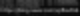

# 하드웨어 지식 중요한 이유
**Date:** 2026. 1. 6. 13:42
**Category:** 다이어리
**Original URL:** https://blog.naver.com/xpfkwh56/224136318119
---

​

시간 감소 기준 약 40% 증가

처리량 기준 약 1.7배 증가

​

이 수치만 놓고 보면, **'안 쓸 이유'** 가 없는데

디테일을 모르고 쓴다면 **'안 쓰는 것'** 이 나음

​

참고로 엔비디아 공식 광고판에 있는 수치는

제가 보여드린 저 수치보다 훨-씬 더 좋읍니다

​

조건이 다르니까 그럴 수도 있겠지만,

쨌거나 **'광고'** 는 **'광고'** 라는 것이지요

​

조금 틀릴 수도 있지만, 비유하자면

​

A 라는 옷이 가볍다고 이 옷은 다른 옷 대비

중량이 30% 더 가볍다고 광고에 써놨는데

​

막상 실제 옷을 사서 무게를 재보니까,

20% 정도 밖에 가볍지 않은 그런 느낌

​

대부분의 IT 부품들에 대한 벤치마크는

자동차 **'연비'** 라고 보면 제일 합당한 듯