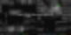

# 데이터 사용량
**Date:** 2026. 1. 8. 5:21
**Category:** 다이어리
**Original URL:** https://blog.naver.com/xpfkwh56/224138625388
---

​

직전 30일 = 2테라

직전 7일 = 600gb

​

통신사에서 샷다 내려서,

방법을 찾고 찾았는데

​

**\* 많이 쓰면 느려짐**

​

​

그 중 하나가 이거임

​

1) 집에서 데이터 많이 쓰시거나,

2) 다운 받을 것이 따로 많이 있다면

​

병렬 네트워크 연산 프로그램 쓰세요

​

30kb-200kb 속도로 받고 있었는데,

아리아 쓰면 5-6mb 로 받는 것 가능함