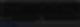
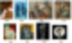
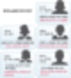
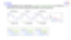
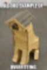

# 파인 튜닝이 거창한 말이 아님
**Date:** 2026. 1. 13. 23:49
**Category:** 다이어리
**Original URL:** https://blog.naver.com/xpfkwh56/224145596410
---

​

**1. 이게 뭔데 씹덕아**

​

<https://github.com/comfyanonymous>

[**comfyanonymous - Overview**

comfyanonymous has 11 repositories available. Follow their code on GitHub.

github.com](https://github.com/comfyanonymous)

​

**\* 애니프사 = 과학**

**엄청난 실력자 입니다**

**​**

ComfyUI 라는 이미지 생성 도구가 있고,

거기 디퓨전 모델, 체크포인트, 로라가 있음

​

디퓨전 모델 = 화가 그 자체

체크 포인트 = 화가의 화풍

로라 = 화가의 스타일이나 기술

​

아마 이런 식으로 이해하면

정확하진 않아도 대충 맞음

​

피카소로 예를 들자면,

​

1) 디퓨전 모델은 피카소의 **'재능'** 임

​

그림을 그리는 능력, 그 자체임

​

모양을 분해하고 재조합하고

색을 쓰는 기본적인 역량을 통칭함

​

2) 체크 포인트는 피카소의 특정 **'시기'** 임

​

​

똑같은 피카소라는 **'인간'** 인데도,

나이에 따라 그림이 전부 차이가 있음

​

이걸 규정하는 것이 체크 포인트 임

​

3) 로라는 여기에 들어가는 습관이나,

어떤 특정물에 대한 감각 등을 의미함

​

피카소가 소만 그리게 연습시키고 싶다,

그럼 **'소 로라'** 를 만들어서 입히면 되고

​

모든 사진을 더 특정 스타일로 하고 싶다

그러면 그 스타일에 맞는 로라를 주면 됨

​

시드는 **'인간사에 있는 랜덤 스위치'** 고,

프롬프트는 모델에게 주는 **'주문서'** 임

​

2026년 1월 13일, 오후 11시 경에

​

피카소, 23세의 화풍,

강아지를 그리는 습관, 을 설정하고

​

주문서 에다가

​

웃고 있는 강아지 그려주세요

라고 하면, 그런 그림이 나옴

​

2. 디퓨전 모델의 경우,

개발비가 **'미니멈 10억'** 임

​

10억도 **'이런 것도 됩니다'** 수준이지,

상용 서비스는 10억으로는 택도 없음

​

체크 포인트는 만약 노베이스 에서

전부 쌓아서 만든다고 하면 적으면 500,

보통은**약 1억 내외** 정도의 금액이 필요

​

주로 들어가는 돈은, 결국 **'교육비'** 인데

​

1) 사진을 몇 장 쓸 것이냐?

2) 얼마나 고퀄 사진을 쓰냐?

3) 무슨 GPU 로 할 것이냐? 등

​

선택하는 것에 따라 금액이 달라짐

​

**\* 간략하게 적은 것 뿐이지,**

**쓰자면 한도 끝도 없이 나옴**

**​**

​

체크 포인트는 통상 적으면 1만장,

많으면 50만장 정도의 사진을 사용함

​

**\* 다만 많다고 좋은 것도 아니고,**

**적다고 좋은 것도 아니란 점이 문제**

​

1장에 알바비 500원 쓴다고 가정하고

만 장이면 500만, 50만장이면 2억 5천임

​

A100 대여료가 1시간에 2천원 쯤이니,

통상 4주 정도 소요된다고 가정하면

​

1장에 1,344,000

8장 쓴다고 치면

약 1천만원 정도 임

​

문제는 1만장으론 택도 없고,

50만장 정도가 **'거의'** 하한선 임

​

사진 50만장 라벨링 하고,

​

돈을 떠나 학습 1회에 **'4주'** 정도

시간이 필요한 것을 계속 쓰다가

목적 맞는 것이 나오면 쓸 수 있음

​

돈, 시간, 다 썼는데 맘에 안 들면?

다시 처음으로 돌아간 다음 하면 됨

​

동시에 돌려도 되니, 2개, 3개, 4개를

연속해서 돌려서 파악해도 되고 자유

​

**3. 베이스 모델을 만들 수 있냐?**

​

**불가능** 함

​

일단 1인 개발 자체가 안 될 사이즈고,

​

돈으로 해결하겠다고 생각하면 최소한

100억은 땅바닥에 버릴 각오를 해야 됨

​

**그럼 체크 포인트는 만들 수 있냐?**

​

이건 가능함,

저렴하게 한다고 치면

​

약 300-500 정도로도

**'제한적인 수준'** 은 가능

​

만약 더 좁히고, 좁혀서 파인 튜닝하면

100만원 전후에도 시도해볼 수 있음

​

근데 될 일인지, 아닌지도 모를 것을

혼자 독자적으로 하는 것은 대부분에게

​

두려운 일이고, 이런 노하우의 경우에도

많이 **'폐쇄적'** 으로 알려져 있다보니까

​

시도하기가 그렇게 만만한 일이 아님

​

4. 때문에, 사람들이 흔히

시도하는 것이 **로라 학습** 임

​

**\* 체크 포인트가 그런 것처럼,**

**로라도 학습 레시피 같은 것이**

**사람마다 전부 다르기 때문에**

**결국 본인이 찾는 것이 결론임**

**​**

정말 길어야 7일 이내면 끝나고,

데이터도 그렇게 많이 필요 없음

​

모델 → 집

체크 포인트 → 아파트

​

로라 → 84제곱, 또는

그 아파트에 있는 방 하나

부엌 하나 같은 것인 셈임

​

이거도 거창하게 잡은 것이지,

부엌에 있는 숟가락 1개

​

방에 있는 연필 1개 이런 식으로

아주 좁혀서 들어가는 경우 많음

​

**\* 그거도 만만한 일이 아니라서**

​

5. 제대로 된 정보도 찾기 어렵고,

무엇보다 **'공인된 가이드'** 가 없는데

​

본인이 데이터 찾아서, 라벨링 하고

학습할 수 있는 툴 찾아서 굴려본다면

​

쨌거나, **'파인 튜닝'** 해볼 수 있음

​

<https://www.youtube.com/@seungsangoh9923>

​

이렇게 시작하면, **워 뭔 소리지** 하는데

​

​

하면서 배우면, 이렇게 익힐 수 있음

​

6. 오호, 그럼 저렇게 시작을 하면

​

내가 앞으로 그림 그리는 과정에 있어서

파인 튜닝을 하는 법 알 수 있다는 말임?

​

**'X'**

**​**

기본적인 원리가 다 똑같기 때문에,

​

당연히 디테일 차이는 있지만

결국 모든 곳에 **'적용'** 할 수 있음

​