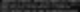
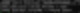
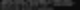

# 인공지능과 코딩으로 할 수 있는 일
**Date:** 2026. 1. 15. 0:35
**Category:** 다이어리
**Original URL:** https://blog.naver.com/xpfkwh56/224146952543
---

게슴츠레한 눈과 활짝 뜬 눈을 컴퓨터는 어떻게 구분할까?

​

**1. 이게 뭔데 씹덕아?**

​

1) 내가 원하는 신체의 좌표 면적을 받아서,

그거로 사람의 물리적인 상태를 읽을 수 있음

​

2) 눈은 얼마나 뜨고 있는 상태인지,

시선은 정면인지, 옆인지, 어딜 보는지

​

머리의 각도는 어떠한 것인지 등등을

설계를 열심히 잘 해놓으면 할 수 있음

​

**2. 그걸 어디에 쓰죠?**

​

자아, 그래서 제가 활용 얘기를

본인이 찾아야 된다고 하는 것임

​

제가 이거 그냥 신기해서 한 것이 아니구,

최근에 영화나 드라마, 예능 같은 것들을

받아서 캡처를 엄청나게 많이 했었는데

​

그 와중에, 눈이 **감긴** 사진들이 많이 나옴

**​**

**\* 선행으로는, 저는 이미징 영상 기술이**

**결국 사진 겹치기라고 생각을 하기 때문에**

**프레임 쌓기 → 소리 신호 넣기로 보는 중**

**​**

**매우 비효율적인 공부인 것은 저도 아는데,**

**그냥 저는 이 방식으로 해보고 싶은 마음임**

​

드라마, 영화, 예능은 왜 받아서 캡처 했냐?

**'인간'** 에 대한 자료가 필요했기 때문

​

일반인들은 정적인 움직임을 갖고,

더 낮은 바이브로 활동하는 편이나

​

방송이나, 영화/연출 같은 경우에는

**더 동적이면서 일상적인** 움직임 있음

​

무튼, 캡처를 와다다 박아서 쓰던 중에

2스텝, 3스텝으로 안전망이 있다면

​

더 정밀한 데이터 얻겠단 생각이 들었고,

​

눈을 감은 사진과 눈을 감지 않은 사진

2개로 나눠서 파인 튜닝 돌리면서 연습

​

그 다음에, **'차이'** 를 어떻게 구분하는지

제가 스스로 인지하고, 머리 조금 박다가

​

뭔가 이런 아이디어로 하면 좋을 것 같아,

라는 생각이 들었을 시점부터 검색 시작함

​

당연히 사람 생각은 다 거기서 거기 니까,

딱 내가 했을 법한 생각을 한 사람이 있었고

​

나랑 같은 생각을 한 사람이 한 시행착오들을

히스토리 추적하면서 계속 타고 오르고 오르니,

​

종국에는 현존하는 일반인이 접근 가능한

최신 기술이 나왔고, 성능과 경제성 사이에서

어떤 것이 좋은 것인지 파악할 수 있게 되었음

​

**\* 내가 무엇을 지금 필요로 하는가**

​

3. 이제 저는 영상이 있으면

다중 캡처를 와다다 박을 수 있구,

​

**\* 그 영상이 100개든, 1000개든**

​

거기서 **유효한** 장면을 포착할 수 있음

​

캡처 할 때, 눈 안 감고 제대로 나온 사진

어떻게 쉽게 고를 방법 없나? 로 시작한 것이

​

A컷, B컷 다루는 활용성까지 영역이 생긴 것

​

사진기 들고 다니면서 대단한 컷 찾을 필요 없이,

그냥 영상으로 휘휘 카메라 들고 여기저기 찍다

​

다다다닥 특정 자세 나왔을 때, 캡처 박으면

A컷 가능하고, 여기서 **'더'** 응용을 한다면

​

특정 자세, 특정 시각 처리, 특정 신체 활동에만

반응하는 모듈을 물론 상용급 퀄은 아니겠지만

​

만들어서 사용해 볼 수 있는 가능성도 있는 것임

​

**\* 응용이야 끝도 없음**

**​**

4. **'문제에 대한 접근'** 싱크가 같으면 이게 됨

​

근데, 하등 관심도 없으면 알아도 쓸모가 없음

사람 눈 떴다, 감았다 하는 것을 알아서 뭐 함?

​

근데 내가 이거에 **재미** 가 있으면,

​

사람 100명이 있고, 나는 거기서 하필

딱 노란 머리를 가진 사람 중 13번째 있는

사람이 눈을 떴나, 감았나가 궁금하다

​

이걸 어떻게 하면 알 수 있을까? 같은

것을 **알고 싶어지는** 마음이 들 수 있음

​

**5. 원 모아 띵쓰**

​

**'만약 수치를 열어놓는다면'**,

동공 크기가 **'음수'** 로도 가능할까?

​

**\* 이를테면 눈을 꽉 감아서,**

**살이 삐져나오는 것을 표현**

**​**

**무리수** 형태로 나올 수 있을까?

​

**\* 아마 이건 전혀 관계 없는 영역이나,**

**이 방식이 컴퓨터 성능 한계 체크가 될 것**

**​**

**결과를 온전히 표현해낼 수 있단 것은**

**굉장히 정밀하게 크기를 읽었단 뜻이므로**

**​**

같은 것들이 이제 찾으면 재밌는 것임