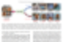
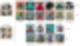
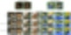
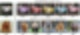
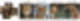
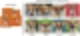
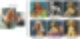

# 저게 뭔데요?
**Date:** 2026. 1. 15. 22:48
**Category:** 다이어리
**Original URL:** https://blog.naver.com/xpfkwh56/224148149538
---

<https://github.com/Victarry/stable-dreambooth>

[**GitHub - Victarry/stable-dreambooth: Dreambooth implementation based on Stable Diffusion with minimal code.**

Dreambooth implementation based on Stable Diffusion with minimal code. - Victarry/stable-dreambooth

github.com](https://github.com/Victarry/stable-dreambooth)

​

아까 있던 논문 내용을 반영한 것임,

​

논문 하면 막 엄청 어렵고 복잡하고

가방끈 길어야 될 것 같은 느낌 드는데

​

결국, 그냥 이러던데? 저러던데?

본인이 했던 내용을 쓴 것에 불과함

**​**

​

가내 수공업으로 이런 걸 할 수 있음

​

