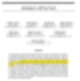

# All You Need Is Love
**Date:** 2026. 1. 16. 5:54
**Category:** 다이어리
**Original URL:** https://blog.naver.com/xpfkwh56/224148381385
---

<https://arxiv.org/abs/1706.03762>

[**Attention Is All You Need**

The dominant sequence transduction models are based on complex recurrent or convolutional neural networks in an encoder-decoder configuration. The best performing models also connect the encoder and decoder through an attention mechanism. We propose a new simple network architecture, the Transformer...

arxiv.org](https://arxiv.org/abs/1706.03762)

​

1. 아무튼 컴퓨터는 어떤 정보가 있으면,

​

그걸 어쩌고 임베딩인가 그 과정을 거쳐서

**'숫자 리스트'** 로 바꾼다 라는 점을 말했음

​

여기에 인코더, 디코더 라는 특정 개념이 들어감

초기 AI 모델은 다음과 같은 방식으로 이해했음

​

1) 인코더 = 입력된 문장을 읽어서 숫자 뭉치로 만든다

2) 디코더 = 숫자 뭉치를 보고 표현 언어로 전환한다

​

apple = 아무튼 빨갛고,

먹을 수 있고, 먹음직 스러운 것

​

우리가 시각 정보로 이걸 읽으면,

머리 안에서 어떤 전기 신호가 생기고

​

**'사과'** 라고 말을 하는 것과 매우 유사함

​

2. 문제는, 초기 모델들은 이걸

**2-3살 정도 되는 아기처럼만** 했음

​

이런저런 이유로 숫자 뭉치의 크기가

​

고정된 상태였기 때문에, 단어 1개를 넣든,

세익스피어 문학을 넣든, 결국

정해진 크기의 벡터여야만 했음

​

설포카 박사한테, 님이 아는 것을

딱 1개의 단어로 설명하세요

​

더블보드 전문의한테, 주절주절

본인의 1살부터 20살까지의 생활과

의료적 단서를 얻을 모든 정보를 주고,

​

또는 30년차 경력직 엘리트 판사한테

본인이 알고 있는 모든 법적 지식 전부,

​

**이걸 1형식 단문(S+V)으로 말해라** 같은

제약을 걸어놨으니 이건 답이 없었음

​

3. 그래서 몇 몇 천재들이 이런 생각을 함

​

만약 **'전부 다'** 가 아니라,

**'필요한 부분'** 만 집중해서

읽으면 더 효율적이지 않을까?

​

1) 지금 내가 찾고자 하는 정보가 뭐지?

2) 내가 쓰려는 정보의 단서들은 뭐지?

3) 그 정보의 실체적인 의미는 뭐지?

​

Q, K, V 로 구분해서,

**​**

**'어디에 집중해야 되는 것인지를'**

확률적으로 뽑아내는 것에 성공함

​

​

얘네가 만든 것 때문에 GPT 가 나온 거고,

​

지금 있는 **'모든'** 유사한 서비스는

다 저게 없으면 나올 수가 없었음

​

그래서 쟤네 결국 뭐 하고 살아요?

​

​

다니던 멀쩡한 회사 때려치운 뒤,

​

공동저자 8명 중, 7명이 창업했고

5개의 유니콘 기업이 탄생함

​

그들이 만든 기업 가치의 합산은,

약 200억 달러 언저리

​

**30조 정도** 임

​

4. 가운데에 있는 아저씨도,

원래 게이밍 그래픽 카드 팔다가

​

이게 산업, 연구 분야에

의미가 있다는 것을 깨닫고

​

팔자가 아주 크게 바뀐 분임