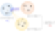

# 수학을 많이, 잘하면 좋은 이유
**Date:** 2026. 1. 16. 12:44
**Category:** 다이어리
**Original URL:** https://blog.naver.com/xpfkwh56/224148728009
---

1. **컴퓨터 비전 모델**, 이라는 것이 있다

​

아주 간단히 말하면 어떤 정보값이 있을 때,

이미지, 영상 정보를 읽어낼 수 있는 아이 임

​

이 친구는 글자 뿐만 아니라, 이미지

상황에 따라서는 추상 정보도 읽는데,

​

얘를 가지고 놀면 이런 것도 해볼 수 있다

​

2. **100명의 인간이 있다고 가정하자**,

​

김리아는 모든 사람들을 외모로 구분해서

못/평/잘 3개의 사람을 고르게 나누고 싶다

​

**\* 왜 그런 짓을 하나요, 는 일단 묻지 말자**

​

못/평/잘은 서술상 편의를 위해서,

99%는 특정한 로직으로 구해지며

​

나머지 1%는 주사위를 굴린다

​

주사위를 굴리는 방식은 많지만

여기에선 먼저 두 가지를 알아보자

​

**발더스게이트3** 라는 게임을 하면

**XdY 주사위** 라는 개념을 배울 수 있다

​

앞에 있는 X 는 주사위 갯수를 말하고,

뒤에 있는 Y 는 주사위의 면을 말한다

​

**\*** **Y면체 주사위를 X개 굴려,**

**전부 합한 값을 사용한다는 의미**

​

1d3 = 3까지 나오는 주사위를 1번

6d1 = 1까지 나오는 주사위를 6번

3d8 = 8까지 나오는 주사위를 3번

​

김리아는 1-6 까지 나오게 하고 싶고,

여기서 12/34/56 을 구분하고 싶다

​

여기서 1d6 주사위와

2d3 주사위는 결국에는

​

**'6'** 을 취급한단 점이 같은데,

​

1d6 는 **'직선'** 이고,

2d3 은 **'곡선'** 에 가깝다

​

만약 도박을 해야 된다면,

​

1d6 은 **운빨실력겜** 이 되지만,

​

2d3 은 100억 번까지 **던질 수만** **있다면**

4로 꼽아놓기만 하면 무조건 이기게 된다

​

그럼 왜 **'4'** 가 많이 나올까?

​

그건 이제 우리 기억 어딘가에 있는

표준편차 라는 것을 다시 익히면 된다

​

3. 김리아는 이런저런 아이디어를 통해,

​

인간의 외모를 정량적인 수치로 전환해

컴퓨터로 전환할 수 있는 발상을 얻었다

​

그렇게 해서, 100명의 사람을 구분하고

모두를 K 개의 방에 나눠서 넣기로 했다

​

1) K = 3

​

존잘예방 = 존잘예 20명, 평범 5명, 존못 5명

평범방 = 존잘 10명, 평범 10명, 존못 10명

존못방 = 평범 20명, 존못 20명

​

30 : 30 : 40

​

비교적 깔끔하게 나눠지긴 했지만,

​

똑같은 **'평범'** 인데도

​

누구는 존잘예방에 갔고

누구는 존못방에 들어갔다

​

이런 일이 발생한 이유는 뭐냐면,

​

외모를 확인하는 지표가

​

이목구비 주차 비율이나 피부색,

질감, 여러 가지 복합적인 것들인데

​

그 **'미묘한 경계'** 에 막차를 타거나,

아쉬운 사람들이 미끄러져서 그렇다

​

이 문제를 해결할 수 있는 방법은?

가장 쉬운 것은 K 값을 늘리면 된다

​

각각의 방을 2개의 클러스터로 나누면,

​

모든 방들이 메이저,

마이너로 나뉘게 되고

​

존잘예 메이저/마이너

평범 메이저/마이너

​

이렇게 묶이는 것이 아쉬울 순 있겠지만

전공은 못 골라도 간판은 바꿀 수 있다

​

2) K = 6

​

여기서 이제 **사고** 가 터진다

​

존잘예 메이저방 = 존잘, 존예만 존재

존잘예 마이너방 = 존잘, 존예, 존못 존재

​

평범 메이저방 = 존잘, 존못 존재

평범 마이너방 = 평범만 존재

​

존못 메이저방 = 존못만 존재

존못 마이너방 = 평범만 존재

​

구체적으로 데이터를 파악해보자,

​

**4. 순수형**

​

존잘예 메이저방이나, 존못 메이저방,

평범 마이너방 같은 경우는

​

방 안의 모든 데이터가 똑같다

​

그러므로 오염도가 0 이고,

표준편차/분산이 0 이 된다

​

완벽하게 촘촘한 클러스터로,

이 방은 오염도가 0% 다

라고 말을 해도 무관할 정도다

​

**5. 코스프레형**

​

평범 메이저 방의 경우,

​

존잘 10 + 존못 0 일 때, 평균을 내면

평범이 나오지만 정작 방 안에는

평범한 사람이 단 하나도 없다

​

**6. 불순물 혼입형**

​

존잘예 마이너방 같은 경우,

대부분 10점인데

0점인 데이터가 소수 섞여있다

​

7. 만약 종 모양으로 넓게 퍼져서

평균에서 균일하게 떨어져 있다면

​

**\* Unimodal**

**​**

손쉽게 방 안에 있는 그룹을

다시 클러스터로 재조정해서

원래 위치로 놓는 것이 되겠지만

​

평균(중앙)에는 아무도 없고,

왼쪽과 오른쪽에 뭉쳐 있다면

​

**\* Bimodal**

​

**'만약 분산이 크면 흩어졌고,**

**분산이 작으면 촘촘할 것이다'**

**​**

라는 **'직관'** 이 통하지 않게 된다

​

대체 이 문제를 어떻게 풀어야 좋을까?

​

사실, 내가 아는 범위 내에서

중등 교육으로는 그닥 답이 없고

​

**\* 수학적 직관이 특출나지 않는 한**

​

​

실루엣 계수 같은 고급 지식을 쓰던가,

​

분포가 단봉이 아니라는 가설을 검정하거나,

다봉분포 여부를 파악할 수 있는 알고리즘을

추가하는 등의 방식으로 해결해 볼 수 있다

​

8. 흥미롭게 적용될 수 있는 분야가,

유통이나 마케팅 영역의 장르일 것이다

​

백화점에서 고객이 매장에서 어느 구역에

머무르는 것인지 측정하면, 동선 내에서

​

시간 함수를 통해 **'고객의 유효 지불 의사'** ​를

데이터로 활용하는 것이 가능할 것이다

​

**\* 어디가 변곡인지도 알아서 나쁠 건 없다**

​

이 때, 특정 고객이 **'인기 구역'** 과

**'사각 지대'** 에 머무르는 시간을 구분할 때,

​

위에서 사용했던 기술을 적용해서

문제를 해결할 수 있다

​

편의점에서 물건을 팔고 있는 업주가,

​

오버스탁과 스탁아웃을 구분할 때,

​

수학을 할 줄 알면 **'분산이 크다'**

라는 지표를 보고,

​

Multimodal 로 경영 전략을

디자인하는 것이 가능하다

​

100명의 인간을 K 개의 방으로 나누는 클러스터링은,

마케팅에선 거의 알파와 오메가에 가까운 영역인데

​

**\* 광고 타깃군을 틀리게 설정하면 돈을 땅바닥에 버리는 것**

​

자신의 상품이 어디에 유효한 것인지, 조금 노력하면

배울 수 있는 통계적 지식을 활용해서 알아낼 수 있다

​

9. 복잡한 현실을 왜곡 없이 분해하고,

잘못된 직관을 교정하는 사고 도구로 좋지

​

진리를 꿰뚫고, 정답을

알아내는 어떤 해법

​

이렇게 접근하면 책상머리 밖을

나오기 어려울 확률이 높음

​

**왜 why?**

​

**'수학'** 을 잘 한다는 것과

**'의사결정'** 을 잘 한다는 것은

​

또 아예 다른 차원의 문제 임

​

잘못된 가정 위의 완벽한 수학은

잘못된 결론을 가장 그 누구보다

그럴듯하게 만드는 것이 가능함

​

**10. 결론**

**​**

어디 무신 중학수학부터 그거

우리 나이에 내용 다 기억하는 사람

​

가방끈 앵간히 긴 사람 아닌 이상,

거의 없구요

**​**

기초부터 하려고 하면 끝도 없고

배운다고 답 나오는 것도 아니니,

​

하면서 채워가세욬ㅋ

​

100점 맞는 공부랑

써먹는 공부 많이 달라요