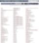

# 알아도 몰라도 그만인 인공지능 이야기
**Date:** 2026. 1. 16. 5:31
**Category:** 다이어리
**Original URL:** https://blog.naver.com/xpfkwh56/224148373505
---

1. 계산기에 불과한 컴퓨터가 어떻게

고등 사고력을 갖추게 되었을까?

​

재밌는 사실인데 결론만 놓고 보면,

컴퓨터는 **'고등 사고'** 를 할 수 없음

​

그냥 **'그렇게 보이는 것'**뿐 임

​

나는 이걸 알고, 모르고에 따라서

굉장한 차이가 있다고 생각하는데,

​

조금 구체적으로 들어가면 이런 것임

​

2. 좋소 오너 김리아는 직원에게

A 라는 작업을 끝냈냐고 물어봤음

​

직원은 자기한테 김리아가

A 를 지시했는 줄도 까먹었지만

​

적당히 요령껏 상황을 무마하려고,

본인의 뇌를 풀가동하기 시작함

​

1) 으음 지금 내가 모른다는 것을

아직 눈치를 깐 것은 아닌 것 같다

​

2) A 가 무엇인지도 모르겠지만,

대충 분위기상 어떤 것 같으니까

몇 가지 단서들로 빨리 추측해보자

​

일반화, 비약, 지레짐작 같은 능력을

최대한 발휘해서 통밥으로 해결하고

​

위기를 탈출한 직원과 인공지능은

**'거의'** 동일한 모습을 보일 수 있음

​

3. 애니프사 중국인들의 경우에는,

남들은 태어날 때 **'응애'** 하고 태어났지만

​

**'010010111!'** 하고 태어난 것 같은

미친 포스를 내뿜는 경우가 아주 많음

​

컴퓨터는 결국 이진수가 기본 언어인데,

​

특정한 어떤 정보가 입력되면 컴퓨터는

자신이 이해할 수 있는 형태로 변역을 함

​

**\* 임베딩**

​

그 숫자 리스트가 **'벡터'** 임

​

왜 벡터로 하냐?

​

현존하는 인류가 갖고 있는 **의미를 공간상의**

**위치로 바꿀 수 있는** **유일한** 기술이라서 그럼

​

만약 사과 라는 글자가 들어왔다고 치면,

그 사과라는 글자를 숫자 리스트에 넣은 뒤

​

가장 가까운 공간에 위치한 숫자 정보와

연결해서 가중치를 부여하고 다시 해석함

​

예를 들어, 사과 가 바구니, 음식, 식탁,

이런 글자와 가까이 있는 상황이라면

​

apple 로 이해하고, 반대로 다른 맥락이면

그 구조 안에서 그에 맞게 이해를 하는 것임

​

**\* 주변 벡터의 방향을 보고,**

**보다 더 가까운 위치를 선별함**

​

A 라는 사람은 사과를 들고, 사과를 했다

라고 하면, 사과를 들다 라는 것이

apple 이랑 가까우니까 apple 로 이해

​

**\* apple 일 확률이 더 높다**

​

그게 아니라, apology 랑 더 가깝다

그럼 그 **가능성** 이 더 높으니까 그걸 고름

​

왕에서 남자 벡터를 더하면 그냥 왕이고,

왕에서 남자 벡터를 빼고 여자 벡터를 더하면?

여왕 이다 라는 출력을 낼 수 있는 것임

​

**\* 과정은 다른데, 결과만 놓고 보면**

**이건 사람이랑 별로 차이가 없는 일임**

**​**

4. 그래서 엄밀하게 따지고 들어간다면,

컴퓨터는 인간처럼 **'사고'** 하는 것이 아님

​

다만, 중요한 점은 뭐냐?

​

80% 확률로 답을 말하고,

20% 확률로 틀리는 것이

​

**'컴퓨터만 그런 것이 아니란 것'** 임

​

인간이 아는 척을 하고, 짐작을 하고,

논리적인 비약을 했다가 틀리는 것처럼

​

컴퓨터 역시, 허상을 말하거나

​

잘못된 정보를 **'아무렇지도 않게'**

맞는다는 듯이 **'거짓말'** 할 수 있음

​

즉, 진짜 놀라운 기술은 컴퓨터가

고차원적 사고를 한단 것이 아니고

​

**'인간의 기준에서 거짓말을 할 수 있다'**

라는 점이 정말 정말 신기한 기술인 것임

​

5. 때문에 인공지능을 **'잘'** 쓰고 싶으면,

특히 그게 만약 LLM 에 가까운 형태라면

​

1) 아첨 하거나,

2) 강한 확신을 갖고 있거나,

3) 고집스럽고 독선적일 때,

​

4) 특별히 근거는 없는데

주장을 강하게 합리화할 때,

​

뭔가 **'문제'** 가 있다고 판단하면 됨

​

더 편한 점은, 저런 행동을 하는 인간을

교정하는 것보다 컴퓨터는 **더 쉽단 것** 임

​

**\* 그냥 다시 작동하면 되니까**

​

인간이 자아 안에서 **'객관적일 수 없듯'**,

컴퓨터는 확률 안에서 **'객관적일 수 없음'**

​

6. 김리아는 1호기한테

말을 가르치고 싶음

​

그럼 도대체 어떻게 해야 될까?

​

먼저 **구분** 을 할 수 있게 해야 됨

갓 태어난 1호기는 세상을 전혀 모름

​

유리컵을 던지면 깨진다

​

들고 있던 물체를 내리면

일반적으로는 바닥에 떨어진다

​

이런 것들은 **'선험적'**

지식이 아니기 때문에,

​

거기에 대한 **'라벨'** 이 필요함

​

컴퓨터도 **마찬가지** 임

​

컴퓨터에게 라벨이 적힌 데이터를 주면,

다양한 라벨을 무분별하게 포식하면서

​

연결하고, 점과 점을 잇는 과정 안에서

점점 견고한 **'학습'** 을 하는 것처럼 보임

​

**\* 이런 이유로 데이터와**

**모델링이 실상 전부라는 것**

​

**NAI** 라는 회사가 있음

​

이 회사는 십덕 애니 그림체를 통해,

누구나 만화/애니를 쉽게 만들 수 있게

하는 프로그램을 만들고 싶었는데

​

이 십덕 애니 그림체라는 것이 꽤 빡쌤

​

에반게리온 그림체 랑,

슬램덩크 그림체 랑,

​

사람마다 다 선호하는 그림이 다르고,

애니 라는 것이 워낙 **깊은** 장르인데

​

그 모든 것들에 라벨링을 단다고 치면,

​

1개에 100원씩 내도, 1만개면 100만

10만개면 천만, 100만개면 1억이 듦

​

**\* 한편 배고픈 국가 국민들을 대상으로,**

**이걸 쌈마이로 굴려서 재벌 된 놈도 있고**

**​**

**무료 체험 LLM 이랍시고 사람들한테 뿌려서**

**대화한 데이터를 중국에 파는 수완가도 존재**

**​**

**→ 그게 돈이 됩니까? 하는데 의외로 큽니다**

**​**

**제가 중국, 중국 하는 이유도**

**다른 특별한 이유가 없음**

**​**

**ㄹㅇ 겪어보시면 시장이 다름**

**​**

직원이 5명 밖에 안 되는 좋소 NAI 는

이런 작업을 **'절대'** 할 수가 없었는데,

​

**\* 저런 작업은 국내 기준으로는,**

**네이버 정도가 아니면 꿈도 못 꿈**

​

NAI 대표에게 **신묘한 계책** 이 떠오름

​

그는 평소 충실한 십덕으로,

언더그라운드 문화에 밝았음

​

**아아, 도대체 특정한 이미지의 태그, 속성을**

**어떻게 하면 값싸고 손쉽게 얻을 수 있을까!?**

​

​

!?

​

​

저작권에서 **완벽하게** 자유로우면서,

**완벽하게** 법률적인 울타리 밖에 있고,

​

**'정교하게 관리된 태그'** 가 있는

사이트가 그의 머리에 번뜩 였음

​

그래서 수십 년 동안, **'집단 지성'** 으로

만들어진 자료를 사용하기로 마음먹고,

​

**\* 설령 아무리 많은 돈과 시간을 들여도,**

**단부루/히토미에서 십덕들이 자발적으로**

**열심히 단 태그 만큼의 퀄리티는 못 나옴**

​

그 내용으로 학습한 데이터로

이미지 생성 모델을 훈련 시킴

​

단부루, 히토미 같은 사이트에서

내가 원하는 태그를 정한 다음에

​

NAI 모델로 굴리면 그 그림체, 연출,

작화가 나오는 **기적 같은** 일이 생겼고

​

회사는 그 서비스를 **'유료로'** 팔고 싶었지만

​

NAI 가 그랬듯, 십덕들도 파인 튜닝 된

SD 모델을 해킹 해서 무료로 뿌리게 됨

​

여기서 나온 것이 **SD 1.5 모델** 인데,

​

1) 그럴듯한 성능을 가진 모델이,

2) 무료로 풀렸다는 점 때문에

​

지금도 단부루 태그를 비롯하여,

SD 1.5 모델의 생태계는 **매우** 강함