# C, C+, 파이썬, 자바
**Date:** 2026. 1. 17. 15:17
**Category:** 다이어리
**Original URL:** https://blog.naver.com/xpfkwh56/224149962326
---

1. 유튜브에 [내 목표 언어] + 기초 검색

짧으면 3시간 쯤, 길면 20시간 정도 있음

​

알파벳 배운다 생각하고, 슥 넘어간 다음

전부 기억하려고 하지 말고 대충 알았으면

​

바로 실전 들어가 시작해도 **'보통'** 충분함

​

**왜 why?**

​

진짜 **'언어'** 가 중요한 것이 아니기 때문

​

**\* 5형식, 관계대명사 정도 알았으면**

**나머지는 하면서 해도 충분하다는 것**

**​**

**관사, 부정관사 이렇게 들어가면**

**공부만 하다가 세월 다 지나갑니다**

**​**

댓글 보니 **기초** 에 매몰되려는 분들 있길래,

그거 **주화입마의 길** 이라는 것을 말씀드림

​

박사처럼 개발 공부해도, **'끝'** 아닙니다

​

개발, 특히 언어는 **'끝'** 자체가 없어요

**​**

**\* 몰라도 된다 (x)**

**지금 몰라도 된다 (o)**

​

내가 이거 마스터하면 자유롭게 쓴다

라는 **목표 자체가 적용 안 되는 장르** 임

​

저만 해도, 토플 고득점에

한국인 네이티브급인데

​

불편이 없거나, 적은 정도지

**'마스터'** 했냐 하면 그럴 리가?

​

**\* 편의점 알바할 때, 한국어 필요한데**

**그거 하려고 kbs 한국어 능력 공부를?**

**차라리 편의점에 대해서 공부하는 쪽이**

​

[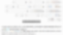](#)

[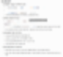](#)

[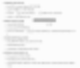](#)

첨부파일 10개 이상은 그록만 되네요, 자비로운 머스크

​

2. 어떻게 빨리 배우셨어요?

​

아, 쟤 어떻게 구현했지? (x)

**​**

**1) 이걸 코딩한 인간은**

**어떤 인간이지? (o)**

**​**

**2) 나랑 핏이 맞나? (o)**

​

글쓰기랑 비슷합니다

​

쓰는 것은 어렵지만,

**읽기** 는 그거보단 쉬워요

​

차분하게 남이 코딩했거나,

쓴 것이 있으면 읽어 봅니다

​

개발을 방어적으로 하냐,

공격적으로 하냐,

​

배려가 있냐, 없냐,

원칙적이냐, 즉흥적이냐,

​

이런 것이 꼼꼼히 보면

작업물에 **'얼추'** 보임

​

**\* 이 사람이랑 일을 하면 어떻겠다,**

**이건 왜 이렇게 했지? 흠 나라면 ,,**

**아하, 이랬구나 그럴 만 했네 ㅇㅇ**

**​**

저는 코딩을 ritual

하게 하는 것을 좋아함

​

집에 왔으면 손을 씻어야 된다

물건은 원위치에 있어야 된다

​

제 마이크로 매니지먼트의 **이상**, 을

코드로는 구현할 수 있어서 너무 좋음

**​**

[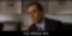](#)

[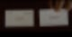](#)

[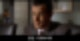](#)

[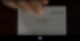](#)

[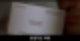](#)

[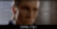](#)

[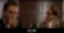](#)

아름답다 or 아름답지 않다

​

코딩하는 시간이 많은 것? **안 중요**함,

​

[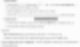](#)

​

정말 중요한 것이 **도메인 지식** 이고,

​

**\* 쉽게 말해, 짬바**

​

내가 무엇을 하겠다, 만 일단 정해지면

코딩하는 것은 **'순식간'** 이기 때문에

​

**\* 어차피 디버깅은 다 오래 걸림**

​

사고의 밀도, 해상도 같은 것이 중요함

​

3. **제 케이스**,

​

저 코드 문제 풀거나, 코딩 대회 이런 것은

나가면 광탈이고 뭐 어떻게 하나도 모름

​

근데 **'내일이라도 같이**

**일을 할 수 있는 사람'** 임

​

**왜 why?**

**​**

저는 코딩은 잘 몰라도,

**'일 하는 방식'** 은 알기 때문

​

**\* SRP, OCP, LSP, ISP, DIP**

**→ 그게 뭔데 씹덕아**

**​**

**한 사람에게 너무 많은 업무를 주지 마라**

**업무 메뉴얼은 간결하고 표준적으로 써라**

**요구 할 수 있는 최소한의 역할만 기대해라**

**불필요한 커뮤니케이션, 좋목, 소통하지마라**

**개인 판단이 원칙과 시스템 보다 선행하지마라**

**→ 상식적인 수준에서 당연한 소리**

**​**

바이브 코딩이고, 뭐고가 중요한 것이 아니구

가능한 바람직한 엔지니어링 원칙을 준수하고,

​

그걸 **나에 맞게 유연하게** 적용하는 것이 중요

​

뭐든 배울 때, 기초는 빠르게 기본은 꾸준하게

그리고 할 수 있는 만큼 **최대한 빠르게 심화** 로

​

이게 **거의 다** 통용 됩니다

​

어린이로 머무르려고 하면 안 돼요