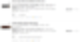

# 서비스 비용을 통한 비교
**Date:** 2026. 1. 17. 22:47
**Category:** 다이어리
**Original URL:** https://blog.naver.com/xpfkwh56/224150310419
---

1. 써본 적도 없긴 하지만,

분당 0.1 달러 들어간다고 침

​

**\* 아마존 영상 분석**

**​**

1분에 오늘 환율 기준, 150원

정확도가 얼마나 될 줄 모르지만

​

그냥 본인이 만족될 퀄이라 치고,

​

집에 달아야 되는 곳들,

프라이빗 생활 구간 제외

​

거실, 방1, 방2, 부엌,

화장실, **딱 여기만 한다** 침

​

그럼 5대 니까,

150\*5 = 750원

​

1시간에 4만 5천원

1일에 108만원

1개월에 3,240만원

1년에 **'4억'** 정도

​

AI 인공지능 분석 서비스에

1년에 4억 태울 수 있는 분?

​

참고로 여기 들어간 계산에는 커스텀

Vision LLM 모델값은 넣지도 않았음

​

AWS 기준으로는,

**객체 탐지** 정도 되네요

​

비전 모델이면 보수적으로 3배,

현실적으로 아마 7배 정도는 할 것

​

12억에서 28억 정도를 써야,

저걸 **'흉내'** 내는 것이 됩니다

​

무엇보다 클라우드로 우리 집을?

**담력 좋은 사람 아니면** 좀 어렵죠

​

2. 1시에 내가 거실에 앉아서 티비를 봤다

1시 30분에 내가 침대에 누웠다

​

이런 정보의 수준을 텍스트로 넣었다 치면,

​

**\* 영상이면 조금 더 높을 것이고,**

**순수 텍스트라면 그보단 덜할 듯함**

​

하루에 모이는 데이터가 40mb? 쯤임

​

**?? 엥, 글자가 그렇게 커요**

**​**

임베딩, 메타 데이터 포함이라 그럼

​

**\* 컴퓨터가 읽을 수 있는 번역 비용**

​

1개월에 1기가 조금 넘게 쓴다고 치구,

토큰 값을 잡기 나름일 것 같긴 한데

​

첫 달 기준으로 50만원 쯤 쓸 것 같음

​

1개월 = 50만

2개월 = 100만 ,,

​

1년 모은다 치면,

월 600씩 내면 됨

​

**\* 정보가 누적될수록 계속 오름**

**​**

이거를 로컬로 쓰면 어떨까?

​

**100년 모으면 2테라 쯤** 됨

​

​

기가당, 저장 용량 값이

비싸야 **300원** 정도 하네요

​

1기가에 300원 주면, 그거를

내가 지지고 볶고 뭘 해도 무한

​

2테라면,**A4 용지 12억 장**에

내 기록을 넣고 찾아 쓸 수 있음

​

4테라면, 24억 장

8테라면, 48억 장 ,,

​

진짜 좋은 SSD 샀다고 치고,

8테라에 **'200'** 정도 하네요

​

저거 사면, **400년** 동안

일상 기록할 수 있습니다 ,,

​

3. 원래 인공지능 쓰는 값이

**'엄청 비싼 것이 정상'** 이었어요

​

**\* 걍 1억 아래는 생각도 못 하는**

**​**

기술이 좋아져서 이리 된 것임

​

**\* 연산도 훨씬 저렴해지고,**

**성능도 비교 불가로 올라옴**

**​**

기계값 빼고 5090 **'2대'** 를

24시간, 한 달 내내 쉬지 않고

그냥 **풀로드** 로 계속 쓴다 침

​

**\* 이론상, 최대 한계 부하 맥스**

**거의 막 채굴 하듯이 쓴다고 치고**

**​**

1) 집에서 매우 넉넉히

500kWh 쓴다 = 10만원

​

1대, 900kWh 쓴다 = 25만원

2대, 1300kWh 쓴다 = 45만원

​

2) 적당히 집에서 쓸 만큼 쓴다

300kWh = 5만원

​

1대, 700kWh = 16만원

2대, 1100kWh = 31만원

​

로컬이랑 가격이 비교가 안 됨

아무거나 비교해도 프로 구독료?

​

그래도 **'10-20'** 은 하지 않나요?

​

가격, 성능, 보안, 뭐 아무거나

잡고 비교해도 이길 수가 없음

​

**\* 5090 의 VRAM 은**

**1.7 TB/s 메모리 대역폭**

**4090 과 비교하면 약 2배**

**​**

**100년치 기록 있다 치고,**

**꺼내오는 시간 0.06초 걸림**

**​**

**→ 4090 = 350-400만**

**5090 = 400-500만 ??**

**​**

**100만원 더 쓰면 성능이 2배?**

**​**

토큰 레이턴시 = 정말 빨라야,

최소로 잡아도 100ms 이상

​

로컬? **'0'**

​

**\* 굳이 수치로 따지자면 약 5ms 정도**

**144 주사율 모니터의 1 프레임 쯤 됨**

​

클라우드는 멀리 있는 사람이

아무튼 간에 통신을 통해 오는 것,

​

로컬은 **그냥 내 옆에 있는 애** 가

**나한테 다이렉트로 말하는 것** 이라

​

이걸 비빌래야 비빌 수가 없음

​

**아, 그래도 개인이 할 수 있는**

**보안 레벨이라는 것이 있는데,**

**​**

**기업이 더 잘 하지 않을까요?**

**​**

만약 네트워크 서버 안 쓴다고 치면,

​

**\* 사실 이걸 쓴다고 해도**

**솔직히 과연 싶긴 합니다 ,,**

**​**

**본인이 무슨 온갖 이상한 프로그램들**

**다 받아서 나 잡아 잡숴 하지 않는 한**

​

보안이 털릴 수 있는 경로 자체가

도둑이 들어와서 컴퓨터 들고

도망가는 것 말고는 있을 수 없음

​

**\* 생판 모르는 사람이 준 해킹툴 있는**

**usb 를 컴퓨터에 내가 꼽았다던가 ,,**

**​**

인터넷 연결 안 된 컴퓨터에 있는 정보를

외부에서 어떤 기술로 해킹해서 훔친다?

​

두꺼비집이 내려가니까, 정전 되니까

안방문이 안 열린다는 말과 비슷한 말임