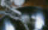
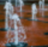
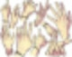
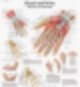
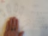

# 아름다움
**Date:** 2026. 1. 17. 14:04
**Category:** 다이어리
**Original URL:** https://blog.naver.com/xpfkwh56/224149905990
---

1. 고대에 한 가닥 했던 인간들을 보면,

직업을 1개만 갖고 있는 아해가 거의 없음

​

그들은 오히려 **'통칭'** 적인 직업을 가짐

아티스트거나, 과학자거나, 기술자인 식임

​

**\* 어쩌면 그 셋 모두를 동시에 가져감**

**​**

1) 표현에 집중하고 있다 = 아티스트

2) 원리에 집중하고 있다 = 과학자

3) 구현되는 기술을 쓴다 = 엔지니어

​

그 이유가 뭘까?

​

**그림을 그릴 때, 중요한 것은?**

**피사체에 대한 이해** 임

​

빛과 형태감, 사물의 구조와 규격,

이런 것들을 **알고 모르고** 차이가 큼

​

한국어를 잘 한다는 것은,

​

맥도날드 버거킹 들어가서

햄버거 주문하는 재주가 아님

​

언어의 컨텍스트, 표현법,

규칙, 약속, 뉘앙스가 **핵심** 임

​

**\* 그래서 외국어 끝판왕이**

**코미디와 문학 인 것**

​

2. 나는 오늘 **물** 에 대해 그리고 싶음

​

파랗게 색칠만 한다고 물이냐? **아님**

​

물이 흐르는가, 튀고 있는가,

겹치는가, 퍼지는가, 등등

​

**'더 구체적일수록'**, 또는

**'표현물에 대해서'** 내가 얼마나

더 잘 생각하고 있냐에 다름

​

물은 색깔이 없음

​

근데 **'파랗게'** 하는 것은

**'해석의 약속'** 임

​

​

이건?

​

파란색이 아닌데도, **'물'** 임

​

저 물줄기가 위를 향한다면?

그럼 중력에 어긋나니 틀릴까?

​

​

아님, 이거도 **물** 임

​

대단한 단서가 있는 것은 아니지만,

땅에서 물이 솟구치는 걸로 보이고

​

아마 분수일 가능성이 높다고 생각됨

​

**\* 본 적도 있는 것 같음**

**​**

유리나 플라스틱, 비닐 같은

질감이랑 비슷한데

그럴 수도 있는 것 아닌가?

​

그럼 둘은 **'어떤 차이가 있지?'**

가 제 생각엔 상당히 중요함

​

​

이 사람의 손가락은 몇 개?

5개임, 다른 사진들은 5개인데

​

몇 개만 손가락이 안 보였다고

일반화 할 수 없으니 5개?

​

아님, 그냥 손가락은 **보통** 5개임

​

그럼 손가락이 4개일 수도 있고,

3개일 수도 있나? **'그럴 수도'** 있음

​

**'말하지 않았어도 그럴 수 있다'**

라는 것을 우리는 이미 알고 있음

​

​

3. 결국 동서고금을 막론하고,

우리는 어떤 **'자연적인 것'** 을

​

모방하여, 아이디어와 영감을 얻고

그로부터 아름다움을 인지하게 됨

​

즉, 더 완벽하다는 것은

얼마나 **'더 자연적인가'** 임

​

자신에게 달린 손바닥을 펴고,

최대한 손가락을 뒤로 밀면

​

**일정 수준 이상 안 넘어감** 이 보임

​

각도에 따라 빛이 다를 것이고,

가장 편하게 폈을 때, 손가락과

손가락 사이 거리가 다를 것이고,

​

그로 인해 시시각각 피부의 늘어짐과

좁혀짐, 관절과 마디에 가해지는 힘이

전부 달라짐을 포착할 수도 있음

​

거기서 느껴지는 전율이 **'아름다움'** 임

​

​

여러 손이 있을 때,

​

​

무엇이 **'아름다운 것인지'** 는

제마다 본인이 규정할 수 있음

​

**\* 현상에 대한 기준과 해상도**

**​**

4. 그림이냐, 카메라냐,

빛은 어떻게 사용하고 있냐,

​

악세사리의 유무, 만약에

악세를 쓴다면 그 악세는 뭐고

반지라면 무슨 반지고 질감은 뭐고,

​

배경은, 연출은,

구도는 같은 것들로 가면

​

**'손'** 하나만 으로 끝날 일이 아님

​

그래서 저 사람들의 직업이

**'많은 것'** 처럼 **보이는** 것임

​

손을 그리다가, 심심해서

손톱에 네일 하나 해보고 싶고

​

네일을 그리려는데, 맨 손톱은

또 맹맹하니까 네일 아트가 보이고

​

젤이냐, 글리터냐, 뭐 붙였냐,

인조손톱이냐, 로 들어가게 되고,

​

그 과정 과정을 **'잇는'** 것은

하면서 **'당연한'** 일이라서,

​

A to Z 접근은 애초, **비현실적** 임

​

아담 스미스가 오늘 나 경제학 해야지

뉴턴이 고전 역학을 하겠어 하고

시작했을 리가 있겠냐는 것 임