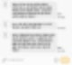

# 어떤 회사
**Date:** 2026. 1. 17. 13:19
**Category:** 다이어리
**Original URL:** https://blog.naver.com/xpfkwh56/224149872455
---

1. 김리아는 1인 좋소를 운영하고 있었음

이 회사는 아무런 기록이 없어도 상관 없음

​

**'내가 다 아니까'**

​

근데, 1명 더 직원을 쓰니까

서로 소통할 라이브러리가 필요함

​

이제 김리아와 직원은

서로 **'약속'** 을 가짐

​

우리가 어떤 의사 결정을 하고,

어떤 무언가를 집행하려면

상호적으로 아는 정보를 공유하자

​

2. 어쨌든, 둘이 그걸 계속 하다가

회사가 확장해서 2명, 3명, 4명 늘음

​

그러다 직원이 500명이 된 상태임

​

법무팀, 회계팀, 홍보팀, 기획팀,

이런 식으로 전부 다 나뉘어 있는데

​

오늘 n시에 본사 문을 열고 x 라는

사람이 방문 했습니다 라는 정보를

기록에 남겨서 모두에게 공유 시킴

​

회계팀에 있는 직원 하나가 불만을 표함

​

**'아니, 제가 그거까지 알아야 되나요?'**

​

쌓였던 불만이 터져나오기 시작하고,

긴급 회의가 열려서 사람들이 모였음

​

**3. 어떤 답이 나올까?**

​

회계는 회계에 필요한 정보만,

법무는 법무에 필요한 정보만,

홍보는 홍보에 필요한 정보만,

​

받아서 판단하겠다는 것이

누구나 **'직관적'** 으로 닿는 답임

​

있으면 편함,

근데 **'남용'** 되면 어떨까?

​

**'알아야 되는 것도'** 모르게 됨

​

홍보팀에서 마케팅 비용을 집행함

회계팀에서 그 비용 정보를 알았음

​

여기까진 Ok,

​

근데 마케팅 **'비용'** 이 아니라,

**'마케팅'** 이 집행되었는데

​

그게 문제가 있나, 없나 모르면

**'법무팀'** 의 기능적 역할이 제한됨

​

너무 상세하게 아는 것이 문제였으니,

정보를 선별하는 것도 중요할 것 임

​

1개씩 정보를 주는 것이 아니라,

묶여있는 5개, 10개의 유사한 정보를

나눠서 각 속성에 맞게 배열한다던가

​

서로 다른 정보를 정규적으로 일반화 해서

하나의 공통된 약속으로 만드는 것도 중요

​

**\* 빨강, 빨그스름, 붉음, 붉그스름**

**= red 로 통합**

​

4. 법무팀에서 점심 메뉴를 골라야 됨

근데 기획팀에서 최근 PT 를 했다 까지는

​

**'굳이'** 몰라도 되는 정보 임

그리고, **'히스토리'** 또한 알면 좋음

​

홍보팀에서 최근 a 라는 메뉴를 시켰는데

반응이 좋았고 맛있게 먹었던 적이 있다,

​

라고 하면, 그건 **'반영'** 하면 좋은 정보 임

​

​

그럼 결과적으로 **'이게 나옴'**

​

근데 저걸 먼저 배우고,

**'옵저버 패턴'** 으로 묶으면?

​

포인터를 **써야 될 곳에도 안 쓰는 사람**,

**안 써도 될 곳에도 쓰는 사람** 처럼 행동함

​

코딩 gpt 한테 다 맡기면 되는데요?

​

​

또는 이런 주화입마에 빠질 수 있음

​

5. 그림은 그릴 수 있음, 춤도 출 수 있고

노래도 할 수 있고, 말도 할 수 있음

​

근데, 그걸 **'한다'** 가 중요한 것은 아님

​

무엇이 필요하고, 필요하지 않은가?

무엇이 아름답고, 아름답지 않은가?

​

관점과 감각, 태도와 사고가 더 중요함

​

그건, 어떻게 기를 수 있음?

​

**'기르는 것'** 이 아님

​

**'이미 있는 것을 확인하는 것'** 이고,

**'확인된 것을 교정하고 성찰하는 것'** 임

​

6. 신랑한테, 바닥을 닦아라 라고 하면

어디를 몇 번? 같은 소리를 할 수도 있음

​

거실 바닥 좌표 (55.126.21) 을

도구 A 를 활용해서 B 회 닦아라

​

라고 하면, **'답답한 짓꺼리'** 를 할 것임

**​**

**\* 다 닦았으니까 나 자유시간!**

​

본인이 바닥을 보고, 더럽다 라는 것을

인지하는 것은 **'아주 고차원적'** 능력 임

​

이걸 갖추면, **'영혼'** 이 있는 사람처럼 함

​

그래서 우리는 수단보다

**'목적'** 을 우선해야 함

​

200층짜리 건물의 높이가 궁금하다,

무슨 공식을 써야 하지? (x)

​

1) **'자'** 들고 재보자!

​

2) 5층 정도 재보니까 불편하네,

부정확하네, 어렵네, 힘드네

​

**→ 핵심**

​

3) 층 마다 동일하게 설계되었을까?

그럼 1층만 정확하게 구하고,

\*200 하면 답이 나오지 않을까?

​

4) **'진짜 정확한가?'**

1층만 재고 200 곱하면 되나?

​

**→ 핵심**

​

5) 어떻게 할 수 있지?

1층을 **'정확히'** 어떻게 재지?

​

정확할 필요가 있나?

오차 허용 범위는?

​

이런 접근이 **'싱크'** 가 다릅니다

​

7. 인공지능 배우고, 활용할 수 있으면

내가 할 수 없던 무언가를 해낼 수 있다 (x)

​

본인이 할 수 있는 것에 **곱하기** 가 된다 (o)

​

인간은 **배울 때보다**,

**가르칠 때**, 더 많이 배운다 (o)