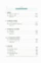
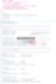

# 인공지능 공부 방향성
**Date:** 2026. 1. 17. 12:06
**Category:** 다이어리
**Original URL:** https://blog.naver.com/xpfkwh56/224149818293
---

​

1. 직장에 들어가서, **'일'** 을 배운다고 하면

일을 배운다는 것을 정확히 어떤 표준화된

표현으로 말하기는 어렵지만 우리 모두는

그게 무엇을 지칭하는 것인지는 알 수 있음

​

식당에서 일을 배운다는 것은,

​

해당 장소에서 이루어지는 행위나

생태적 사고방식, 구성 같은 것을

익히는 것과 유사하다고 할 수 있는데

​

이걸 더 정제해서 표현하면,

​

**1) 언어와 문화에 대해서 배운다**

**2) 정의와 약속에 대해서 배운다**

​

라고 설명하는 것도 가능할 것 임

​

2. **'인공지능'** 에 대해서 배운단 것은,

​

글자 그대로 **'인공적인'**,

사람의 힘으로 만들어내는

​

**'지능'**, 사고 기계에 대해 배운단 뜻임

​

이 학습을 하는 우리의 **목적** 은,

​

컴퓨터를 배우는 것도 아니고

코딩을 배우는 것도 아니고,

수학, 영어를 배우는 것도 아님

​

우리는 **'인간이 할 수 있는 어떤 것을'**,

​

그게 **'컴퓨터가 되었든, 뭐가 되었든 간에,**

**그것이 할 수 있게 하는 것이 목표'** 인 것임

​

때문에, 어떤 프로그래밍 언어를 배울까요?

기초 수학을 배우면 될까요? 같은 질문에

​

제가 **별 의미가 없다** 는 말을 하는 것인데,

​

주식이나 부동산으로 예를 들어서 본다면

​

최신 금융 공학 기술을 알든 모르든 간에

땅과 건물에 대한 이해가 있든, 없든 간에

​

결국 매매의 본질과 상품에 대한 감각이

그 모든 것을 선행하는 개념이라서 그럼

​

주식 공부, 라고 하면 사람들은 per, pbr,

정성분석, 정량분석, 이런 식으로 **시작** 함

​

근데 그건 그냥 **'수단'** 에 불과함

​

왜 이런 함정에 빠지냐면, 우리는 꽤 자주

우리가 무얼 하는 것인지 **까먹어서** 그러함

​

주식 공부는, **'상품'** 에 대한 공부고

**'거래'** 를 할 수 있는 사람이 되면,

​

**\* not doing, but being**

​

당연히 **'상품을 거래할 수 있는'** 사람이 됨

​

인공지능도 마찬가지임,

​

인공지능 > 머신러닝 > 딥러닝 위계를

​

제가 몰라서 인공지능이란

표현만 쓰는 것이 아니구,

​

삼각형, 사각형 공식 많이 아는 것보다,

**'도형, 기하'** 에 대해서 알고 싶다

​

방정식과 해석학을 **'공부'** 하는 것보다

보이는 것을 기반으로 보이지 않는 것을

​

정확히 **'예측'** 하고 싶다 라는 **'욕구'** 가

본인을 더 나은 곳으로 데려다 주기 때문에

사고를 **닫게 하지 않으려고** 하는 것임

​

3. 질문으로 다시 돌아가면 이런 답이 나옴,

​

**1) 어디서 공부를 시작해야 될까요?**

​

내가 수능을 공부할 생각이 있는 상태고

수학을 배워야 되면 뒤도 안 돌아보고 그냥

현우진 강의 골라서 프패 끊고 그거 들음 됨

​

하지만, **'수학'** 을 공부하고 싶으면

​

​

우리의 **'첫'** 시야는 마치

이런 상태인 것이 **정상** 임

​

​

이게 시작인 것이, **'비정상'** 임

​

**\* 단, 학교 공부라면 후자가 답입니다**

**후자를 전자처럼 하면 인생 조집니다**

**​**

> **수학이 뭐임?**

​

개념원리, 정석, 어떤 교재, 강사가 아님

​

**수학이 뭔지?** 부터 시작을 해야 됨

​

이거에 대해서 **'가능하면'**, 본인이

직접 내 머리에서, 내 뇌를 사용해서

추측하고, 가정하고, 감을 잡아야 됨

​

**\* 그래서 시험공부랑 다른 것**

**​**

심지어 틀려도 됨,

오래 걸려도 됨,

​

3일, 30일이 걸려도

내가 정한 어떤 정의가 있고

​

그게 맞는 것인지 끊임없이

성찰하고, 검증하고 찾으면 됨

​

그럼 결국, 수학이

**수, 식, 도형** 이다

​

라는 **'결론'** 에 닿게 됨

​

**\* 이게 배우지 않아도**

**알 수 있어짐, 진짜로**

​

**인공지능** 도 똑같음,

​

우리는 인공지능 이라는 언어를

서로 헐겁게 약속하고 있을 뿐이지

​

**'인간이 해야, 인간이 할 수 있는 것들을,**

**인간을 요구하지 않고 할 수 있으면 됨'**

​

때문에, **'어디서'** 라는 질문엔 답이 없음

​

저는 매일 오후 3시에 컴퓨터가

알아서 켜지길 바랍니다

​

원래 이거 사람이 눌러야 되는데,

그 버튼 누르는 것을 사람이 없이

할 수 있게 하고 싶읍니다, 라고 하면

​

그 역시, **'인공지능'** 과 다를 바 없음

​

이게 제가 계속, 본인의 목적

본인의 욕구 같은 것을

강조하는 이유임

​

**2) 무언가를 배우는 방식**

​

사람마다 학습하는 방식이 다름

​

누구는 일단 문제를 많이 푸는 것,

누군가는 직접 내가 실행하는 것,

​

또 누구는 책으로 시작하는 것,

​

실제 보면서 하는 것 등 학습을 대하는

각자의 **'신경망'** 이 전부 차이가 있음

​

그리고 그 모든 것들이 **'자신'** 을 규정함

​

자, 우리는 **인공지능을 배우는 것이 아님**

​

저는 **'인공지능'** 이 필요했던 것이 아니구,

​

**'실제 인간이 없어도'**, **'제가 원하는 것'** 을

**'다른 무엇이 대체하길 원했던 것'** 임

​

그럼 벌써 **'시야'** 가 달라짐

​

**\* 이 접근에 대해서, 돈이 많으면 되잖아**

**하기 시작하면 이제 또 답이 없어지는 것**

​

저는 인간이 없어도, 오후 10시 마다

알아서 저희 집에 있는 문이 열리길 원함

​

이걸 **'어떻게'** 할 수 있을까요?

​

텔레파시? **물리적** 으로 **'불가능'** 함

​

어떤 **'힘'** 이 필요하고,

그 힘이 저기에 **'작용'** 해야 됨

​

문이 열리려면, 손잡이가 돌아가야 됨

손잡이가 돌아가야 되는 이유는

​

손잡이와 문에 달려있는 문고리

실린더가 손잡이와 연결되었기 때문임

​

저 **'실린더'** 가 돌아가면, 문이 열림

​

**만약 거리에 제약을 받지 않고,**

**실린더를 돌리려면 어떻게 해야할까?**

​

이런 것이 **'과정'** 인 것 임

​

근데 사람들은 평소 하던 습관이 있어서,

​

**문 여는 방법** 이요? 그거 하고 싶으면요

**​**

**물리**를 알아야 됩니다, 라는 말을 듣고

중/고등학교 물리 교과서 읽기 시작함

​

**\* 알면 좋죠 ,, 당연히 ,,**

​

근데 그걸 **'지금'** 읽을 때는 아님

정확히는 **'결국'** 알게 된다에 가까움

​

**\* 주화입마 가능성 다분한 표현이지만**

​

실린더를 전자 구동계로 돌리든,

물리적인 기계공학을 사용하든,

생체 바이오 액션에 도움을 얻든,

​

우리의 목적은 **실린더 돌리기** 임

​

좌우로 움직이는 실린더와 연결된

어떤 구동계가 있다고 가정할 때,

​

이걸 돌리는 법을 알면, 그걸 이용해서

다른 곳에도 전이해서 사용할 수 있어짐

​

이게 **'제가'** 접근하는 방식 임

​

**4. 우리는 인공지능을 어떻게 하고 있냐?**

​

인간이 뛰고, 걷는 것보다

​

자동차 모터나, 자전거를 이용한

**'토크'** 를 사용하면 더 효율적임

​

단, 여기서 말하는 효율에 있어서

트레이드 오프 관계는 **'상식'** 임

​

어려운 이야기가 아님

​

매장 키오스크 이용하려면

키오스크 사용법과 터치를 하면

뭐가 바뀐다 를 알아야 되는데,

​

그거 알기 위해서 필요한 노력이

점원 부르는 것보다 쉬운 사람은

그냥 본인 방식대로 해도 무관함

​

그러나, **'인간'** 처럼 **'지능'** 을

사용하는 기술은 대부분의 경우,

​

**'컴퓨터 연산'** 을 사용하는 것이

가장 좋은 방식이다 라는 것이

​

아직까지 알려진 제일 나은 내용 임

​

즉, 우리는 **'컴퓨터한테,**

**지시하는 법'** 을 알아야 됨

​

**1) 컴퓨터한테 에 대해서**

​

컴퓨터한테 내일 12시까지, 알아서 해놔

라고 하면 컴퓨터는 단순히 일을 못하는

인간의 수준도 아니고, **아무것도** 할 수 없음

​

12시가 뭔데요? **이 지랄을 하기 때문** 임

​

**'파이썬 하라고 하는 이유'** 도 비슷,

할 수만 있으면 어셈블리어가 제일 좋음

​

하다못해 c언어 배우는 것이 **더더** 나음

​

근데 그게 매우 매우 어려우니까,

**제일 쉬운** 파이썬으로 하라는 건데

​

**\* 더 쉬운 언어도 있지만, 생태계 이슈**

​

**'영어'** 배우기 어려운데? 라는 경우는,

**'영어'** 로 한정해서 그런 것처럼

​

**\* 영어가 싫으면, 이태리말, 러시아말,**

**중국말, 아프리카말, 다 배워야 됩니다**

​

영어로 **'박사'** 안 해도 되는 것처럼,

​

No, Yes, Ok, 오오오 노노노노노

​

정도만 알아도 컴퓨터랑

**'대화'** 할 수 있음

​

컴퓨터 **'언어'** 깊게

가는 함정 주의해야 됨

​

**\* 개발 언어 집착 들어가면 끝 없습니다**

**주화입마 빠지면 답이 없구욬ㅋㅋ**

**​**

**2) 지시하는 법**

​

이게 **이억배 정도** 더 중요함

​

한국어, 영어 잘 하는 것보다

그 사람의 **'언어 센스'** 가 중요함

​

마찬가지로 결국 인공지능 **활용**은

누가누가 더 개발 잘 하냐? 이게 아님

​

내 도메인 지식과, 데이터 전처리 능력,

그리고 그걸 통한 **'모델링 구현'** 이 중요함

​

경영학 박사 딴다고, 아마존 만들 수 있고

일론 머스크 되는 것은 아니라는 소리 임

​

컴퓨터한테 **'일'** 을 시키고 싶으면,

**사람한테 일을 시키는 것** 과 똑같은데

​

좋소에서 사람 부려봤으면 더 잘 알 것이고,

사회에서 협업 해봤으면 그 느낌이 있을 것임

​

그걸 **'컴퓨터한테 잘 적용하면'**,

**'비교적 더 편하게 잘 할 수 있음'**

​

**\* 제가 무척 매력적이게 여기는 부분**

**​**

누군가와 협업을 한다고 가정하겠음

​

잠시 후, 전화 드릴게요

vs 15분 있다 연락드릴게요

​

전자와 후자 중, 뭐가 더 **'일잘'** 임?

​

후자임, **왜?**

​

더 **'객관적인'** 언어를 쓰고 있기 때문

​

**\* 언더 엔지니어링**

**​**

2026년 1월 17일, 오전 11시 35분

32분 18초, 그리니치 천문대 본초

자오선 경도 0도를 원점으로 삼은 GMT

기준 이라고 말을 하는 것은?

​

일을 **'못하는'** 인간 임

왜? 이건 설명이 필요 없음

​

**\* 오버 엔지니어링**

​

이런 원칙들을 적용해서,

​

**\* 옵티멀**

​

유지보수성과 확장성을 중심에 두고

대화하면 더 좋은 대화를 할 수 있음

​

저는 모듈화와 파이프라인 아키텍처를

중시하는 편이고, 혼자 하는 프로젝트임에도

​

불구하고 내일 당장 누구 하나 들어와서

할 수 있을 정도로 주석을

꼼꼼하게 다는 것을 좋아함

​

단계적 개발과 스터빙을 선호하며,

**​**

**\* 일단 전체적 뼈대를 빨리 잡고,**

**세부 내용을 이후에 채워가는 것을 선호**

​

Defensive Coding 과 예외 처리에 민감한 편임

​

외부 라이브러리나 환경 변수에 대한

의존성을 철저하게 관리하는 편이고,

​

**\* 아웃소싱 싫어하는 성향과 밀접**

​

Crash 를 방지하기 위한 여러 장치를 놔두길 좋아함

​

**\* 라이브러리가 없어도, 대체 함수를 정의하거나**

**디버깅 메시지가 출력되고 넘어갈 수 있도록 처리**

​

제가 컴퓨터 내공이 높지 않기 때문에,

모르면 fallback 하는 로직도 일정 정도는

가늠하고 설계하는 편임

​

모든 임계값과 모델 경로, 옵션들을 하나에

모아 관리하고, 파라미터 옆에는

상세한 의미를 주석화 해서 처리함

​

tqdm 을 사용하여 진행률을 표시하고,

각 스테이지의 시작과 끝, 주요 통계를

콘솔에 깔끔한 포맷으로 표현하는 것도 좋아함

​

**\* 취향과 마이크로 매니지먼트에 대한 습관**

​

**저게, 무슨 소리죠?**

​

1) 야생에서 창업한 좋소 사장이

2) 리스크 매니지먼트에 대한 이해가 있고

3) 합목적성과 적합성을 중시하면서

​

4) 아웃소싱 싫어하고, 본인 스스로가

책임질 수 있는 영역 따지는 스타일이란 것

​

저 수치는 다 본인이 해봐야 아는 겁니다

​

우리 내일 같이, 짜장면 팔아요

​

라는 **'프로젝트'** 를 한다고 치면

​

무슨 짜장면요? 춘장은 뭐 써요?

면은요? 조리 시간은요?

냄비는 뭐 쓸 건데요?

누가 만들 건데요? 같은 이야기를

​

**'전부'** 다 정해서 하기를 좋아함

​

**\* 저화질 이미지는 뺍시다**

**​**

**→ 저화질의 기준이 뭐죠?**

**이미지의 기준과 표준은 뭐죠?**

**​**

**사람이랑 일을 할 때는,**

**이런 소리 하면 사회성 낮은**

**이상한 사람 취급 받으니까**

**​**

**→ 중요한 말인데도 삼켜야 됨**

**에둘러, 사회적 표현으로 바꿔야 됨**

**​**

**내가 알아서 생각해야 되는 반면,**

**컴퓨터랑 일을 할 때는 전혀 문제 X**

**​**

**그래서 매우 편합니다**

**관용적이지 않아도 돼요**

​

안 되면, 왜 안 된 건데요?

​

코딩 배우면 할 수 있나요?

​

**??글쎄요???**

​

제 경우, 저는 제가 개발자라고 생각 안 함

엔지니어 라고도 **당연히** 생각 안 함

​

​

그냥 PM 에 가까운데,

​

내가 제일 **'잘하는 것'** 이 이거라는 것을

**'내가'** 알고 있기 때문에 불편이 없음

​

**5. 결론**

**​**

공부 어떻게 해요?

접근 어떻게 해요?

​

**후 엠 아이?**

​

제가 **'사장'** 이 직접 해본 일만,

​

직원한테 맡길 수 있다는 **원칙** 은

제 코딩에도 **'당연히'** 들어갑니다

​

즉, 제 코딩 실력은 **'개발력'** 이 아님

내 **'업무 능력'** 과 **'표현'** 의 한계 지

​

제가 **'기초 공부'** 를 하는 이유는,

**'더 잘 표현'** 하기 위한 것이지

​

**'인공지능'** 다루기 위한 것이 아님