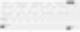
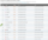
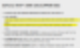
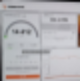
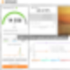

# 고사양 컴퓨터 사고 싶은데, 힌트 없나요?
**Date:** 2026. 1. 18. 18:57
**Category:** 다이어리
**Original URL:** https://blog.naver.com/xpfkwh56/224151023229
---

<https://www.3dmark.com/>

[**3DMark.com - Share and compare scores from UL Solutions' benchmarks**

Share and compare benchmark scores from 3DMark, PCMark and VRMark benchmarks. Check out the world's fastest PCs in our Overclocking Hall of Fame.

www.3dmark.com](https://www.3dmark.com/)

​

1. 제조사 벤치 = 광고 = 못 믿음

​

2. 3DMark = 그거보단

더 근거 많이 보여주고,

​

일단 **'표본'** 자체가 많음

​

​

3. ai 랑 직결되는 것은 아니지만,

**성능이 어느정도인가?** 는 확인됨

​

5090 이 결국 정답인 이유도 여기에 있음

​

하단에 들어가서,

​

​

이렇게 보면,

​

GPU 만든 회사 이름 나옴

전체적으로 봤을 때,

​

어, 이거 약간 나랑 **핏** 이 맞는다

싶은 회사를 골라서 구입하면 됨

​

내가 자동차를 사고 싶은데,

좋은 자동차가 뭔지 모르겠다

​

그럼, 르망24 에 참가한 제조사 중

어디가 1등을 많이 했나? 를 보듯이

같은 방식으로 접근해서 읽는 것 임

​

**\* 르망24 최다 우승 기업은 포르쉐,**

**​**

**너 그래서 르망 1등 해본 적 있어?**

**하면 현대 같은 회사는 입꾹닫이 됨**

**​**

4. 그럼 당연히 1:1 대칭은 어렵지만,

​

MSI 는 **단일 GPU 성능** 일 때 더 좋고

**GPU 중심의 설계** 를 하고 있다가 보임

​

MSI 모델의 경우, 타 모델도 가능하지만

​

전압 곡선, 전력 테이블, 부스트

알고리즘 같은 GPU 튜닝이 가능하고,

그걸 제조사에서**'적극'** 권장하고 있음

​

**\* 므시 = GPU 튜닝의 표준을 만든 기업**

​

​

광고에 있는 **'보증'** 사양 이고,

​

​

이게 **글로벌 랭커가 뽑은 퍼포먼스** 임

​

쟤네는 일반적인 목적이 아니라,

​

벤치를 위한, 벤치에 의한 컴퓨터를

만들어서 돌린 것이기 때문에

​

집에선 저거 따라 할 수도 없지만,

얼추 **'느낌'** 은 가져갈 수 있음

​

5. 쿠다 텐서니 뭐니 여럿 있지만,

일단 그건 각자 알아보는 걸루 하고

​

**'클럭'** 이 뭔지부터 알아보겠음

​

클럭은 일종의 **'노동량'** 같은 것임

​

클럭이 높다 → 일을 많이 한다

클럭이 낮다 → 일을 적게 한다

​

클럭이 높으면 작업이 빨라지고,

초당 연산량이 증가하게 될 것임

​

그럼 고클럭이 **'장땡'** 이네?

​

P = C \* V^2 \* f

​

f (클럭) 은 전력 소모와 선형적으로 비례하고,

V (전압) 은 전력 소모의 제곱에 비례하게 됨

​

즉, 고클럭을 위해서 전압을 올리면

V^2 \* f 의 속도로 **가파르게** 증가함

​

그래서 무작정 막 올린다고 답이 아님

​

연봉 1천 → 연봉 3천

실수령 차이 거의 X

​

**벌면 벌수록, 다 내 돈이 됨**

​

세전 연봉 1억이면, 세후로 7800 정도,

세전 2억이면 1억 3천 정도 가져가게 됨

​

**'돈을 더 벌었는데, 내 손에 남는 건 없네?'**

​

**\* 약 15% 손해**

​

이런 경우, 방법은 대개 둘 정도임

​

**1) 분리과세, 비과세 소득을 늘리자**

**→ 텐서, 아키텍처 등등**

**​**

이거는 우리가 아니라, 제조사가 함

​

**2) 최적의 소득 구간을 찾자**

**→ GPU 튜닝**

​

이제, 이게 개인이 할 수 있는 영역 임

​

6. 반도체 트랜지스터가 상태를 바꿀 때,

내부에 전하를 일종의 연료처럼 사용함

​

**클럭을 올렸는데, 전압이 없으면?**

​

**\* 연료가 덜 들어갔으면?**

​

신호는 안 켜졌는데

다음 클럭 신호가 넘어가니까

크러시가 터짐

​

그럼 클럭에 맞게, 계속 끌어올리면?

​

**\* 연료를 계속 계속 더 많이 주면?**

​

그래픽 카드가 고장 나서 뻗어버리거나

​

발열 폭증, 전력 폭증으로

자체적인 브레이크가 걸림

​

**\* 제조사에서 설정 했던**

**브레이크도 풀 수 있긴 함**

​

7. 현실적으로 5090 GPU 에서

뽑을 수 있는 전력이 575w 인데,

​

**\* 마진 없으면 위험**

**​**

개인에게 주어진 부품 운빨도 있겠지만,

​

**'여기서 얼마나 전기는 덜 먹고,**

**얼마나 퍼포먼스는 최대로 좋은가'**

​

라는 것을 찾아내는

작업을 하는 것이

​

**'GPU 튜닝'** 임

​

너무 덜 주면 크러시,

너무 많이 주면 고장?

​

**좀 무서운데요?**

​

피차 저기서 왔다갔다 했었음

​

**순정**

​

​

**언더볼팅**

​

들어가는 **전기**도 줄었고,

**성능 안정성** 은 증가했고,

​

**발열** 도 감소함

​

저거 기준 약 +4% 증가인데,

컴퓨터 24시간 굴린다고 가정하면

​

57분 가량, **공짜로 얻은** 시간임

​

**\* 매우 보수적으로 했음에도 불구하고**

**​**

만약 내가 특정 고성능 작업을 한다,

그럼 조금 더 부하를 주고 만약에

​

굳이 늘 그럴 필요는 없겠다 싶으면

조금 낮춰서 사용할 수가 있단 것임

​

글로벌 최고 랭커 수준이 +20-30%

그러니까 내 컴퓨터로 10시간 걸리는데

쟤 컴퓨터로는 7시간 8시간 정도 걸림

​

**\* 당연히 저렇게 오래는 못 돌아갈 것**

​

부품마다 차이가 **'당연히'** 있겠지만,

​

제가 몇 번 돌려보니 +7% 언더까진

음, 이거는 해볼 수 있겠다 레벨이었고

이상은 저도 두려워서 시도하지 않음

​

언더볼팅은 어떻게 하는데요?

​

자연어로 바꾸면, 이 클럭 이상으론

**'전압을 쓰지마!'** 라고 지정하는 것임

​

반대로 코어 클럭을 더 주고 싶으면,

​

전략 제한이랑, 제한 해제 옵션을 빼고,

살살 **조금씩** 올려보면서 괜찮다 싶은

시점까지 간을 보면서 조율을 잡으면 됨

​

**\* 팍 올리면 그래픽 카드 탑니다**

**그럼 컴퓨터 새로 사야 될 수도 있음**

​

8. 보통 바닐라 감성이 강해서 그런데,

​

상급기 vs 하급기 이렇게 잡고 갈 때

성능이 뭐가 더 좋냐? 는 제 생각에는

질문 자체가 **단단히** 좀 틀린 겁니다

​

상급기의 마감,

발열 제한, 안정성 등은

​

마치 자동차로 따지면

시속 200km 300km 밟아도

​

부드럽게 지면을 딛어주는

그 주행감과 비슷한 것인데,

​

**\* 다운포스, 서스펜션,**

**디스크 브레이크가 감성?**

**​**

**벌써 핸들에 잡히는**

**느낌 부터가 다른데**

​

포르쉐를 타고 시속 30km 밟으면서

모닝이랑 차이 없네? 이러고 있으면

그걸 왜 샀어? 라는 말만 나오는 것임

​

상급기는 똑같은 튜닝 작업에 있어서,

훨씬 더 안정성이 높고, **'마진'** 이 좋음

​

보통 좋은 물건 일수록,

다루려면 지식이 필요함

​

**9. 결론**

​

하드웨어 공부하고 사야 된다