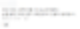
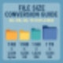

# 로칼이 대체 몸니까?
**Date:** 2026. 1. 18. 0:42
**Category:** 다이어리
**Original URL:** https://blog.naver.com/xpfkwh56/224150403089
---

​

1. 인공지능 하면, 대표적인 것은?

​

**'GPT'**

**​**

GPT 는 어떻게 돌아가냐?

​

온라인 서버로 돌아간다

무슨 온라인 서버로 돌아가냐?

​

대중교통처럼 모두가 사용하는

공용된 서버 안에서 연산하는

특정한 클라우드 안에서 돌아간다

​

장점이 뭐냐? 쉽다, 편하다

단점이 뭐냐? 그게 **끝** 이다

​

GPT 한테 본인이 아는 아무 글이나

긁어서 복붙으로 PDF 100p 짜리

보여주고 읽어보라고 하면 소설 쓴다

​

**왜 why?**

​

뭐 여러 이유가 있지만,

간단하게는 **'출력 한계'** 때문

​

출력 한계가 뭔데?

​

1) GPT 는 사람들이 생각하는 것

이상으로 아주 똑똑하고 대단한 것

​

2) 마치 학원으로 비유하면,

현우진이 온라인에서 챗봇처럼

사람들한테 대답을 해주는 것

​

현우진은 **'아주아주 뛰어난 사람'**

​

근데 현우진이 100만 명을

대상으로 대답하는 상황이면?

​

본인이 아는 것을 다 쓸 수 있을까?

그렇게 일을 하면 현우진은 죽게 됨

​

**\* 대답 좀 하다 무리 가면**

**본인이 아, 이건 에바다 하고**

**할 수 있는 만큼만 할 것 임**

**​**

GPT 는 기계니까, 죽지는 않음

대신 어떤 일이 일어나냐?

​

**'돈이 오지게 들어감'**

​

테슬라가 그록 만들 때, **10조** 썼음

​

**\* 인프라 값만 10조**

**​**

10조 땅바닥에 버렸냐?

썼으니 본전을 찾아야 됨

​

그럼 무슨 생각을 하냐?

​

들어간 돈, 들어올 돈 따져서

어디까지 **'풀어놔야'** 가늠을 함

​

그래서 출력 성능 **'제한'** 을 걸음

​

뭐 적당히 걸 수도 있는 것 아닌가?

​

**'사람들이 생각하는 것 이상으로**

**굉장히 제한이 빡씨게 걸려있음'**

​

업체는 절대, 하드캡을 공개하지 않음

​

**\* 공개해도 믿을 수 없는 정보임**

**원리를 알면 그 이유가 당연하게 됨**

​

통상적으로 시중 모델의 경우,

하드캡 100k 정도 쯤이 정배인데

​

비유 하자면, **A4 용지 50-100장**

이미지로는 **적당한 이미지 30장** 임

​

즉, 지피티를 쓰든 제미나이를 쓰든

그게 최신이든, 레거시 모델이든 간에

​

**'하드캡'** 달린 모델은,

저 정보 이상의 것을 못 다룸

​

더 구체적으로 무슨 말이냐?

​

이미지 40장을 분석 시키고 싶다,

​

그래서 40장을 올리면

얘는 40장 중에, 본인이 봐서

​

**'리소스 덜 먹는 몇 장만'** 보고,

나머지는 **'상상'** 해서 채워 넣음

​

본 것도 정확하게 본 것이 아님

​

**\* 출력 제한이 있으니까**

​

글도 마찬가지, 책 1권을 보여주면

앞/중간/뒤를 다 잘라서 읽은 다음

​

보통은? 뒤 내용만 거의 집중해서

중간 중간 본인이 **소설 쓰게** 될 것임

​

이게 GPT 가 **횡설수설 하는 이유** 임

​

GPT 한테 **'링크를 가져와라'** 하면,

**'짤린 링크'**​ 를 가져올 때도 있을 것

​

**\* 실상 얘는 검색하는 것이 아님**

**​**

그 이유도 똑같음,

​

출력 제한이 걸렸기 때문에

웹 크롤링, 검색이 안 되는 것

​

이건 어떻게 교정할 수 있냐?

개선할 수 있냐? **불.가.능** 함

​

프로 모델을 쓰든, 뭐 있진 않지만

100만원 구독제 모델이 있든 간에

​

클라우드를 쓰는 한, 퍼포먼스,

출력 제한은 **절대** 해결할 수 없음

​

왜 **'절대'** 라는 표현을 하냐?

​

놀랍게도, **이 장사는 돈이 안 됨**

​

**\* 내일 당장 다 망해도 안 이상함**

**​**

동네에 피시방들이 여럿 있음,

근데 그 피시방들이 서로 경쟁함

​

**'결국 1명이 살아 남는다면'**,

이 시장을 다 먹을 수 있으니까

​

그래서 1대에 500만원, 1천만원

하는 컴퓨터를 100대, 200대씩 둠

​

사람들이 와서 마구 사용하는데,

이거 점점 이상하다는 기분이 생김

​

처음에는 바로 돈이 될 줄 알았는데

생각보다 **'수익화'** 가 잘 안 되고,

​

들어가는 비용이 점점,

**'천문학적인 단위'** 로 바뀜

​

**\* 대부분 클라우드 업체는 제공하는**

**서비스 성능을 전부 내렸던 전례 있음**

**안 내린 업체는 없나요? 싹 다 망했음**

​

그래서 **'라이트 유저'** 만 받기로 함,

​

헬스장을 먹여 살리는 것은,

몸 만들어보겠다고 큰 마음 먹고

1년치 긁고 안 오는 사람이지

​

맨날 와서 PT 도 안 하고,

기구만 쓰는 그런 놈이 아님

​

고성능 컴퓨터인데 손님들이 와서,

**인터넷** 이랑 **유튜브만** 볼 수 있음

​

롤이라도 돌리려고 하면?

바로 **'샷다운'** 걸어버림

​

이상하네, 좋은 컴퓨터 라는데

왜 여기선 fps 15 밖에 안 된담?

​

컴퓨터가 후진 것이 아님

업체에서 **'막아둔 것'** 이지

​

**만약 이걸 풀면?**

​

전 세계 1위 부터 10위 부자가

전부 모은 돈을 합쳐도 **1년 컷** 임

​

1년도 **'아주 넓게'** 잡은 것 임

​

오픈 AI 하루 활성 사용자가

보통 추산 잡아도 2천만 임

​

**\* 국내**

​

질문 1회에 다 없다 치고 인풋,

아웃풋 2천 토큰 쓴다고 가정하겠음

​

정확하진 않지만, 질문 하나 할 때마다

업체는 **'최소'** 25원 정도는 쓸 것임

​

**'10회만'** 질문 해도, 하루에 50억 임

​

글로벌 기준으로 **2억** 정도가 씀

똑같이 10회 쓴다고 치면 **500억** 임

​

100번 티키타카 하면?

하루에 **5천억** 씩, 녹아내림

​

참고로 이게 하드캡 100k 임

​

하드캡 200k 로 올리면,

1조, 400k로 올리면 2조 임

​

**'하루에 2조를 써야 됨'**

​

저렇게 매일 1년을 쓴다고 치면,

대한민국 정부 예산과 거의 동일

​

사람들이 하고 있는 것은,

현우진을 데려다 놓고

​

마치 **하루에 2억명** 이 질문하면서

현우진 수학 잘 못 하네? 하는 꼴임

​

**\* 현우진은 답의 퀄리티가 어떻든,**

**무조건 2억명에게 대답을 해야만 함**

**​**

2. 그럼 만약에, GPT 같은 걸,

**'내 전용'** 으로 쓸 수도 있을까?

​

그게 바로 **'로칼'**

​

GPT 는 10분 마다

기억을 잃는 천재 임

**​**

**\* 얘는 몸에 문신도 안 함**

​

로칼은 그거보단 머리가 나쁜데,

손님이 1명 이고, 기억을 영속적으로

언제나 내가 원하는 수준으로 기억함

​

**그럼 하드캡 1m, 2m 도 가능해요?**

​

물론 하드캡 자체도 **'없지만'**,

그럴 필요 자체가 없음ㅋ

​

**왜 why?**

​

GPT 가 하드캡이 중요한 이유는,

모든 정보를 클라우드에 두기 때문

​

**\* 물리적인 하드캡 제한은 없지만,**

**컴퓨터 성능 때문에 일정 한계 존재**

​

즉, 클라우드에 있는 기억된 정보를

얘는 **'호출하는 연산 비용'** 이 존재

​

그래서 모든 것을 기억하고,

모든 것을 다 찾아서 말해야 됨

​

**그러나, 본인 하드에 있다면?**

​

1) 하드에 있는 모든 기억을 훑고

2) 내가 지금 필요한 내용만 찾아서

3) 그 내용만 머리에 넣고 연산 가능

​

즉, 책 100만권이 있을 때

​

클라우드 모델은 100만권을

전부 읽은 다음, 내 질문 답 함

​

**\* 항상 머리에 100만권 필요**

**​**

로컬은 100만권을 읽은 다음에,

내가 지금 뭘 묻고 있나 찾고,

​

거기서 유효한 정보를,

본인 머리에 **'넣어놓고'**

​

**'넣어둔 것'** 과 **'본 것'** 을

구분해서 대답을 하게 됨

​

그래서 저밀도 정보는 다 치우고,

고밀도, 중요한 맥락만 기억해서

​

**그걸 그대로** 성능에 반영할 수도 있음

​

서울대 나온 사람도 같이

일 해보니까 별 것 없던데?

​

힘들게 서울대 출신 뽑아놓고,

​

싱크대에서 설거지만 시키면

당연히 그걸 누굴 쓰든 뭔 상관

​

만약 서울대 출신 앉혀다놓고,

나에 대해서 **'기억'** 하게 시키면?

​

적어도 처음 본 놈 보단 나을 것임

​

이게 **'학습'** 임

​

사용자 환경 설정 하는 것처럼

커스텀 하면, 내 입맛대로 맞는

LLM 모델을 사용할 수 있는 것

​

**클라우드에도 그런 것 있는데요?**

​

거기에 글자 넣어보세요

과연 몇 글자 들어가낰ㅋㅋ

​

무궁무진하지만 LLM 하나만 잡아도,

제미나이/GPT 이런 것만 있는 것 아님

​

파인튜닝 된 도메인 특화 모델이 있고,

LLM 모델을 내가 쪼개서 쓸 수도 있음

​

**\* 활용성은 말하면 무한해서 끝이 없음**

**​**

**흐음, 내가 찾아보니까 로컬로 하면**

**이거도 안 되고, 저거도 안 된다던데?**

​

검색해서 찾지 말라는 이유가,

​

아마 그거 검색해서 읽으신 사이에

**최소 1세대 이상**, 무조건 발전해있음

​

**\* 오픈 소스의 위력, 일단 공짜니까**

**미친 놈들이 미친 놈처럼 개발을 한다**

**​**

저도 나름 검색 좀 친다는 사람인데,

네이버를 뒤지든, 구글링을 하든 간에

​

**'내가 찾았던 것 기준으로'**

안 된다는 것은, **'다'** 가능했음

​

이게 시계열 자체가 매우 다른데,

​

**'작년'** 에는 10억 정도 있어야 하던 것이

**'금년'** 에는 1억 이면 가능한 상황 임

​

<https://huggingface.co/deepseek-ai/DeepSeek-R1-0528>

[**deepseek-ai/DeepSeek-R1-0528 · Hugging Face**

We’re on a journey to advance and democratize artificial intelligence through open source and open science.

huggingface.co](https://huggingface.co/deepseek-ai/DeepSeek-R1-0528)

​

3개월 안 걸리게 만든 딥시크가,

현존 ai llm 모델 성능 다 발랐음

​

아, 성능 좋은 것은 알겠는데

그래서 그거 집에서 돌아가요?

​

원래 **'2억'** 있어야 돌릴 수 있는데,

​

**\* 인프라 장비 기계값만 2억**

​

그게 지금 **1천만원** 까지 떨어짐

​

**예전에는 2억 없는 사람은**

**손가락만 빨고 구경해야 했던**

**서비스가 1천으로 가능한 것**

​

**\* 물론 생태계 이슈가 있어서,**

**저거 사용할 때 지불할 것 있음**

**​**

여기서 만약에 고사양 GPU

가격이 더 내려간다면 어떨까?

​

**'당연히 훨씬 더 저렴해지고,**

**할 수 있는 것은 훨씬 많아짐'**

​

그럼 고사양 GPU 사면 손해네?

​

**'모델 요구 사양이 내려가면서,**

**고사양 GPU는 이전보다**

**더 뛰어난 걸 할 수 있어짐'**

​

만약 할 수만 있으면 무조건

하이엔드 하란 이유가 이거

​

3. 그래픽 카드 바꾸고, 라마 깔고

거기에 그냥 말 하고 RAG 학습 시킨다

​

**이러면 제가 지금 로컬 쓰는 것 맞나요?**

​

맞긴 맞죠, 근데 대치동 아파트 들어가서

학교도 안 보내고 있는 그런 느낌 이지요

**​**

무궁무진한 모델들, 연구들이 많으니까

그 안에서 내가 접목 시키고 싶은 것 있으면

그걸 있는 그대로 고스란히 쓰면 됩니다

​

딥시크 다운 받아가지고,

아 한국어 잘 못 알아들어요 (x)

​

뭐만 물어보면 다 검열 걸려요 (x)

​

**이건 너무 못 쓰고 있는 겁니다**

​

비싼 것은 **'모델'** 입니다

​

**\* 개인이 만드는 것 불가능**

**딥시크 만드는데 5억 달러 씀**

​

정보를 최적화 시키고, 모델을 추가하고,

도메인 정보를 입력하고, 파인 튜닝 하면

​

품질의 레베루가 달라져버림

​

**\* 게임 모드 까는 것과 동일**

**​**

**여기에, 막강한 성능을 기반으로**

**쉬지 않고 쏟아지는 ai 과학 기술을**

**집에서 혼자 적용하면서 쓴다면?**

**​**

뭐야, 이게 도대체 어디까지

가능한거야? 소리가 나오게 됨

​

가볍게 쓰고 있다면

체감 어려운 것이 당연

​

오히려, **'자유'** 가 족쇄가 됨

​

식당 가서, 추천 메뉴 딱 보고

그냥 정해진 것 먹고 싶다면

​

로컬을 쓸 이유도, 필요도 없음

​

**그렇다면 로컬로 돌리면?**

**​**

식재료도 내가 사야 하고,

손질도 내가 해야 되고,

메뉴도 내가 정해야 되지만

​

**'주방'** 에서 내가

**'직접'** 조리할 수 있음

​

남들이 밀키트, 전투식량

오독오독 먹고 있을 때

​

방금 만든 집 밥을, 내가

장 본 식재료 로 만드는데

​

이게 차이가 없을 수가 없죠

​

4. 활용, 너무 막연한데 뭐 좀 만만하게

예시로 들어주실 수 있는 것이 없을까요?

​

1-1) 오픈 라이브러리 잘 찾아내면

고등지식 가득 담긴 대학 교재가

pdf 파일로 **'무한하게'** 존재합니다

​

그거 죽을 때 까지 봐도 다 못 봅니다

​

1-2) 거기 카테고리 들어가서,

어린이, 아동, 유아 로 잡은 다음

​

​

자동 다운로드 매크로 거신 다음,

**'넉넉히'** 10gb 정도 다운 받으세요

​

**\* 보통 10mb 언더 입니다**

​

그럼 적게 모으면 한 500권 쯤,

많이 모았다 치면 1천권 쯤 나옴

​

그거 OCR 모델로 추출한 다음에,

파싱하고 임베딩 잘 꾸려놓은 후,

​

**\* 쉽게 말해, 컴퓨터가 읽을 수 있게**

​

그거 기반으로 LLM 을 짜든,

뭐 어디에 쓰든 쓰시면 됩니다

​

**LLM 로 쓴다면?**

​

아동학 대학교재 1천권 읽은

**아동 전문가 비서** 가 생기겠죸ㅋ

​

2-1) 맘카페든, SNS 든 간에

들어가서 뭐 재주껏 크롤링 하든

아니면 수동으로 긁어서 만들든,

​

거기 있는 글자, 이미지 데이터셋을

알잘딱으로 열심히 잘 가공을 하세요

​

그 다음에, 그걸 RAG 에 넣고

마케팅 페르소나로 쓰면

​

**'인간이 없어도, 고객 반응'** 을

​

제한적으로 유추할 수 있는

시뮬레이션 모델이 나옵니다

​

2-2) 같은 맥락으로 인터넷 쇼핑몰에

온갖 사람들이 달고 있는 리뷰를 긁고,

​

그걸 데이터셋에 넣어서 정제 한다면

고객 반응군에 따른 연산 모델이 나옴

​

3) 마음에 드는 소설을 잔뜩 찾으세요,

그리고 그 모든 것들을 전부 넣으세요

​

다빈치풍으로 그려줘, 유화로 그려줘 와

세익스피어처럼 적어줘, 라는 것은

​

**'기계'** 입장에서 동일한 주문 입니다

​

세익스피어가 2025년에,

라노벨 스타일로 쓰는 소설을

써달라고 하면 나올 겁니다

​

위의 1번이든, 2번이든

3번이든 **얼마 정도** 할까요?

​

만약 저거 사람이 하려고 하면,

1억, 2억으론 엄두도 못 냅니다

​

**'팔지만 않고, 바깥에 꺼내지만 않으면'**

문제가 될 가능성은 **'현재까지'** 낮지만,

​

조만간, 전부 규제 걸릴 겁니다

​

**\* 확신**

**​**

흠흠 제 콤퓨타에는 지금

10TB 정도의 데이터를

보유하고 있는 상태입니다

​

제가 이런 시점에 강남 아파트 라든가,

빅테크 주식에 관심이 생길 이유가 없죠

​

그거 보다 더 좋은 것들이

땅바닥에 널부러져 있는데