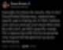
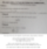

# 말 나온 김에
**Date:** 2026. 1. 18. 4:29
**Category:** 다이어리
**Original URL:** https://blog.naver.com/xpfkwh56/224150498251
---

쓰고 계신 구독 AI 뭔진 모르겠지만,

거기에 조-금만 공부 더 하셔가지고

​

API 만 붙여서 굴려보셔도,

**'엥, 너 뭐임?'** 싶으실 것임

​

프로바나나 기준으로 치면,

​

no api = 1k

api = 4k 차이 납니다

​

이미지 생성 모델 화질이

4배 차이 난다는 소리임요

​

**성능으로 따지면 16배 증가**

​

**\* 심지어 이게 종결 성능도 아님**

**​**

유튜브 대체로 남들이 144p,

재주 좋아야 480p 정도 보는데

나는 그걸 2160p 로 보는 차이 ;;

​

**\* 144 → 2160 = 200배 이상**

**480 → 2160 = 대충 16배 정도**

**​**

이게 어떻게 차이가 없을 수 있음

**​**

​

오픈 AI 는 작년에 IMO 금상

찍은 모델을 만든 회사 입니다

**​**

**​**

불과 4일 전에는, 퍼트넘 수학 경시 대회

나가서 12개 문제 전부 맞춘 모델도 나옴

​

<https://github.com/AxiomMath/putnam2025?tab=readme-ov-file>

[**GitHub - AxiomMath/Putnam2025: Our solution to Putnam 2025.**

Our solution to Putnam 2025. Contribute to AxiomMath/Putnam2025 development by creating an account on GitHub.

github.com](https://github.com/AxiomMath/putnam2025?tab=readme-ov-file)

**​**

**'가능성'** 이 저평가된 상태가 아니고,

**'있는 기술'** 도 모르고 있는 상태 에요