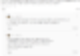
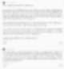

# 뭐 만들어?
**Date:** 2026. 1. 18. 15:03
**Category:** 다이어리
**Original URL:** https://blog.naver.com/xpfkwh56/224150838510
---

​

1. 그냥 최신 기술 배워서

전부 싹 다 박으면 안 됨?

​

닭 잡는 칼, 소 잡는 칼을

구분해서 쓰는 것이 재주

​

2. 사물을 구분하는 모델 중에,

​

sam mobile 이 있고,

sam3 이라는 것이 있음

​

전자는 40mb 정도고,

후자는 **'최소'** 2gb 임

​

풀 구성하면 추론 vram이

12기가를 넘는데,

​

**\* 양자화 안 하면?**

**최소 20기가 이상**

**​**

**제 컴퓨터는? 32gb**

**그럼 저거로 20gb 쓰고,**

**12gb 로 해야 되는데 ,,**

**​**

**2천원 줄 테니까 스타벅스 가서**

**커피 사 오고, 올 때 뼈해장국 사와**

**뭐 이런 요구나 다를 바가 없죠**

**​**

당연히 제가 1억, 10억 넘는

거대한 서버 컴퓨터도 있고,

​

돈도 너무 썩어나는 사람이면

우와 재밌겠다 하고 다 하겠지만,

​

사물 체크에 저렇게 리소스 쓰면

그거 말곤 아무것도 할 수 없음

​

**\* 가능하면 하이엔드**

**사라는 소리도 이거임**

​

sam mobile 은요?

​

한참 양자화해서 깎으니까

맥시멈 300mb 정도 먹음

​

**\* 이건 그래도 쓸 수 있겠다 레벨**

**​**

300mb 면, 멀티 프로세스 열어서

10개를 해야, 3gb 를 찍는데

​

sam3 고성능 단일 모델 쓰면,

​

어쨌거나 뭐든 **'1개'** 할 때,

바로 12기가 먹고 시작해버림

​

대신, 그건 **'거의 완벽하게'**

해결해 줄 수 있겠죠

​

3. 제가 적용했던 아이디어는,

비디오 자체를 읽는다가 아니고

​

**\* 애초에 영상 분석을 할 때**

**​**

영상을 일단 찍은 다음에,

겹치는 프레임 지우고

​

픽셀 변화량 적은 것만 추려서

**'이건 바뀐 것이 맞다'** 라는 것만

골라서 그 이미지만 따로 연결해,

​

**\* 어떻게 보면 fps 를 줄인 셈**

​

이미지만 따와서, 그거만 **연산** 함

​

CCTV 는 24시간 풀로 안 돌아감,

특정 시간대나, 특정 조건에만 가는데

​

거기서 봤던 아이디어를 차용해서,

​

**'영상이 아니라 이미지 정보를**

**빼서 읽으면 되잖아?'** 로 응용했음

​

**\* 영상 > 이미지 > 텍스트 순서로**

**정보 처리 부담이 증가하기 때문임**

**​**

이렇게 하면, 영상에서 1차 필터,

이미지에서 2차 필터, 텍스트 캡션과

이미지 비교하면서 3차 필터라서

​

정확도는 더 높은데,

수행 연산은 더 감소함

​

**\* 상황 마다 다를 수 있는데,**

**제가 돌렸을 때는 그랬읍니다**

**​**

**메타 데이터 선별 후, 연산의 경우**

**특정 조건은 잡았지만 나머지에선**

**유의미한 결과값이 보이지 않았음**

**​**

4. 왜 그랬냐?

​

**너 나만 계속 쳐다보면서,**

**내가 뭐 하는 것인지 다 말해**

​

숨 쉬고 있습니다

숨 쉬고 있습니다

숨 쉬고 있습니다

숨 쉬고 있습니다

​

이렇게 나오니까,

​

**숨 쉬는 것은 빼**

​

배가 들어갑니다

배가 나옵니다

배가 들어갑니다

배가 나옵니다

배가 들어갑니다

배가 나옵니다

​

**호흡이랑 관련된 것은 빼 ;;**

​

숨은 제가 잘 압니다

근데 호흡이 뭔가요?

​

**(호흡과 숨의 차이에 대해 알려줌)**

​

언니 ,, 나 ,, 몸이 뜨거워 ,,

머리가 너무 ,, 복잡하고 ,, 아파

​

**\* 1개 분석할 때, 1시간 걸림**

​

이렇게 되기 때문임

​

5. 코딩이야 아닌 말로 맡기면 그만이고,

어차피 널리고 널린 것 붙여 쓰면 그만인데

​

**'생각'** 을 하는 것이 오래 걸리고 어려움요

​

어떻게 하면, 내일의 내가 편할까?

넓게는 결국 이런 문제를 풀고 있음

​

6. 본문으로 돌아가면 어떤 것들이 될까요?

​

**'손'** 이 **'분유'** 와 터치할 때마다,

이동 했다고 달아볼 수도 있지 않을까요

​

그거 아니면 만질 일이 없으니까,

그리고 규칙에서 벗어난 행동이라면

그거만 예외처리 해서 잡는다면요?

​

**'해봐야 안다'**

**​**

이러니, 도끼자루 썩는 줄

모르고 돌리게 되는 것 임