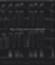

# 오버클럭 예시
**Date:** 2026. 1. 18. 20:57
**Category:** 다이어리
**Original URL:** https://blog.naver.com/xpfkwh56/224151118912
---

​

1. 최대 전력 소모 618 w,

평균 전력 소모 5xx w

**​**

2. 온도 최대 62도 이하

오프로드 X 쓰로틀링 X

​

3. 부스트 클럭 기준, **'3300'**

무난하게 유지될 때는 **'3200'**

​

**\* 제조사 보증 기준치 보다**

**25-30% 정도 더 쓰는 것 임**

**​**

담력만 있으면 집에서도 간단히

이런 것을 구경할 수 있긴 합니다

**​**

**4. 이게 뭐 한 것임요?**

​

포르쉐로 최대 시속

300km 밟은 것과 같음