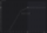
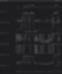
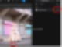

# 원리를 알고 써야 됨니다
**Date:** 2026. 1. 18. 20:27
**Category:** 다이어리
**Original URL:** https://blog.naver.com/xpfkwh56/224151093324
---

그냥 X, Y 축 읽으면 됨

​

1. 이 곡선이 의미하는 바가 뭐냐면,

​

점과 점 사이에 기울기가 가파르다

= 전압을 넣는 족족, 클럭 효율이 좋다

​

반대로 점과 점 사이 기울기가 별로다

= 전압을 넣어도, 클럭 효율이 별로다

​

이겁니다

​

**\* 앞글에 있는 세전, 세후 소득 비유**

**​**

**​**

2. 즉, 언더 기준으로 선택할 구간은

​

몇, 몇을 세팅하고 어떻게 해라

이렇게 국룰로 정해지는 것이 아니고

저렇게 크게 세 구간으로 나뉘게 됨

​

이걸 어떻게 기준을 잡냐에 따라,

본인이 선택할 수 있는데 본문에서는

편의상, 그냥 있는 디폴트 로 잡겠음

​

A = 전기를 최대한 덜 쓰고,

나는 성능의 손해를 감수한다

​

B = 70% 정도 발휘 했으면

거기서 안정적 출력으로 충분

​

C =최대한 끝까지 뽑아먹겠다

D = 언더볼팅 안 하고 그냥 쓴다

​

​

3. 그래서 각각 구간을 잡은 다음에,

​

​

결과를 확인해볼 수 있는데,

​

​

Flux 2.0 dev 모델 기준으로,

40 steps, 1024 \* 1024 이미지

뽑는 시간 30초 걸리고,

​

애초에 제가 최적화를 잘 해놔서,

vram 한계까지 쓰진 않았지만

​

B 구간 선택 시에는

max 575w, 2865 클럭

​

C 구간 선택시에는

max 581w, 2947 클럭

​

성능 -2.8% 손해

전력 -6w 이득

​

**\* 평균은 더 계산해서 확인해야 되는데,**

**그게 중요한 것이 아니니 일단 생략 함**

​

발열은 어차피 똑같이 움직였고,

​

**\* 피크값 기준, 근데 냉각도 제가 참으로,**

**민망한 이야기지만 매우 잘 설정 해놨긴 함**

​

만약 GPU 온도로 따지면 여유 잡아서

1도 정도 이득 봤다고 볼 수 있을 듯

​

**4. 결론**

​

상황, 조건마다, 사용 목적마다

출력을 다르게 쓸 수 있는 것임

​

B 구간과 C 구간을 각각 평탄화 해서

일정 전압이 유지되도록 할 수도 있고,

​

A 구간을 더 촘촘하게 자를 수도 있고,

​

취향마다, 판단마다 주어진 전압값을

어디에 지불하고 투입할지 결정하면 됨

​

평균 전압을 높게 가져갈 것인지,

아니면 피크 성능을 중시할 것인지,

​

자고 일어날 동안, 절대 무슨 일이

있어도 변수가 있길 원하지 않는지

​

환경에 대한 이해를 갖고 써야 됨