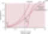
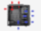

# 과학을 배우는 방식
**Date:** 2026. 1. 19. 16:41
**Category:** 다이어리
**Original URL:** https://blog.naver.com/xpfkwh56/224152109948
---

​

**1. 현학적임, 재미 없음**

**어려움, 복잡함, 집중 안 됨**

​

​

2. 어떻게 하면 컴퓨터

케이스의 공기 흐름을

더 원활하게 할 수 있을까?

​

3. 흡기가 중요하다

vs 배기가 중요하다

​

흡기 → 외부에 있는 공기를 안으로 밀어 넣는 것

배기 → 내부에 공기를 밖으로 빼내는 것

​

총 10개의 팬을 쓴다고 가정하겠음,

​

올배기, 올흡기, x:y 비율 배정

​

**1) 올배기**

​

컴퓨터가 고성능 진공 청소기가 됨

​

현실은 아니겠지만 이론상

음압(진공상태) 에 가까워지고

내부에 있는 부족한 공기를 채우기 위해

​

케이스에 있는 미세한 모든 틈새를 통해

주변 공기가 빨려들어옴

​

**2) 올흡기**

**​**

모든 팬이 바람을 안으로

밀어넣기만 하기 때문에,

내부에 난류가 발생함

​

소용돌이 치면서 기체 분자들이

계속 끊임없이 방황하는 일이 생길 것임

​

**\* 찜질방**

**​**

그럼 올배기, 올흡기는 다 바보들이냐?

​

**아님**

​

케이스가 작으면 작을수록

남조선 컴퓨터 사용 환경 감안할 때,

​

어차피 여름에 에어컨 거의 다 쓰니까

내부에 공기를 머물 공간을 줄일수록

​

올배기는 가장 큰 효율을 보일 확률 높음

​

마찬가지로, 오픈 프레임 같은 경우는

그 형태가 조금 달라질 수는 있겠지만

올흡기를 구축할 때, 가장 좋을 것임

​

**즉, 내부에 있는 공간이 작다**

​

그럼 어차피 계속 안에 있는 공기를

빨리빨리 꺼내는 것이 더 낫고,

​

**\* 들어가고 나가는**

**딜레이가 의미 없으니**

​

반대로 공간이 규정되지 않았다,

그냥 케이스가 없고 **뚜껑 열려있다**

​

그럼 선풍기 바람 같은 걸로,

바로 직접 쏴주는 것이 더 낫지

​

그걸 굳이 뺄 필요 없다는 것임

**​**

**\* 여기까진 중고딩 물리 수준이고**

**과연 진짜 그런가? 는 실험 하면 됨**

​

4. 결론만 보면, **'일반적인 경우'** 는

적절한 그 비율을 상황에 맞춘다가 답

​

그럼 여기서 한 걸음 더 나아갈 수 있음,

​

**'대체 최적의 비율은 뭘까?'**

​

공기가 들어오고 나갈 수 있는 곳은

전면, 후면, 상단, 하단 이렇게 **4개** 임

​

**\* 케이스가 사각형인 경우라면**

**​**

베스킨 라빈스 같은 곳에 가서,

드라이 아이스를 얻어온 다음에

​

어디에 몇 개를 위치 시켰을 때,

내부 기체 순환 흐름이 어떻게 되나

​

를 관찰하면, **'알아서 과학을 알게 됨'**

**​**

**히터는 높은 곳에 달아야 할까?**

**아니면 낮은 곳에 달아야 할까?**

**​**

그렇다면 에어컨은? 왜?

​

결국 같은 문제를 푸는 건데,

이렇게 접근하면 깊이가 달라짐

​

24/7 계속 돌아가는 것이 아니라,

특정 온도에만 반응해서 특정 구간에

있는 공기만 효율적으로 뺄 수 없을까?

​

라는, **'생각'** 을 하면 탐구 활동이 됨