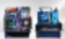
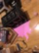
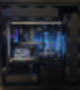

# 욕심이 있을 때, 하면 좋은 것
**Date:** 2026. 1. 19. 16:13
**Category:** 다이어리
**Original URL:** https://blog.naver.com/xpfkwh56/224152070515
---

​

더 비싼 것을 사려고 하지 말고,

**'커수'** 를 알아보세요

​

이게 개인용 컴퓨터

조립 끝판왕 기술인데

​

모든 전기 제품은 **'열'** 과 싸웁니다

​

즉, 같은 출력을 내는데

**'덜'** 뜨겁게 관리할 수 있으면

​

다룰 수 있는 성능이 **훨씬** 커져요

​

**흠, 그냥 찬 바람 넣으면**

**알아서 식는 것 아닌가요?**

​

혹시 그런 생각이 들었다면,

중학 물리 찬찬히 공부해야죠

​

공냉과 수냉은 온도 차이가

작게 잡아도 **'10도'** 입니다

​

**\* 20-30도 차이는 그냥 발생**

**​**

이 온도를, 주식 수익률로

이해하면 더 간단한데요

​

똑같은 돈으로 똑같이 주식해서

누구는 연 5% 수익률 간신히 찍는데

​

누구는 연 10% 수익률을

그냥 가뿐히 찍는 것임

​

**와, 그럼 그거 왜 안 해요?**

**​**

**​**

**컴퓨터가 터져요**

**​**

**\* 누수 = 전기 + 물 → 즉사**

**​**

GPU 같은 것이야

다시 사면 된다고 쳐도

**​**

**SSD 같은 것은 일단 고장 나면**

**현실적으로 돌이킬 수도 없음**

**모든 데이터가 전부 날아가는 것**

**​**

특히 NVMe 는 아주 성능이 뛰어나지만

일단 데이터 손실 발생하면 현존하는

과학 기술로는 되살릴 수 없다고 봐야 됨

​

**\* 제한적인 조건 내에서는 가능**

**​**

돈 많이 주면 해줄 수 있지 않나요?

​

그걸**'재현'** 가능하게 할 수 있는 사람은

노벨상을 받으면 받았지, 여기엔 없을 듯

**​**

**​**

커수는 공임비만

**100만 원대** 입니다

​

**\* 하이엔드로 가면**

**보통 천만원이 넘음**

**​**

**​**

커수의 꽃이 **gpu 쿨링** 인데,

​

저건 아스트랄 달고, 팽팽 돌려도

40도 이상 안 올라갈 정도임