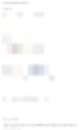
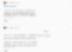
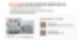
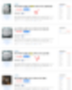
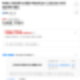

# 트레이딩
**Date:** 2026. 1. 19. 15:53
**Category:** 다이어리
**Original URL:** https://blog.naver.com/xpfkwh56/224152041549
---

​

1. 미래의 내가, 월 100만원씩 할부로

1년 내내 갚는 것보다 오늘의 내가

천만원 짜리를 저렴하게 사는 것이 **낫다**

**​**

**1) 오늘, 바로, 간편하게, 전부 다 사기 (x)**

​

당연히 비쌉니다, 택시 타는 것이니까요

​

**2) 천천히 필요한 것을 하나씩 배우면서,**

**필요한 물건을 좋은 가격에 나올 때,**

**마치 주식 사는 것처럼 사서 모으기 (o)**

​

통장에 1억 있습니다, 주식 뭐 사요?

이거 사세요, 오케이 갑니다~

​

투자 하실 때, 사용하시는 논리를

모든 **'거래'** 에 적용해서 사용하세요

​

우리가 배운, 주식 기술은

여러모로 비싼 기술 입니다

​

트레이딩을 잘 하는 사람은,

**인생 전반의 효율** 이 좋아져요

​

우린 **'변화하는 상품'** 을 사는 겁니다

​

**2. 트레이드 오프**

​

1) 멀티팩이 보면, 더 저렴합니다

​

​

근데, A/S 가 **셀프** 입니다

​

**\* 제가 계속 모르면 안 된다는 이유,**

**말씀하신 견적 얼추 해도 1200 인데**

**아무것도 모르고 구입하면 2천 쯤 임**

​

​

즉, 92만원 으로 살 수 있는데

​

​

검색하니까, 할부로 사면 100 또는

결제 할인 받아서 99.x 에 살 수 있음

​

**\* 어디라고 최저가 아니고,**

**다이내믹하게 계속 바뀝니다**

**​**

그럼 이제 의사결정을 하면 됨

​

a. 1년 뒤에, 내 현금의 가치는?

만약 그게 10% 보다 높다면?

낮다면? 상황에 맞게 판단이 가능

​

b. 무이자 할부나, 카드 한도를

맞춰서 사용하면 어떤 이득 있지?

​

같은 것도 **'같이'** 활용할 수 있음

​

예를 들어, 5개월

무이자 할부 가능하고

​

피차 내 손에 5개월 동안

현금 당장 없어도 그거 갖고

마땅히 뭐 할 것이 없다?

​

그럼 미래가치 할인율 적용해서

그거에 맞게 사는 것이 더 이익임

​

**\* 당연한 소리**

​

고소득 프리/사업자들의 경우에는,

이거로 마술 부리면 **아주** 효율 좋음

​

그게 아니라도 **'해볼 수'** 있는 것 있음

​

사업자 등록하고, 사업자 명의로 계산서 발급하고,

사업자과 관련된 직접적인 자산인 것을 증명한다면?

​

**'부가세'** 를 활용할 수 있어지죠

​

**\* 만약 할부 + 부가세를 합치면?**

**​**

2) 어떤 주식이 있는데, 1년에 버는 돈은

1억 밖에 안 되고, 시총은 30억 정도 함

​

그럼 이 주식은 사야 할까?

대체로는 살 이유가 없는 주식임

​

**\* 너무 비쌈**

​

근데 보유하고 있는

현금성 자산이,

100억 이라면?

​

믿고 거르는 국장에서는,

그래도 애매한 부분 있지만

​

**'컴퓨터'** 는 조금 다를 수 있음

​

시중에 있는 중고 컴퓨터인데,

케이스 같은 경우는 아닌 말로다가

​

**'느낌 감가'** 지, **'성능 감가'** 가

발생할 가능성이 거의 없는 제품

​

문제집 가격이 10만원인데,

이 친구가 앞 페이지 5장만 씀

​

나머지는 **'손도'** 안 댔다면?

​

아무리 비싸도, 이 문제집은

2만원을 받기 어려운 편 임

​

그럼 5장 페이지 남의 손 탔던

문제집을 2만원에 살래? 아니면

​

새 제품으로 완전 깨끗한 물건을

10만원 주고 살래? 를 고를 수 있음

​

**3) 128gb 가 64/96 gb 보다 저렴하다**

​

렘을 병렬로 사용하는 것은 어렵고,

불안정하며, 제대로 성능도 잘 안 나옴

​

그래서 통상, 2개 정도 쓰는 것이 국룰

​

ram 64 는 표준 모델이기 때문에,

규격이 상대적으로 안정적이고

​

소프트웨어 호환성도

대체로 더 넓은 반면에

​

ram 48 은 ddr5 나오면서

생긴 비표준 용량이라서

​

구축하는데 더 난이도가 높음

​

그래서 64 \*2 세팅보다

48 \*2 세팅이 **'더 비쌈'**

​

**\* 바이오스 어려움**

**​**

32, 48 배수로 잡았을 때,

48 배수는 없는데 32 배수는 나옴

​

문제는 64 에 통용되는 모델이

96 에 통용되는 모델보다 많아서

​

시장의 수요에 맞게, 16 32 64 128

이렇게 타고 갈 때, 가격이 **더 저렴함**

​

다나와 찾아보니까 최저가

신제품 가격은 비싸던데요?

​

**'1년에 그거 몇 개 팔리나 보세요'**

​

**하나만 걸려라** 임

​

보셔야 되는 것은

**'업체의 매입 단가'** 임

​

동일 가격 비중에서, 64 렘

매입 감가가 2-30% 라면

​

128 렘 매입 감가는

50%가 그냥 넘어감

​

**왜 why?**

**​**

이게 사는 놈이 없으니까, 돈이 묶이고

회전율에 비례해서 할인 들어가는 것임

​

이 연습이 과연, 앞으로 있어서

**'컴퓨터 살 때'** 만 적용될까요?

​

천만원 넘는 컴퓨터를 구매했는데도,

​

고작 사진 하나 뽑는데 5분, 10분씩 쓰고

렌더링 하는데 4-6시간 쓰는 사람 많아요