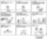

# C 언어, 컴퓨터 과학 마스터 하기
**Date:** 2026. 1. 21. 16:53
**Category:** 다이어리
**Original URL:** https://blog.naver.com/xpfkwh56/224154749884
---

​

1. 그래도 좀 똑똑하거나,

천재 레벨이면 될 것 같은데?

​

​

2. 아저씨는 누구세요?

파이썬 개발한 사람 임

​

파이썬 **'으로'** 개발한 사람 말고,

**'파이썬'** 을 만든 사람이 쟤 임

​

크리스마스 휴가 때, 걍 심심해서

만들기 시작해서 2년만에 완성함

​

이 사람조차 지금 파이썬

**'다'** 아냐 하면 모른다고 함

​

**\* 수학 박사 니까 전 세계 모든**

**수학 지식을 다 아냐? 랑 같은 질문**

**뒤로 갈수록 점점 더 끝도 없어짐**

**​**

**미적분을 할 수 있는 것이랑,**

**미적분 수능 4점 문제 푸는 것이랑**

**미적분 가르치기는 전혀 다른 것임**

**​**

'멈춤' 을 잘 해야 됨 ;;

​

3. 깊게 갈 수도 없는 장르고,

그렇게 해서도 안 되는 장르 임

​

학원에서 **별 만들기** 이런 것 말고,

오늘 내가 해결할 문제 풀어야 됨

​

4. 사업 열심히 하던 사람들이

트레이딩 이런 곳에서 왜 망하냐면

​

**'스답'** 을 할 줄 몰라서 그럼

​

근데 매매는 열심히 해야 잘 한다? (x)

게으르게 해야 **'살아남을 수'** 있음 (o)

​

**\* 마냥 열심히 할수록 지옥이 가까워짐,**

**제도권 엉덩이 무거운 분들이 그래서**

**주식판 들어오면 신세를 조지는 것 같음**

**​**

제가 맛 좀 보니까, 상당히 비슷함

​

하나도 몰라도 안 되고,

다 알아도 안 됨

​

그 경계는요? 본인이 **'정해야'** 됨