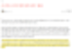

# 딥러닝 공부 하고 싶읍니다
**Date:** 2026. 1. 21. 0:30
**Category:** 다이어리
**Original URL:** https://blog.naver.com/xpfkwh56/224153925536
---

1. 딥러닝 공부고 나발이고, 처음에

​

개발 환경 세팅한다고 포맷 1-2번? 하고

의존성 충돌 한다고 지웠다 깔았다 하고

​

내가 써야 되는 프로그램이나,

드라이버가 호환이 안 되기 때문에

​

가까스로 그거 돌아가는 nightly 찾고

​

튜토리얼도 아니고, **'회원 가입'** 단계에

도달하는 것만 해도 보통이 아닙니다

​

**\* 컴퓨터 사고 설치 환경에**

**아무리 빨라도 3일은 쓰실 듯?**

**​**

2. 검색 열심히 잘 하면 되지 않냐구여?

​

**'내 컴퓨터, 내 사용 환경'** 이랑

똑같은 인간은 지극히 희소합니다

​

​

영어를 **'알게 된다는'** 소리도,

​

전쟁 바닥에서 만난 유일한 친구가

미국 사람인 그런 느낌이기 때문에

​

결국에는 그냥 **할 수 밖에** 없어져요

​

한글로 네이버든, 구글이든

​

딥.러.닝.워.크.스.테.이.션

인.공.지.능.컴.퓨.터

​

검색할 때랑, 나오는 정보가

아무리 작아도 10배는 차이남

​

3. 구현을 해야 되는데,

도저히 방법이 안 나온다?

**​**

**수학** 아니면 **영어** 임

​

**\* 종종 하드웨어 이슈**

​

수학을 기가 막히게 잘 한다면

영어 몰라도 됩니다,

내가 안 찾아봐도 되니까

​

​

4. 한편 그리고 **'배운다'** 에

환상을 가질 필요 없는 이유가

약간 이 말 그대로 인데,

​

마치 인공지능 세계는

​

2시간 마다 인체 기전이 바뀌는

시대에 살고 있는 **의사** 라던가,

​

2시간 마다 헌법이 개정되거나,

법이 바뀌는 세계에 있는 **변호사**

​

가 되는 것 같은 경험을 하게 됨요

​

**\* 고수, 전문가 같은 것이**

**존재할 수가 없는 근본 이유**

**​**

수술실에 들어가거나,

​

처방을 하는 동안 바뀌고

재판을 하는 도중에 바뀜

​

5. 그래서 결국 이게 어떻게 되냐면,

​

내가 필요한 것들을 찾아낸 다음에

내게 맞춰서 **고쳐 쓰는** 재주가 생김

​

세팅 다 끝내놓고, 시동 딱 걸면

멀쩡히 잘 돌아갔던 애들이

업데이트 되면서 다 충돌하고,

​

되는 애, 안 되는 애 섞이면서

컴퓨터 붙들고 세팅만 2시간,

3시간 하기 싫은 경우라면야

​

파이썬을 사방팔방에 깔아놓고

리스크 매니지먼트를 하게 됨

​

**\* C/D 드라이브 나눠 쓰란 이유**

**결국 가상환경 맞춰서 쓸 테니까**

​

6. 결과적으로 이건 내 꺼는 알아도,

남의 꺼는 **하나도 모르는** 바보가 됨

​

**\* 재주 1개를 잘 배워가지고,**

**100개, 1000개 활용하기보단**

**​**

**재주 1억개를 들고 있어가지고,**

**1억 1번째 고생을 덜 하는 느낌?**

​

뭐 배운다고 길이 보이고, 앞이 열리고

​

그런 것도 없고 그냥 오늘 하루 벌어서

하루 먹고 사는 그런 것에 더 가까움요