# 딥러닝
**Date:** 2026. 1. 21. 16:38
**Category:** 다이어리
**Original URL:** https://blog.naver.com/xpfkwh56/224154730716
---

[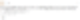](#)

**​**

**1. 가우시안 블러를 지우는 방법!**

​

​

함수를 배우고,

​

[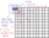](#)

​

블러링 원리를 익힌 다음에,

​

​

경계값을 규정하는

방식을 파악하고,

​

[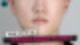](#)

​

주파수 분리 기술을 응용해서,

​

[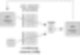](#)

​

픽셀 재귀 모델링을 하고,

​

[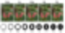](#)

​

스무딩이 걸려있다 = 뭉개져 있다

​

[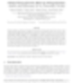](#)

[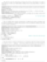](#)

​

검은 것은 글자요, 흰 거슨 종이

​

[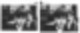](#)

​

급격하게 픽셀이 변화하는 구간

= 미분 문제를 푼 다음에,

​

**'그걸 일반화 하고'**,

​

**\* 수학 문제는 수학 문제 일 뿐,**

**내 상황에 맞게 적용은 딴 문제**

​

[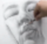](#)

​

각도별, 얼굴의 덩어리값을 읽고,

그에 맞게 스케일을 건 다음에

​

**\* 이거는 수학,**

**과학 문제도 아니고**

**걍 대놓고 직관**

**​**

**사진이 x, y배 커질 때마다**

**몇 배씩 증가해야 되는데?**

**같은 것은 정규화도 잘 안됨**

**​**

**변수도 만들기 나름이라서,**

**하는 족족 너무 복잡해지고**

**​**

[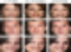](#)

​

개별 픽셀 샘플링 MVP 를 만들고,

​

[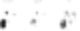](#)

​

상용 모델들 패러미터 튜닝을 하고,

​

[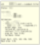](#)

​

온갖 라이브러리를 뜯어서,

내 입맛에 맞게 커스텀 한 후

​

[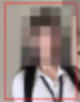](#)

​

블러 경계값을,

​

[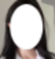](#)

​

최적화 해서 러프하게 잡고,

​

[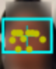](#)

​

1차원 좌표로 전환한 다음에,

​

[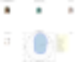](#)

​

레이 캐스팅 모델로 전환하고,

​

나온 매트릭을 기준으로

열-심히 열심히 찾으면 가능

​

**\* 이 방법 외에도 얼마든 Ok**

​

심지어 여기서 얼굴 복구

얘기는 나오지도 않음

​

**\* 덧셈, 뺄셈 정도 한 것**

**​**

에바 같은데요?

​

모르면 안 됨?

당연히 몰라도 됨

​

대신, 3시간 만에 해결할 수 있는 것을

모르면 30일 넘게 풀어도 답이 안 나오고,

​

**\* 천재적 직관으로 모든 문제들을**

**다 뚫는 비상한 머리가 있다면 예외**

**이런 사람은 하나도 몰라도 괜찮음**

**​**

어차피 저걸 본인이 **'깨닫게'** 됨

​

**\* 아! 이래서 배우는 구나!**

​

2. **'딥러닝'** 을 쓴다면?

​

​

위이이이잉, **끝**

**​**

[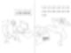](#)

**​**

**3. 결론**

**​**

잘 모르겠으면 인터넷에

사진 안 올리는 것이 최선