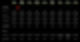
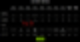
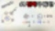
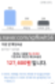
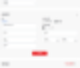
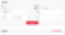
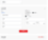

# 답변
**Date:** 2026. 1. 22. 17:44
**Category:** 다이어리
**Original URL:** https://blog.naver.com/xpfkwh56/224156100237
---

1. VRAM이 중요하다고 하셨는데

5090이 너무 비싸서요ㅜ 5080으로

타협은 어떻게 보시나요?

​

(4090이 24G이라 살펴봤는데

확실히 이것도 싸지는 않네요..)

​

https://www.nvidia.com/ko-kr/geforce/graphics-cards/50-series/rtx-5090/

​

**엔비디아 공식 사이트** 접속

​

​

사양 비교

​

**소고기, 돼지고기 만큼** 다릅니다

​

​

5시리즈

​

​

4시리즈

​

​

3시리즈

​

**\* 숫자의 단위가 다름**

**​**

이게 BMW 3/5/7

벤츠 C/E/S 그런 것보다

​

헷갈리고 어렵게 해놔서

혼동할 수 있는데, **스펙** 보면

​

내가 실제 타협할 수 있는 것과

타협할 수 없는 것을 알 수 있음

​

**\* 벤츠 C 시리즈 풀옵이**

**S 시리즈 깡통 보다 좋다?**

**​**

다른 것은 뭐 그렇다 치고,

그럼 VRAM 용량 왜 중요해요?

​

**VRAM = 주방다이 같은 것**

​

작으면 **'재료가 안 올라갑니다'**

​

힘 좋은 사람은 물건 100kg 들고,

약한 사람은 80kg 들다 다친다

​

이런 수준도 아니고,

​

VRAM 이 낮으면 낮을수록,

높으면 높을수록, 할 수 있냐/없냐

​

이런 문제랑 **직결** 합니다

​

국적, 자격 뭐 ,,

이런 것과 비슷해요

​

**\* 사람들이 기를 쓰고,**

**90 시리즈 사는 이유**

**​**

에르메스 가방 조금 더 저렴한 것,

샤넬백 조금 더 라인 낮은 것,

​

**'기계'** 라서 이런 문제가 아님

​

**할 수 있냐, 없냐 차이** 임

​

재밌는 점은, 이게 **'소비자용'**

온디멘드 플래그십 끝판왕이지,

​

블랙웰 에서 **'제대로'** 할 생각하면

1-2억 아래로는 꿈도 못 꿉니닼ㅋㅋ

​

원래는 개인이 1-2억,

소기업이 4억 내외 정도?

​

기업 연구소, 대학부설 연구소가

10-20억 정도 있어야 가능했는데

​

인프라 구축 비용이

**약 '1/10'** 로 감소함

​

**'1년'** 만에

​

여전히 서울 최상급지는 비싼데,

하급지 30평은 **1억 언더** 면 들어가고,

​

중급지 메이저 쯤은 **3억** 에

넘볼 수 있는 시대가 된 것 ,,

​

**\* 그래서 시장이 폭발적으로 성장중**

**​**

2. 아직까지 저의 추후 작업들이

어느 정도일지는 몰라서 고민중인데

​

RAM 64GB와 128GB

차이가 다이나믹 할까요??

​

> 높은 확률로 다이나믹 할 겁니다

​

컴퓨터 부품은 **'기계'** 입니다

​

교재, 강의, 럭셔리 이런

무형의 물건처럼 내 느낌,

​

이런 것이 아니고,

**'설계'** 부터가 달라요

​

ABS 있는 자동차, 없는 자동차

성능이 1배인 자동차, 2배인 자동차

​

이건 내 **'느낌'** 이 아닙니다

​

마치 요식업 자영업자에게 있어서,

시설 창업을 하는 것과 비슷한 건데

​

음식만 잘 만들면 된다,

하고 홀을 소홀한다면?

​

**당연히** 문제가 있을 것이고,

​

살면서 설거지 알바 정도는

그래도 한 번은 해보셨을 건데,

​

통상 매장에서 하는 설거지가

집에서 하는 것보다 쉬웠을 겁니다

​

**\* 대단히 센스가**

**좋아서가 아니구요**

​

왜냐면, 주방용 워싱 다이를 짤 땐

집 싱크대보다 식기를 넣을 공간이 넓고

​

높이를 맞추고, **'산업용'** 목적으로

설계하고 만들기 때문이지요

​

**흐음 AI 어차피 행렬 연산이 전부인데,**

**GPU 가 중요하고 CPU 는 필요 X 아님?**

​

대부분 그렇게 말하는데,

​

**'과연 내가 하려는 모든 작업에**

**GPU 가 정확히 쓰인단 보장은?'**

​

**오프로드** 도 있구요,

**전처리** 는 CPU 가 합니다

​

**\* cuda 미호환도 적진 않음**

**​**

GPU 는 수술방 의사고,

​

CPU, RAM 이런 것들은

옆에 있는 스텝들 이에요

​

의사만 10억 주고 데려다 놓음 뭐하나요,

간호사도 없고, 행정 직원도 없음 끝이지

​

**'다'** 중요하고, 하나씩 뺄 때마다

병목이 **'거의 대부분'** 발생합니다

​

그 **'병목'** 을 **내가 타협하냐, 마냐** 죠

​

**\* 싱크대에 식기 넣고 닦는 공간이**

**실제 닦는 공간인 것 같지만, 닦기 전**

**​**

**비치하는 공간이 작거나 불편하다면**

**전체적인 설거지 과정은 당연 불편함**

**​**

3. 시작은 SSD 4TB 1개로 충분할까요?

안그럼 첨부터 파티션(?)인가해서 다른

1개를 추가로 구입해서 설치하는게 좋을까요?

​

선결론, 나눠 쓰세요 가 아니구

**나눠 쓸 수 밖에 없어진다** 임요

​

4TB 용량 자체는 **'무난'** 합니다

​

근데 SATA 냐, NVMe 냐

NVMe 도 PRO 냐, 아니냐

​

이런 것에 따라 다를 것이고

​

SSD 는 충분히 빠르지만,

**장기 보관** 에는 부적합하고

​

​

SSD = 낸드 플레시 메모리

​

**\* SSD 는 전하로 기록을 함**

**그래서 없어지면 영영 못 찾음**

**디지털 전기 신호를 복구해야 됨**

​

최악의 경우에, **'뒤'** 가 없습니다

​

HDD 는 훨씬 더 느리지만,

물리적으로 기록을 남겨서

안전성 면에서는 더 우월합니다

​

**\* 최소한 얘는 흔적이 있긴 있음**

**​**

**파티션은 나눠야 되는 건가요?**

​

3TB 썼는데, 운영체제 바꾸고 싶음

​

→ 파티션 안 나눴음

→ 전부 백업 후, 포맷

​

1TB 는 운영체제랑 기본 시스템 파일

4TB 는 내가 주로 사용하는 업무 파일

​

→ 1TB 만 바꿔놓으면 그만

​

파이썬도 다 **'가상환경'** 이라고 해서,

1개만 쓰는 것이 아니고, 목적 마다

설정해서 그에 맞게 나눠서 사용합니다

​

**'그걸 왜 해요?'**

​

단일 파이썬 사용,

의존성 충돌 났음

​

**뭐가 문제인지 파악 안 됨**

**다 지우고 새로 깔아야 됨**

​

나눠서 했으면?

​

구축한 가상환경만 지우고,

​

**테스트** 도 마음껏 돌려보고

쓰다가 얼마든지 버릴 수 있음

​

컴퓨터 = 윈도우 (x)

​

컴퓨터 = 되는 것은 되고,

안 되는 것은 안 됨 (o)

​

**4. 아, 이거 어설프게 맞출 바에야**

**그냥 제대로 돈 주고 써야겠는데요?**

​

​

**'전기'** 가 필요함

​

​

무턱대고 고전력 맞추면,

**프리미엄 요금제** 써야 됨

​

​

저는 **원래** 전기를 펑펑 많이 사용함

​

**\* 공청기, 로청, 세탁/건조기, 식세기,**

**청소기, 티비, 빔프로젝터, 온열/냉방기**

**제습기, 물리센서, 간접조명 수십개 등**

**​**

사람 마다 쓰기 나름이겠지만

600w 피크 전기를 쓴다고 치고,

​

450w 1시간 풀 사용하면

1시간에 0.45kwh

​

0.45\*24\*30 = 324kwh

​

**\* 거의 딱 맞아떨어지죠?**

**집에선 클럭 올릴 때 제외하고,**

**언더볼팅해서 500 맞추니까**

**​**

**→ 기타 업무용 노트북이랑**

**추가 워크스테이션은 사무실**

**​**

2대면 \*2

그러므로 사용량에서,

+ 648kwh

​

3대면 \*3

그러므로 사용량에서,

+ 972kwh

​

수치는 가상으로 잡은 것 임, 이거도 하기 나름

​

900kwh 집에서 사용하면,

27만원, 자그마한 상가에서

사용한다고 가정하면 16만원

​

**\* 약 10만원 절감**

**1년에 120만원 절감**

**​**

근데 **2000kwh** 의 경우는?

​

115 만원이

32 만원으로 바뀜

​

**\* 계약전력 4kw 정액제 쓰면,**

**월 지불하는 금액은 3-4만원 쯤**

**→ 동네 PC방, 편의점 이런 곳들**

**​**

전기세만 월 80만원 절감한다고 치면,

1년에 **960만원** 절약할 수 있는 것인데

​

**\* 소상공인, 중소기업 각종 혜택은 덤**

**​**

월세 30만원짜리 상가 들어가서,

​

컴퓨터만 놔두고 돌려도

960-360 = 600만원 이득

​

**\* 제일 이득은 그냥 이런 짓을**

**애초에 안 하는 것이 이득이지만**

​

서울대 가면 좋은 이유?

거긴 **'전기'** 가 쌉니다맠ㅋㅋㅋ

​

1J = 1N \* 1M

1W = 1J /1s

1Wh = 1W \* h

​

400w 1시간 썼다고 가정

러프하게 344kcal 열 나옴

​

선풍기 뒤에 선풍기

에어컨 뒤에 에어컨을 놔두면

​

결국 선풍기가 선풍기를 식히고

에어컨이 에어컨을 식히니까

얼마든지 냉각할 수 있지 않을까!?

​

열역학 법칙 때문에 안 됨

​

**\* 그리고 온도가 높으면 높을수록**

**난이도는 기하급수적으로 올라감**

​

​

현실에서 **산소미포함** 할 수 있음