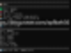
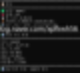
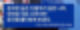

# 가정용 난방기
**Date:** 2026. 1. 23. 5:26
**Category:** 다이어리
**Original URL:** https://blog.naver.com/xpfkwh56/224156602581
---

이걸 사람이 어떻게 따라가 ,,

​

Qwen3 VL 30B

양자화 모델 사용

​

KV Cache margin 약 30%

​

CSV 분석

​

이미지당 평균 단어 약 240개

총 단어 72만개

초당 2154 단어

분당 129,207단어

​

얼마 걸렸냐? 5분 35초

​

**로컬이 ,, 미래 ,, 다**

**​**

https://huggingface.co/papers/2601.00417

**​**

딥 델타 러닝 어쩌고 하시던데

​

소인은 헤아릴 수 없는

웅대한 뜻이 있으시겠지요 ,,

​

그저 따거들만 믿읍니다 ,,