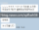

# 다들 비슷한 듯
**Date:** 2026. 1. 23. 12:50
**Category:** 다이어리
**Original URL:** https://blog.naver.com/xpfkwh56/224156955554
---

​

1. 돈 매우 많이 벌고,

야인 생활 지겹다면서

​

행복하게 공무원

하고 계신 분인데

​

**\* 직업 만족도 200%**

​

대학교 연구실 까진 커버 됨

**​**

댓글에 콤퓨타 조립

묻는 분들 많으셔가지고,

​

아, 이거 중간에 다리 놔줘도

욕 안 먹겠다 싶은 인맥 없나

​

찾다가 제안 해봤는데 짤 먹음

​

**\* 조립쟁이 찾기**

**개빡쌔단걸 저도 앎**

**​**

2. 그럼 왜 소개로만 하고,

굳이 나가서 그걸 안 하느냐?

​

손기술 좋고, 지식이 많으면

그거만 해도 밥 먹고 살지 않냐

​

내가 생각하기에도,

약간 바이탈 의사랑 비슷

​

**\* 비빌 수준은 아니지만**

​

리스크는 매우 매우 높은데

리턴은 작고, 스트레스 크고,

​

결국 본인이 하는 수밖에 없는 듯

​

3. 아직 안 샀다?

​

눈동냥 많이 보시고,

손기술 수련 열심히 하시고,

​

샀다?

​

[](#)

​

저도 **수냉 기술**

배우는 중입니다

​

산소 호흡기만 붙여놨을 뿐,

공냉으론 답이 없습니다 이거

​

**\* 물리적 한계**

**​**

**어차피** 나중에 다 수냉 쓰게 됨