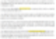
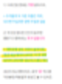

# 엔비디아에서 하는 짓
**Date:** 2026. 1. 23. 5:53
**Category:** 다이어리
**Original URL:** https://blog.naver.com/xpfkwh56/224156610852
---

<https://aimatters.co.kr/news-report/ai-news/36982/>

​

해쩨?

​

**\* 500TB 면 대학교재**

**16,666,666권 분량임**

​

​

단부루 태그, 히토미 태그나

안나 아카이브나 무슨 차인지,

​

<https://blog.naver.com/xpfkwh56/224150403089>

[**로칼이 대체 몸니까?**

1. 인공지능 하면, 대표적인 것은? 'GPT' GPT 는 어떻게 돌아가냐? 온라인 서버로 돌아간...

blog.naver.com](https://blog.naver.com/xpfkwh56/224150403089)

​

뉴스 1월 21일

포스팅 1월 18일