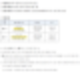

# 워크스테이션 예산 감각
**Date:** 2026. 1. 23. 16:18
**Category:** 다이어리
**Original URL:** https://blog.naver.com/xpfkwh56/224157216720
---

**1. 모르겠다?**

​

**사.지.마.라** 임

​

코랩 같은 무료 서비스 맛보기나,

유튜브, 인터넷만 되는 컴퓨터로도

​

**이게 어떻게 돌아가는구나** 는 가능

​

뭐를 해보려고도 해보고,

개선하려고도 해보고,

​

어디서 신기하단 것도 써보고,

이게 되나? 저게 되나? 하면은

​

이제 **'아하'** 싶어질 때가 오게 됨

​

**\* 하, 근데 여유가 되면 일단 사놓고**

**거기서부터 시작하는 것도 으으음 ,,**

**​**

100개, 1000개는 안 되는데,

1개, 5개 정도는 해볼 수 있고

​

특히, **'데이터** **전처리'** 같은 경우

**발상** 과 **노가다** 가 전부이기 때문에

​

**\* 근데 이게 딥러닝의 꽃 임**

​

심지어 진짜 피시방에 방문해서

USB 들고서 해도 해볼 수는 있음

​

2. 살 생각 있으면 **하이엔드** 라메요?

​

그 이유는 뭐냐면, 100만원 쓴다

티도 안 나고 사는 의미가 아예 없다

​

300만원 쓴다 고기 50g 쯤 나온다

350만원 쓴다 고기 180g 나온다

​

막 **이런 식으로** 늘어나서 그럼

​

가격 대비 성능이 **'비선형적'** 임

​

더 빠르다, 더 느리다, 불편하다

이 문제가 아니고 **'할 수가 없음'**

​

나 돈 한 3천만원 쓸 생각 있어요

부족해요? 그럼 한 7천 쓸게요 하고

​

짱짱하게 맞춰서 돌리겠다고 해도,

​

​

이 바닥이 마치 무슨 리니지도 아니고

**아~ 여기 뉴비가 왔구나** 이 취급이 됨

​

**왜 why?**

​

난생 처음 들어본 대학교 이름 산하에

있는 연구실에서도 예산 **10억** 배정함

​

10억? 1억도 **'엄청'** 큰돈임

​

**\* 주식판에서나 튜토리얼 통과지**

​

H100 1장 = 4-5천만원

​

근데 1억을 써도, **'다 안 뚫림'**

​

**'순정'** 으로 **'오타'** 를 치지 않는

LLM 하한선이 아마 **'70B'** 쯤임

​

1B = 4GB

70B = 280GB

​

**VRAM 280GB**

​

**\* 참가비 2억, 1대당 600w 잡고**

**4대 돌리면 2400w 라는 결과가 ,,**

**​**

**한 여름 파워냉방 풀로 돌리면**

**1시간에 약 600w 정도 사용함**

**​**

그래서 다 높으면 높은대롴ㅋ

낮으면 낮은대로 사양 타협함

​

**\* 제 영상 보시면**

**32gb 로 고화질 이미지**

**​**

**30B VLM 모델로**

**3천장 5분만에 읽힘**

**​**

내가 뭘 쥐고 있든 간에,

​

**쪼꼼만** 현실이랑 타협하면

가용 성능이 **팍팍** 뛰기도 함

​

덤으로 H100 사려면 4-5천인데,

그것도 싹 다 치우고 **'기계값'** 만

​

1시간 빌리면 잘 찾으면 3-4천원

비싸면 한 1-2만원 정도에도 나옴

​

**가격은 왜 달라요?**

​

월세 안 내는 노점상 갈 것이냐,

잘 차려진 정식 매장 갈 것이냐,

​

그거를 이제 **고를 수** 있어서 그럼

​

**3. 결론**

**​**

문법이 다르다

​

근데 관심 갖고 파기 시작하면

하루가 다르게 실감을 하실 것임

​

나 어제보다는 뭐 많이 알게 된 것 같아

이 느낌을 **안 갖기가 쉽지 않은 분야** 임

​

이렇게 빠른 장르는 처음 겪어봄

​

> **배우지 말고, 누리세요**

**​**

**4. 대학원 질문**

​

10-20억 따리 시설을 별 딴 생각 없이,

​

일단 굴려볼 수 있는 **기회** 가 주어지면

그거 하나만 보고도 본전은 뽑을 듯요?

​

학교마다 학비 차이는 있겠지만 일부는

걍 전기세만 내고 다니는 걸 수도 있음

​

제 생각에 **'지식'** 격차는 진작 끝났고,

​

**\* 이건 반박불가, 극소수만 아는 기술이나**

**아주 희소하고 비밀스런 지식 정도 아니면**

**누가 더 안다, 모른다 차이는 의미가 그닥 ,,**

**​**

**→ 경험, 가치관, 태도 이런 문제가 중요**

**​**

**소프트웨어는 상당히 많이 올라온 것 같고**

**이제 여기에서 로봇을 어떻게 붙이냐 같은?**

**​**

자본 격차도 흠, **시간 문제** 아닐까 싶음

​

4차 산업혁명, 4차 산업혁명 말로만 들었지

이런 정도일 줄은 겪기 전엔 상상도 못 했음