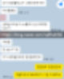

# 결국 돈이 없으니까 배우는 것임
**Date:** 2026. 1. 24. 17:01
**Category:** 다이어리
**Original URL:** https://blog.naver.com/xpfkwh56/224158298639
---

​

1. 돈이 많으면 **'다'** 맡기는데,

**'다 맡길'** 돈을 버는 것 보다

​

**'안 맡겨도 되는'** 기술을

배우는 것이 저렴할 때 많음

​

2. 번역기 나오니까

영어 안 배워도 되잖아요?

​

**'같은 단어'** 를 표현할 때,

영어가 **'리소스'** 를 덜 먹음

​

3. 중국어 할 줄 알면 왜 좋냐?

​

1-20살까지 중국어로 공부한 사람이

한국어 배워서 나랑 대화하고 있을 때,

​

내가 중국어로 하면 더 좋은 것과 같음