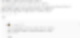

# 그 세계에서는 'VLM' 이 진짜입니다
**Date:** 2026. 1. 25. 3:44
**Category:** 다이어리
**Original URL:** https://blog.naver.com/xpfkwh56/224158720766
---

​

1. 상용 > 도메인 > API > 보조모델

> 넘사벽 > 로컬

​

**\* 상용에서 무료, 유료**

**유료에서 플래그십과 엔트리,**

**이 차이도 상당히 큽니다**

**​**

무슨 신약 바이오 기술이니, 혁신,

주식판에서 보던 그런 얘기가 아니라

​

**'진짜'** 내 컴퓨터 안에서

**'당장'** 일어나는 일 입니다

​

이거는 외우고 있어야 될 **'법칙'** 이고,

로컬도 로컬 나름입니다

​

2. 그냥 VLM 이 있고, 그 다음에는

이미지 VLM 이 있고, 그 위에는

​

**'비디오 VLM'** 이 있습니다

​

**\* 이 파트가 엣지에요**

**​**

**그리고 이걸 세계에서 제일**

**잘 쓰는게 지금 중국입니다**

**​**

비디오 VLM 에 파인튜닝이

들어가면 **'괴물'** 이 나옵니다

​

​

3. 제가 작업물을 하나 하나

블라그에 마구 못 올리는 이유?

​

**해보시면 압니다**

​

현재 국내에서 다룰 수 있는 사람이

적어도 제가 아는 한, 극히 드물고요

​

알아도 어디가서 얘기 잘 안 합니다

​

**왜 why?**

​

파인튜닝 LLM 만 써도

사실 **사람이 필요 없어요**