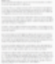

# 로컬 인공지능의 현실과 한계 궁금합니다
**Date:** 2026. 1. 26. 11:39
**Category:** 다이어리
**Original URL:** https://blog.naver.com/xpfkwh56/224159949062
---

**1. 댓글을 못 찾겠어서 본문은 생략**

​

지피티만 챗봇으로 몇 번 써본 사람이다

대화 몇 번 정도 해보고, 아직 멀었네 하고

접었다가 보조모델 까진 귀찮아서 안 했고,

​

간단하게 api 설정해서 붙였는데,

**시대가 여기까지 왔는가?** 하고 너무 놀랐다

​

→ 지극히 정상, api 를

썼는데 그 충격을 느꼈다?

​

로컬로 넘어가면 구라치고 있네

**'이게 이 가격이라고?'** 소리 나옴

​

**\* 이해할 수 없을 정도로 저렴하고,**

**본인 역량 따라 공짜 로도 이용가능**

**​**

**내가 1시간에 2만원 까지**

**부가 서비스 지불해봤는데,**

**​**

**이렇게까진 쓸 필요도, 이유도 없고**

**​**

**1시간에 200원, 300원 정도는**

**써도 그만 안 써도 그만**

**​**

**1시간에 7천원 전후 쓰겠다 하면,**

**인류 진보 레벨을 경험하는 것 가능**

**​**

**당연히 무료로 써도 대개 충분합니다**

**찾아서 할 시간이 없거나, 도저히 내가**

**이거는 못 써먹겠다 싶은 것들이 있다**

**​**

**그럼 그런 것만 골라서 유료로 쓰면 됨**

**​**

​

**2-1. 로컬은 직접 자료를**

**먹여야 능력이 올라간다**

​

반은 맞는 말, 반은 틀린 말

​

**2-2. 32B 를 일단 깔아서 테스트 중이다**

​

64G 맥이면 32B 를 쓸 필요가 없다

서울대를 나왔는데 왜 굳이 험한 일을?

​

**\* 양자화, 파인튜닝, 거기에다가**

**해당 모델은 심지어 오픈소스 잖아요?**

**​**

**2-3. 클라우드 api 로 나는 충분하던데?**

​

다른 글들 읽어보시면 다음 단계 나옴

대략 월 3-5만원, 비싸야 20 언더 쯤,

​

알아보고 쓰다가 **'제대로'** 쓴다 생각하면

인건비랑 비슷하다는 결론에 닿으실 것

​

**왜 why?**

​

상용 클라우드 서비스 중에, 어지간한

서비스는 다 이미 **공짜로** 풀렸거든요 ;;

​

사람들이 블로그에 공짜로 마구 글 쓰는데,

그거 누가 정돈해서 유료로 파는 것과 **똑같**

​

좀 귀찮아도 네이버 가입하고, 인터넷 설치하고

내가 블로그 들어가서 뒤지면 거기에 다 있는데!

​

심지어 **'돈 받고 안 파는'** 얘기도 많은데!

​

**2-4. 비용은 감안할 수 있지만,**

**제 고민은 성능 그 자체 입니다**

​

그래서 제가 돈이 전부가 아니라고 한 것

​

**'쓸 수 없는'** 입장에서는 돈만 있으면,

이라는 생각만 하지만 쓰는 입장에서는

**그래서 쓰면 결과가 나옴**? 이 되기 때문

​

**\* 이게 매우 매우 중요**

**​**

**2-5. 로컬 성능이 압도적이라는 표현**

​

​

**2-6. 단조로운 대학원생에게도**

**과연 로컬이 정답이 맞을까요?**

​

취미로 라틴어 배우는 사람이 와서,

저한테도 과연 **'학계'** 에서 다루는

그런 지식을 알 필요가 있을까요?

​

비인문학도가 와서, 인문학 배운다고

쌀이 나와요? 떡이 나와요?

​

**그거 안다고 어떤 이득** 이 있나요?

라는 질문과 다소 비슷합니다

​

뭐 그래서 당장 어떤 도움이 됨?

하면 솔직히 글쎄, 라는 답만 나옴

​

다만, 알고 모르고 차이가 있냐?

라는 질문에는 **확신**이 있으실 것임

​

**\* 인문학 박사와 초등학생이**

**과연 같은 인생을 살고 있을까?**

**​**

**돈을 더 버냐, 마냐, 잘 사냐, 마냐**

**이런 차원이 아니라 인생의 해상도**

**​**

**로컬도 똑같음**

​

특수한 상황조차 로컬이 큰가요?

​

= 특수한 상황조차 영어를 할 줄 알면

더 많은 정보를 취급할 수 있는 건가요?

​

그냥 **질문에 답이 있습니다**

차라리 특수한 상황이 더 심하죠

​

그거 다루는 사람 몇 있지도 않은데

​

**2-7. 제가 저 공부하겠다고, 저를 가르치는**

**자료들 직접 찾고 가공하고 이해할 시간에**

**차라리 학원 가는 것이 더 빠를 것 같거든요**

​

물론 틀린 말은 아님

근데 생각은 해봐야 될 듯?

​

제 생각에는 학원 출석하는 것 보다

본인이 본인을 가르칠 선생을 만드는

작업에서 3할은 먹고 들어가지 않을지

​

**\* 목적이 아는 것인지, 배우는 것인지**

​

**2-8. 어떻게든 배우려 합니다**

​

인문학 고학력자?

​

자기 기준 확실하고,

솔찌 자기 능지에 부심 좀 있다

​

**\* 어디가서 대놓고 말은 안 하지만**

**​**

**안 배울 이유 전혀 X**

​

2-9. 온라인 마케팅 나온지 10년 입니다

그래도 바깥에 찌라시 뿌리고, 전단지 돌고

그러는 이유는 **'시대'** 가 달라서 입니다

​

아무리 건강한 사람도 1시간에 많아야

전단지 한 1-2천장 붙이는 것이 한계지만,

​

온라인 마케터는 1-2천 view를

**'수치'** 로 다루는 것이 어렵지 않음

​

제가 블로그에 글 쓰면 케바케 인데,

아마 많으면 3-5천 정도 보는 것 같고

​

적어도 1-2천 전후에서 왔다갔다 합니다

​

이거 인터넷으로 글 써서, 툭 하니까

쉽게 하는 것이지 사람 앉혀놓고 저한테

5명한테만 말하라고 해도 될 리가 없죠

​

인공지능, 이라고 생각하면

그 언어가 주는 압도감 때문에

​

약간 곡해할 가능성이 더 높은데

심플하게 그냥 **'기계'** 입니다

​

차이라면, 세상에 처음으로 나타난

**'지성을 흉내내는 기계'** 라는 점이죠