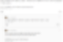

# 컴피 쓰는 법
**Date:** 2026. 1. 26. 18:21
**Category:** 다이어리
**Original URL:** https://blog.naver.com/xpfkwh56/224160460140
---

​

그림 그려주는 인공지능이네 (x)

​

세팅 해두면 24시간 알아서 그림 뽑고

VLM 로 사진 추려서 내 기준에 맞는

​

제일 고퀄들 모은 다음에,

후보정에 리터치까지 해서

​

밥상에 갖다주는 놈이 comfyUI 입니다

​

패딩도 1번씩 수동으로 하냐,

오토로 걸어서 반복분 집행하냐,

​

기본 노드 쓰냐, 커스텀 노드 쓰냐,

커스텀 노드를 만들어서 쓰냐 가

아예 전혀 다른 툴 활용으로 연결됨

​

flux 2 pro 모델 이랑

프로바나나 가격 차이 **매우** 크고,

8k 양산 같은 것은 시도?도 못 함

​

프롬프트도 리딩 노드랑 연결해두면

메타 데이터 다 읽어서 보관하니까

심지어 재현성 있는 그림도 가능한데 ,,

​

1장 1장 뽑아서 신기하네,

​

쓰는 것은 당연히 상용이 낫지만

각 잡고 쓰려면 저거론 답이 없음

​

뽑을 때마다 톤 앤 매너가

이유도 모르고 뒤집어지는데

그걸 실용적으로 어떻게 씀

​

어떻게 1번은 굴려도, 나중에

다시 쓰려면 버리고 다시 쓰는

바이브 코딩이랑 한계가 똑같죠

​

가정에서 **'공장'** 을 돌릴 수 있는데

장난감으로 쓴다면 너무 아쉬운 것

​

컴피 안 쓰고 **'표준 공정'** 가능?

절대 불가