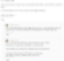
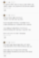

# 있고 없고의 문제
**Date:** 2026. 1. 27. 0:58
**Category:** 다이어리
**Original URL:** https://blog.naver.com/xpfkwh56/224160840169
---

​

**1. 통념 : 돈이 있을수록 고민이 없어진다**

**사실 : 돈이 많을수록 고민이 달라진다**

​

돈이 없거나 부족할 때는 모든 고민이

**'돈을 버는 방법'** 만으로 터널화 되는데,

​

그 과정에서 다른 생각을

점점 안 하는 버릇을 하게 됨

​

이러다가 돈이 생기면 어찌 될까?

​

아무 준비가 안 된 상태이기 때문에,

굉장히 막막한 느낌을 받을 수도 있음

**​**

**문제가 해결된다 (x)**

**문제가 드러난다 (o)**

​

나는 이게 흔히 말하는 **'그릇'** 에 대한

그나마 제일 적절한 해석이라고 생각함

​

소비를 할 때, 돈의 제약이 없어진다면

​

**'그래서 이걸 쓰면 진짜 해결이 됨?'**

같은 것에 매우매우 집착하게 될 것임

​

우선, 써봤는데 막상 해결되지 않았던 적을

대부분이 꽤 많이 경험했을 가능성이 높고,

​

돈은 자원이라서 소모하면 **'끝'** 이기 때문임

​

부자는 모다?

돈이 많은 사람이다

​

그냥 돈이 많은 사람일 뿐임

​

그래서 돈이 없어지면 없어질수록

**부** 라는 본인의 지위를 상실하게 됨

​

내가 지금 이뻐서, 어려서, 뭘 잘 해서

어떤 특권을 누리고 있음을 알고 있다면

​

상식적으로 그걸 **'남용할'** 리가 없음

​

**2. 통념 : 의지와 노력의 문제다**

**사실 : 적성, 재능, 확신, 관심사, 운 등등**

​

많은 사람들이 내일의 나를 믿지 못하고,

이러니까, 저러니까 하면서 하면 되는데

안 해서 문제 라는 식으로 시간을 허비함

​

그래서, 의지가 중요하고 노력이 중요하고

요즘엔 좀 들 보이는 것 같은데 실행력이니

저스트 두 잇 이니 한참 얘기가 많았었음

​

그렇다면 똑같이 생각을 해보자

**​**

**'규칙적이고, 부지런하고, 도덕 교과서처럼**

**시키면 뇌 빼고 그대로 하는 그런 인간들은?'**

​

내가 뭐 서울대 가고 이랬던 정도는 아니지만,

**그냥 시키면 하는 것을 무척 좋아했던 때** 있음

​

그 시절을 돌아보면 이랬던 기억이 남음

​

쨌거나 그냥 하는 것은 나름, 할 만 했음

문제는 이걸 해서 그래서 **진짜 되냐?** 였음

​

수험이든, 사업이든, 투자든, 무엇이든

그 **'일'** 자체의 난이도는 **쉽고 어렵고** 에

있어서 사실 크게 영향을 미치는 것 아님

​

진짜 어려운 것은, **'불확실성'** 임

​

내가 해본 적은 없지만 라이센스 공부나,

어려운 시험이나, 이런 것들이 어려울까?

​

아마 하겠다고 하는 사람이면

그래도 견적 봤을 텐데 **하면 할 것임**

​

어려운 것은, 그래서 이 길의 끝이 있냐

끝이 있다면 거기서 내가 원했던 목적이나

비전이 과연 존재하긴 존재하는 것이냐?

​

이게 **진짜 어려운 것** 임

​

라플라스 방정식도 엉댕이 딱 붙이고,

머리에 쑤셔 박으면 사랑하는 짓이라서

아무튼 간에야 결국 머리에 넣을 수 있음

​

근데 그거 배우면서, 취직 되나?

라는 혼돈에 사로잡히면 약도 없음

​

**3. 그럼 이런 문제들은 어떻게 풀 수 있냐?**

​

말은 쉬움, 그냥 원하는 것을 하면 됨

​

아닌 말루다가, 하는 척을 하니 어려운 것이지

하고 있으면 그거보다는 쉬울 가능성이 높음