# 킹니프사를 조심해
**Date:** 2026. 1. 27. 22:14
**Category:** 다이어리
**Original URL:** https://blog.naver.com/xpfkwh56/224161973848
---

[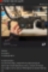](#)

[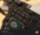](#)

[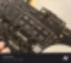](#)

[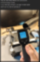](#)

[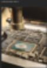](#)

[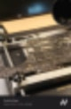](#)

[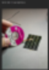](#)

[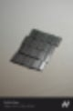](#)

[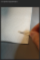](#)

[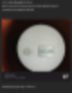](#)

[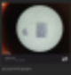](#)

[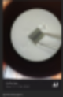](#)

[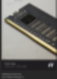](#)

[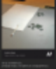](#)

[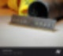](#)

[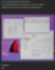](#)

<https://www.youtube.com/@SolderingMaster99/videos>

[**납땜명인 Soldering Master99**

납땜문의»01063006911동영상 보시고 작은 도움 되시길 바랍니다.구독.좋아요.알람설정은 큰 힘이 됩니다. ※ 명인전자 MYEONGIN Electronics ※ . 정밀한 납땜 해드립니다. · 급한,긴급 납땜 해드립니다. · 소량,대량 납땜 해드립니다. · PCB 샘플 납땜 해드립니다. · PCB 불량수리해 드립니다. · 전자부품 구매해 드립니다. · 제품,공구,배너광고 홍보해 드립니다. ※ 근무요일 및 시간 ※ · 월 - 토(격주) 오전 9시 - 3시(가끔외근) · kakao » volvo1207 · mobile » 01063...

www.youtube.com](https://www.youtube.com/@SolderingMaster99/videos)

<https://www.youtube.com/@mrsolderfix3996>

[**Mr SolderFix**

Hi everyone , your time is much appreciated , so thank you and may I say how I look forward to sharing my soldering experiences and solutions with you all. My video's will be covering many aspects of soldering , ranging from the very basic stuff to the very extreme difficult projects, with the odd f...

www.youtube.com](https://www.youtube.com/@mrsolderfix3996)