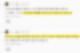
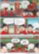

# 인공지능 아직 멀었지 않나요?
**Date:** 2026. 1. 28. 15:00
**Category:** 다이어리
**Original URL:** https://blog.naver.com/xpfkwh56/224162787415
---

​

1. 저도 지피티 써보고, 제미나이 써봤는데

​

**'어차피'** 나중에 다 먹기 좋게 가공될 물건을

굳이 일찍 해봤자 무슨 의미 있나 모르겠습니다

​

솔직히 스마트폰 새로 나왔다고, 일반인들은

쓰지도 않은 최신 기능에 집착하는 것 같아요

​

초기 스마트폰 모델이야, 뭐 신제품 나오면

안 되던 것도 되고 그런 차이가 있었겠지만

​

결국에는 **'평준화'** 되면서 다 비슷해졌잖아요?

이걸 유난 떨어가면서 만지작거릴 이유 있어요?

​

아만보

​

지금 **'평준화'** 된 것 같으세요?

​

<https://www.vibekanban.com/>

[**Vibe Kanban - Orchestrate AI Coding Agents**

Get the most out of coding agents like Claude Code, Gemini CLI and Amp. Orchestrate multiple AI coding agents, track tasks, and manage your development workflow efficiently.

www.vibekanban.com](https://www.vibekanban.com/)

​

**2. 바이브 칸반**

​

바이브 코딩? 그거 쥐피티나

클로드한테 그냥 시킨 다음에

뚝딱 거리면 코드 나오던데? (x)

​

리뷰 하는 **'에이전트'** 랑

코드 짜는 **'에이전트'** 가

별개로 존재하고,

​

시켜놓으면, 코드 짜는 애들을

리뷰 하는 애가 **'관리'** 합니다

​

그리고 **'최종적으로'** 검수가

끝난 코드를 보여주고 결제를

해달라고 요청을 합니다

​

컴피로 왜 **'그림'** 만 그려요?

​

**파이프라인 전처리 모델로 쓰면**

**공정 프로세스를 다 제어 하는데?**

​

포토샵 할 줄 아는 직원 1명을

뽑아다가 24/7 굴리는 것과 같고,

​

직원 1명을 골라도, **'기계'** 처럼

일을 해줄 수 없는데, 저거는 가능

​

즉, **'공장'** 을 소유할 수 있는 셈

​

마르크스가 떠들었던 이야기가 뭔가,

곰곰2 고민해보시면 가치가 보일 것임

​

생산 수단의 민주화, 는 결이 다름

기존에 없던 흐름이란 것은 **확실** 함

​

<https://v0.app/>

[**v0 by Vercel - Build Agents, Apps, and Websites with AI**

Your collaborative AI assistant to design, iterate, and scale full-stack applications for the web.

v0.app](https://v0.app/)

​

**3. V0**

​

Vercel 에서 만든 UI 툴이구요

​

1-2년차? 수준의 백엔드나

웹디는 그냥 **'깔끔히'** 대체됩니다

​

남들이 제미나이 한테

**'뭐뭐뭐 만들어줘'** 할 때,

​

**'툴만 달라도'** 이런 차이가 생김

​

4. 로컬로 아예 넘어가면?

​

**'툴'** 이 아니라 **'환경'** 이 달라짐

​

당장 위에 보이는 저 두 모델을

내가 **'200%'** 커스텀 해서

오픈소스 찾아 맘껏 쓸 수 있단 것

​

**\* 저 기술은 하늘에서 뚝딱 떨어졌을까요?**

**​**

5. 서울대 로스쿨 커리큘럼이 100% 오픈

그래서 누구나 거기 있는 것을 **'똑같이'**

전부 배울 수 있는 상황이고, 서울대 의대

​

커리큘럼이 100% 오픈, 누구나 마음만

먹으면 그거 찾아서 본인도 공부할 수 있음

​

지금은, **'의사'** 가 아니라면

**'인간'** 을 해부할 수 없습니다

​

**'법률가'** 가 아니라면

**'재판'** 을 참여할 수 없고

​

**'약사'** 가 아니라면,

**'의약품'** 을 취급할 수 없음

​

6. 프로그래머 는 **'라이센스'** 가 없음

​

**\* 그걸 솔직히 만들 수도 없음 ,,**

​

웹디자이너도 **마찬가지**,

이런 회색 영역은 세상에 많음

​

인공지능 분야는 **'계급장'** 이 없음

​

​

파괴적 혁신이 **'지금으로부터'**,

딱 1년 사이에 **'폭발적'** 으로 발생함

​

왜놈들은 아직 오랑캐 입니다,

**'제가 봤는데'** 여전히 약합니다

​

만만하게 볼 문제가 아닙니다

그거랑 솔직히 별로 다르지 않음

​

23년, 이후에는 어떻게 되었을까?

​

과거에는 **'글로벌 대기업'** 레벨 에야

100B, 200B 를 **'간신히'** 만졌는데,

​

100B 모델이 **'취미'** 레벨 까지 왔고,

​

파인 튜닝은 **ML, DS 전유물** 이었는데

지금은 **'힙스터'** 정도면 만질 수 있음

​

**경로 의존성** 과 **인지적 게으름** 이라는

두 가지 사고를 막는 짐을 내려보세요

​

**'개인'** 이 가져서는 안 될

**'힘'** 을 가질 수 있을 겁니다