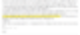

# 정돈
**Date:** 2026. 1. 28. 19:50
**Category:** 다이어리
**Original URL:** https://blog.naver.com/xpfkwh56/224163131833
---

​

1. 딥러닝, 파인튜닝 등등 하면

성능 겁나 좋아지고 그게 전부 아니고

여러가지 트릭/테크닉들이 존재한다

​

그거 쓰면, 목적에 맞는 생산도 가능

목적에 맞는 활용을 잘할 수 있다 (o)

​

2. 그런 모델들이 시중에 널려있는데,

클라우드 AI 라 여러 제한이 있다 (o)

​

3. 로컬로 굴리면, 규제/성능 제약 외 등등,

조차 알빠노 하고, 내 취향 다 때려 박아서

정말 **'내 마음대로'** 인공지능 쓸 수 있다 (o)

​

4. **'고성능 모델'** 을 쓰면 더 좋고,

**'저성능 모델'** 을 쓰면 더 안 좋다 (x)

​

고성능 모델이 더 **'쓰기가 쉽다'** (o)

​

손바닥 만한 여자 지갑에 이삿짐 넣기

vs 10톤 트럭에 이삿짐 넣기랑 비슷함

​

5. 그 외에도 여러 다양한 이유가 있기에

하드웨어에 투자할 수 밖에 없을 것이다 (o)

​

6. 돈을 써야겠는데? 라는 생각**만** 들면 (x)

예전에 올린 영상처럼 이거는 **증폭기** 임

​

내 능력에 비례해서 모든 것들이 올라감

​

그리고 정상적인 경로를 타고 있으면,

뭘 배워야지? 라는 고민이 없어야 정상

​

하나 하려면 배울 것이 산더미다,

여기서 이제 뭐 하지가 더 맞는 접근