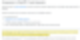

# 오늘 로컬 샀어요, 이제 뭐 함?
**Date:** 2026. 1. 29. 17:00
**Category:** 다이어리
**Original URL:** https://blog.naver.com/xpfkwh56/224164271245
---

<https://github.com/openinterpreter/open-interpreter>

​

일단 이거 부터 붙들고 배우기

시작 하는 것도 좋을 듯 하네요

​

이거 꿀통이에요 쓰세요 (x)

​

여기서부터 **'시작'** 을 하면

안 배워도 아는 것 많아짐 (o)

​

네이버 검색하고, 구글 검색하고

​

로컬? 챗봇? 이렇게 접근하지 말구

아 바탕화면 정리 너무 지저분하네

​

바탕화면 정리해줘, 그럼 샤샤샤샥

하고 컴퓨터가 알아서 깔끔히 해주는 ,,

​

검색하기 귀찮네, 야 재밌는 것 좀 틀어봐

​

하면 다라라락 하고 화면 두들겨주는

이런 걸로 해야 재미도 있고 빨리 배움