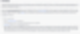
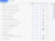
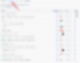
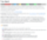
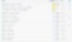
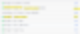
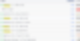
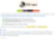
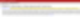

# 도저히 로컬 못 하겠읍니다
**Date:** 2026. 1. 30. 2:54
**Category:** 다이어리
**Original URL:** https://blog.naver.com/xpfkwh56/224164800674
---

1. 시간이 없으면?

돈이 많으면 됩니다

​

**보조모델** 을 스십시오

​

2. 리아님이 그러셨잖아요

​

**1) 무료 > 유료**

​

그리고 유료에서

값싼 것 > 비싼 것

​

**2) 유료 > 도메인**

​

같은 용도면 도메인,

그러니까 특정한 목적으로

잘 깎아서 만든 것이 더 낫다

**​**

**3) 도메인 > API**

​

API 달아놓으면 성능 좋다

​

여기까진 이해가 잘 갑니다

​

근데 **'보조모델'** 이라는

표현이 무슨 말이죠?

​

이게 왜 **'상용 끝판왕'** 임요?

​

제가 월에 그래도 쓰는 돈도 많고,

​

남들보다 좀 친다고 생각을 했는데

보조 모델이 **뭔지도** 모르겠습니다

​

**3. 왓 이즈 보조 모델?**

​

서론이 깁니다

​

처음 인공지능을 접하는 사람들은,

​

저 많은 서비스 중에서 도대체

기왕지사 같은 돈을 어디에 담아야

좋을 것인가? 같은 고민을 하게 됨

​

그럼 대체로 다음과 같이 갈림

​

**1) 추천, 소개**

​

남조선은 기본적으로

**농업 사회 소프트웨어** 라,

​

모든 영역에 이 요소가 적용됨

​

누가 뭐 좋다더라, 괜찮다더라 하면

걔가 그랬어 하고 쉽게 쉽게 가는 편

​

실제로, **'누가 써도 만만한'** 것이거나

내가 **'해보니까'** 좋은 것을 추천해서

​

기본빵은 먹고 가는 경우도 많긴 많음

​

**2) 벤치마크**

​

추천, 소개 앞단에 있는 채널임

​

대부분의 인공지능 서비스들은

우리가 **'잘났다'** 라고 광고를 함

​

집중할 부분이 있음, **'광고'**

​

그럼 실제로 찾아보겠음

​

벤치마크는 **'성능의 성적표'** 인데

​

누가 그냥 잘 한다, 라는 것은

듣기에도 어렵고 감도 안 오지만

​

수치로 딱 떨어지거나,

​

비교가 되는 것은 아무래도

사람 마음에 더 들어오게 됨

​

그래서 ~가 ~보다 뛰어나다

A 는 10점 B 는 20점 이런 식으로

벤치가 나오고, 그걸 바탕으로

​

매니아들이 일종의 여론을 만들면,

자연스럽게 그게 퍼져나가는 구조임

​

그럼 **누가 맞냐, 틀리냐** 이전에

대체 **'벤치'** 는 누가 발표를 할까?

​

놀랍게도 대부분의 인공지능 벤치는,

**'자사'** 발표고, 외국 법은 잘 모르겠지만

​

남조선에서 했다간 철퇴를 맞기 좋은

요상한 방식들로 집계하고 광고를 함

​

그래서 **믿을 수가 없음**

​

X, Y, Z 가 있다고 가정하겠음

셋 다 자기가 주식을 잘 한다고 함

​

X 는 자기가 mdd 가 제일 낫다

그러므로 여기서 내가 최고다

​

Y 는 내가 수익률이 제일 높다

그러므로 여기선 내가 최고다

​

Z 는 내가 수익금이 가장 높다

그러므로 내 밑으로 다 접어라

​

라는 식으로 주장을 하는 상황임

​

이러면 **비교가 안 됨**

​

<https://www.swebench.com/>

[**SWE-bench Leaderboards**

Introducing CodeClash , our new evaluation where LMs compete head to head to write the best codebase! Click here to learn more. Bash Only Verified Lite Full Multimodal Bash Only evaluates all LMs with a minimal agent on SWE-bench Verified ( details )  Compare results New! Filters: All Tags ▼ Model ...

www.swebench.com](https://www.swebench.com/)

​

이 사이트를 들어가면,

단일 지표로 비교를 하는데

​

이거도 아예 100%는 아니지만

​

**\* 왜냐하면 인공지능 벤치 자체를**

**평가할 수 있는 적합한 체계가 없음**

**주식 고수? 무슨 기준으로 할 건데?**

​

다른 것도 비슷하니 자잘한 것은 빼고,

​

제가 주장하고 싶은 부분만 골라내다가

마음대로 갖다 붙여서 계속 적어보겠음

​

​

기준은 위와 같음

​

최소한 **'단일 체계'** 로

비교한다는 것 자체가

이 바닥에서는 **양반** 임

​

​

1등과 2등의 차이는?

​

**'0.2%'** 차이 남

​

가격은?

​

0.72 vs 0.46

​

0.26 **'달러'** 차이 남

​

똑같은 일을 시켰을 때,

​

전자는 7만 2천 불이고

후자는 4만 6천 불임

​

성능% / $가격으로 계산하면

​

상단에 있는 것들 보다는

하단에 있는 것들이

**'훨씬'** 남는다는 결론이 뜸

​

> 아, 싸면 좋긴 하죠
>
> 정작 성능이 구리면 그건 쫌?

​

한가한 사람들이나 하는 짓이지만,

​

​

버튼 하나만 누르면 **딴 소리** 나옴

​

​

에이전트 기반 서비스에서는,

**듣도 보도 못 했던** 놈이 1등 임

​

**'인간'** 이 **검증한** 순위에서

**'1등'** 을 했다는 점이 **킥** 임

​

​

더 복잡한 문제로 갈수록,

​

​

점수 차이가 확연히 나타나는데,

​

​

**동일한 모델 안에서도**,

보조 모델 여부에 따라서

​

성능 **'10%'** 차이 발생함

​

해당 리더보드 1개만 가져온 것이지,

이거는 **'모든'** 영역에 다 일반화 됨

​

제가 대단한 뭐를 찾아낸 것이 아니구,

​

해가 뜨고 달이 진다, 밀물과 썰물,

중력 이런 것처럼 사실 **당연한** 얘기임

​

​

이런 것들이 제가

말하는 **'보조 모델'** 임

​

하나 하나 찾아서 보시면,

**'미쳤네'** 라는 소리만 나옴

​

미국

​

그럴만 한 것이,

​

따거

​

여기가 **'엣지'** 라서 그럼

​

**4. 아니 그럼 로컬은 무어임?**

​

보조모델 몇 개만 찾아서 봐도

눈이 뒤집어지도록 신기한데요?

​

무료 > 유료 > 도메인

> API > 보조모델 > 넘사벽

> 로컬 > 넘사벽 > AI 엔지니어 연구

​

> 넘사벽 > AI 네임드 기업 연구

> 넘사벽 X100 > AI 빅테크

​

**아만보** 임 ㄹㅇ