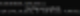

# 디퓨전 로라 학습 난제
**Date:** 2026. 1. 30. 3:52
**Category:** 다이어리
**Original URL:** https://blog.naver.com/xpfkwh56/224164821385
---

<https://arxiv.org/abs/2511.18159>

[**Bringing Stability to Diffusion: Decomposing and Reducing Variance of Training Masked Diffusion Models**

Masked diffusion models (MDMs) are a promising alternative to autoregressive models (ARMs), but they suffer from inherently much higher training variance. High variance leads to noisier gradient estimates and unstable optimization, so even equally strong pretrained MDMs and ARMs that are competitive...

arxiv.org](https://arxiv.org/abs/2511.18159)

​

**디퓨전 모델은 혹시**

**마스킹을 구분할까?**

**​**

1) 누끼 따서 지우면

모델이 가리고 배운다

​

내가 전에 해봤는데 진짜

그거만 쏙 빼고 배우더라

​

2) 누끼 따서 지우면

모델이 왜곡해서 읽거나

​

원래 왜곡된 것이

본체인 줄 안다

​

**1 → 잘 지우면 올려도 돼**

**​**

너가 아직 잘 하는 집을

안 가봐서 그래

​

**2 → 오염된 데이터 다 빼**

​

너가 아직 덜 디여 봐서 그래

​

> 그래서 누구 말이 맞는데요?

​

제가 아는 한에서는

아직 아무도 몰라욬ㅋㅋ

​

​

로라굽기 장인이 되

​

전기만 좀 싸고 편하게

쓸 수 있음 참 좋겠는데 ,,