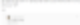
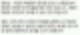

# 생각하기 나름 같아요
**Date:** 2026. 1. 30. 18:16
**Category:** 다이어리
**Original URL:** https://blog.naver.com/xpfkwh56/224165632668
---

​

1. 우리 동네에 편의점이 1개 있음

그래서 혼자 독탕으로 다 먹고 있는데,

​

갑자기 근처에 편의점 하나가 생겨남

경쟁자가 생겼으니 화가 날 일 일까?

​

2. 저 집 갔다가 물건 없으면

여기 와서 찾을 수도 있는 것이고,

​

편의점은 적절한 예시가 아니겠지만

저런 방식의 클러스터로 특정 지역이

하나의 메카로 되는 경우도 빈번함

​

​

3. 인공지능, 하면 왜 보통 비관적이지?

저는 그렇게 볼 문제가 아니라고 생각함

​

생산성이 더 좋아졌는데

이게 왜 나쁜 일이에요?

​

더 많이 배우고, 새로운 시대에

준비해야 될 일에 가깝지 않을지

​

4. 포토샵 생겼다고 디자이너 없어지지 않았음

포토샵을 할 줄 아는 디자이너가 생겼지

​

엑셀 있다고 누구나 기장 쓰는 것 아님

같은 **'한글'** 을 다룬다고 같은 **'한글'** 아님

​

대체가 되냐, 안 되냐, 그 이면의 본질에는

그래서 당신이 누구냐, 라는 문제가 선행함