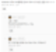

# 알아야 보인다
**Date:** 2026. 1. 30. 15:42
**Category:** 다이어리
**Original URL:** https://blog.naver.com/xpfkwh56/224165445303
---

​

니가 한 것이 뭐임?

똑같은 그래픽 카드를 팔아도,

​

**'내가 해줄게'** 라고 하면

아무리 보수적으로 잡아도

​

지금 제가 갖고 있는 재주면

적게는 30? 많으면 **200 정도**

​

더 주겠다는 사람 찾는 작업이

그리 별로 어려운 일은 아닐 겁니다

​

하급기랑 상급기의

가격 차이가 **수백** 인데

​

저는 상급기별 모델의 차이를 알고,

그게 AI 활용 퍼포먼스에 어떤 원리와

방식으로 적용되는 것인지 잘 압니다

​

5090 하면 언더볼팅 노래를 부르는 이유는

이걸 들고 **'게임'** 을 하는 사람이 많기 때문

​

순정 부스트 클럭 다 걸어도 보통은 2800,

많아야 2900 내외 찍히는 것이 보통인데

​

**\* 570-600 언저리 전력 소모하면서**

**​**

당연히 기본적인 뽑기 빨은 있어야 하겠지만

제가 갖고 있는 제품 기준으로,

​

저는 **전력 500w 언더 쓰고,**

**클럭 3300 뽑습니다**

​

**\* 물론 오래 굴릴 때, 어떨진 나도 모름**

**​**

발열은 max 70, 표준편차 감안해도

50대 에서 왔다갔다 시킬 수 있구요

​

수냉을 쓴다면 소음이나 안정성 면에서

더 낮은 수준을 유지하는 것이 가능할 것