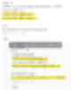

# 인공지능 장르가 도파민 폭탄 입니다
**Date:** 2026. 1. 30. 15:41
**Category:** 다이어리
**Original URL:** https://blog.naver.com/xpfkwh56/224165443663
---

​

1. 커뮤 이런 것 보고, 괜히 근거도 없이

떠드는 이야기 찾지 말라는 이유도 뭐냐면

​

논문? 어렵다, 복잡하다, 현학적이다 (x)

​

오히려 **'정확한'** 표현을 하기 위해서

단어 하나씩 정제하고, 꼼꼼하게 보면

이 사람이 왜 이런 글자들을 골랐지?

​

어째서 이런 데이터를 본문에 담았지?

같은 식으로 명료하게 읽을 수가 있음

​

수학, 영어 어렵다? 어렵다면 어렵죠

​

근데 블로그에 저는, **'제 맘대로'**

자의적인 단어, 표현, 사고를 쓰는데

​

논문이나 제도권 자료는

통일된 언어로 통일된 표현으로

​

통일된 설명을 하기 때문에

그런 측면에서는 훨씬 낫습니다

​

그럼 그걸 아는 양반이

왜 그렇게 글을 쓰냐구요?

​

아니까 그렇죠

​

보기는 쉬운데, 만드는 입장에선

대부분 그게 쉬운 일이 아니니까

​

2. 남조선 기준으로, **'한글 검색어'**

여기에 대중적인 사이트들 찾으면

​

ML 만 해도 있으면 좋다, 아니다

뭐 이 수준에서 지나지 않습니다

​

**\* 몇 년동안 무캡션이 답이냐,**

**유캡션이 답이냐로 싸우고 있음**

**​**

**유캡션도 상세 캡션이 답이냐,**

**단순 캡션이 답이냐 만 반복함**

**​**

**왕초보도 따라하는 무작정 따라하기!**

**이런 것들만 대체로 많이 있기도 ,,**

**​**

디퓨전 모델이 가우시안 분포를

전제한 상태로 잠재 공간을 형성한다

​

알고 모르고, 차이 **분명** 있구요

​

경험칙에 근거한, 아무튼 간에

데이터는 천천히 오래 구워야 된다

​

이 말은 거시적으로는 하향을 하되,

미시적으로는 적당한 진폭을 찾아라

​

라는 말을 간단히 한 것에 불과합니다

​

**문제는?**

​

당장 1-1000 step 까지는

우하향 그리면서 학습 잘 했는데

​

나중에 10만 step 보고 나니까

**'평탄화'** 과정이었을 수 있는거죠

​

주식이 오늘 5천원 6천원 하길래,

​

상단 6천원 하단 5천원 걸어놓고,

진폭 홀짝 여기구나 했는데 나중에

​

10만원 20만원 쭉쭉 올라간 시점엔

그냥 작은 점 집합에 불과한 것처럼요

​

이쯤에 슬슬 느낌이 오시겠지만,

**그래서 데이터에 미치는 겁니다**

​

1) 시도할 때마다 다르다

2) 돌려보기 전까지 모른다

​

차이라면?

​

증시를 꿰뚫는 규칙은 아직 없습니다

​

**\* 투자 공부할 때도, 많이 찾아 읽었음**

**​**

ML 도 비선형적이고, 복잡계인데

물론 금융공학도 비슷한 것이 있지만

​

제 배움과 흥미가 적어 잘 몰라,

​

제가 봤던 **'CS'** 만큼의

내용을 못 본 걸 수도 있지만

​

ML 파트는 고작 티스푼으로

하고 있을 뿐이지만, **'명백하게'**

​

인류가 **'아는 것'** 의

범위를 늘리고 있습니다

​

그리고 인공지능을 다루게 되면

그 **'현장'** 에 가까이 할 수 있습니다

​

불과 얼마 전까지만 해도, 우리는

레이어로 구분하면 학습이 잘 되는데

​

**근데 왜 레이어로 구분을 하면 잘 됨?**

이라는 것에 대해 답을 내릴 수 없었어요

​

예를 들자면, 무지성으로

분산투자 하면 아무튼 좋던데?

​

분산투자 하고, 주식 나눠서 사면

걔네들이 결국 수익률은 더 높던데?

​

라는 **'경험칙'** 밖에 없었는데,

그 이유를 사람들이 규명한 겁니다

​

엣지에 머무르면 머무를수록,

같은 인생을 다르게 살 수 있음

​

세상을 더 알고 죽을 수 있습니다