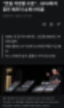
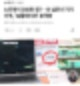
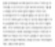

# 이 가격에 살 물건은 아님
**Date:** 2026. 1. 31. 2:46
**Category:** 다이어리
**Original URL:** https://blog.naver.com/xpfkwh56/224166039700
---

​

1. 실거래가랑 차이가 있긴 한데,

본인이 잘 다룬다면 모르겠지만

​

혹시 저런 시세대에서 거래해야 된다면

​

집에 있던 컴퓨터로 하시고,

병목 경험하면 코랩을 쓰세요

​

딱히 다른 이유는 아니고

공짜라서 코랩이 좋읍니다

​

고물 노트북에도 코랩은 돌아감

​

2. 충분히 익혀놓고, 5090 다음으로

엔비디아에서 신제품 나올 때 노리세요

​

제 경험상, 이런 관점에서 핵심은 둘 입니다

​

하나, 절대 엣지에서 멀어지지마라

최신 기술 다 배울 순 없더라도

팔로업은 소홀히 하지 말아야 됨

​

정작 그게 안 되는 상황에도

내가 그걸 안 하고 있다쯤은

스스로 자각하는 것이 좋을 듯

​

둘, 최대한 심화/깊게 들어가서

파는 것이 돈이 된다든가, 취직에 좋다

​

이런 얘긴 그짓말로도 할 수 없지만

어느 하나를 아주 상세히 파고 갔을 때

뭔가 시야가 열리는 느낌이 들 수 있음

​

3. 놓쳤다고 아쉬울 것도 없는 것이

싸게 산 것보다 안산 것이 이득입니다

​

잘 모르는데 결과만 보고,

껄 껄 하면 임자를 만나게 되는데

대부분 그 날에 목숨을 잃습니다

​

다 시기가 있고, 주인이 있는 것임

잡았으면요? 최대한 잘 써먹으세요