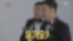

# 빅테크 수쥰
**Date:** 2026. 2. 1. 16:50
**Category:** 다이어리
**Original URL:** https://blog.naver.com/xpfkwh56/224167631453
---

1. 현재 대부분의 사람들이

그러니까 더 정확하게 말하자면,

​

딱히 유료 대여 시장 안 쓰고,

​

3-4x 시리즈 모델 쓰는 분들은

4-5년 전 모델을 쓰는 겁니다

​

**\* 본인이 많이 안 알아봤다면**

**​**

인공지능 장르에서 4-5년 은

일반 시계열에서 어느 쯤일까요?

​

낮게 잡아도 \*10-100 정도,

과장하면 \*1000 하면 됩니다

​

1년 늦다, 10년 늦다 내지

1년 늦다, 1천년 늦다 인 셈이죠

​

5천년 전 인류랑 현대 인류가

같은 공간에서 살아가는 겁니다

​

**\* 이게 마냥 과장은 아님**

​

흥미로운 점은, 옛날 전통 스타일로도

현대 수준의 퀄리티를 뽑아내거나,

​

또는 경제적 이슈 때문에 경우에 따라

**'더 좋은'** 경우들도 꽤 많단 점 입니다

​

세계 최고의 무기는 핵무기,

또는 생물/화학 병기지만

​

일상에서는 길거리에 나뒤는

​

돌이나, 원초적인 주먹 무기가

그거보다 더 쓸모 있는 것처럼요

​

2. 5년 전, 모델을 1세대로 잡으면

상용 하이엔드 모델이 **3세대** 정돕니다

​

**\* 약 2년 전 모델**

​

EVA 라는 따거가 만든 모델이 있는데,

​

편의상 VRAM 으로 해자를 잡으면

24gb 이상을 자유롭게 쓸 수 있을 때,

​

**'아 이게 뭐다'** 쯤으로 쓸 수 있습니다

​

그리고 빅테크에서 공개된 비전 모델은

​

**\* Gemini: A Family of Highly**

**Capable Multimodal Models**

**​**

사실 명확한 이름?도 없이 그냥 통칭해

**'Native MM'** 이라고 부르는 것인데

​

**비공개 모델** 로 얘네가 뭘 하는 것인지는

관계자가 아닌 이상은 **알 수도 없습니다**

​

공개 모델도, 이런 식이에요

​

주식해서 돈 어떻게 버셨어요?

싸게 사서 비싸게 팔았습니다

​

무슨 주식 사셨어요?

가치주 샀습니다

​

제대로 알 수 있는 것이

하나도 없다는 말이죠

​

**\* 틀린 말은 아님**

​

엣지로 갈수록 이게 **심해집니다**

​

3. 그럼 최소한 지금 단서라도 나온

네이티브 엠 뭐시기는 뭐가 그렇게

잘났길래, 다들 파고 싶어 안달일까요?

​

역사 공부를 할 시간입니다

​

인간이 지닌 지성 중 하나는,

​

다양한 형태의 지식을 복합적이고

입체적인 형태로 통제한단 겁니다

​

과학자와 기술자들은 이 현상을 통해,

​

멀티모달 이라는 개념을 이끌어냈고

세대 구분을 나누자면 **이런 식** 입니다

​

**\* 편의적이지, 정확한 건 아닙니다**

**​**

1) 0세대 - 분류기

​

**\* ResNet, EfficientNet**

​

인공지능에게 사진 한 장을 던져줍니다.

그럼 AI 는 미리 학습한 정답지 중에서

하나를 고릅니다. 그리고 이렇게 말합니다

​

이 사진은 95.12% 확률로

강아지 인 것으로 추측 됩니다

​

컨텍스트가 **전무** 합니다

​

강아지가 뛰고 있어도, 걷고 있어도,

밥을 먹고 있어도 그냥 강아지 입니다

​

**왜 why?**

​

정답이**'하나'** **​**니까요

​

2) 1세대 - 대조 학습

​

**\* OpenAI CLIP**

​

인터넷에 널린 사진 수억 쌍과

텍스트 수십억 개를 긁어옵니다

​

그리고 그 모든 것을 통째로 박습니다

​

일전에 말했던

단부루, 히토미

그게 이겁니다

​

**\* 믿기 어렵겠지만,**

**역사적 사실입니다**

​

비전 모델은 메이드복, 을 보면

자연스럽게 히토미에 나오는

만화와 연결지어 학습을 합니다

​

그래서 코스프레를 한 여성이나,

비일상적인 의상, 행위를 하는 경우

​

대부분은 **'그림'** 으로 인식합니다

​

**체육복은 어떨까요?**

​

한국에서 흔히 보던

그런 체육복이 아니고,

​

**부르마** 가 나옵니다

​

오타쿠가 지만 아는 단어를 듣고,

일상어랑 혼동해 킥킥대는 것처럼

​

2세대 대조 학습 모델들은 실제로

거의 대부분 그런 한계가 있습니다

​

그래서 **'모든'** 여자를 1girl 로 칩니다

​

왜냐하면 히토미 **'solo'** 처럼

​

여자 1명 나오는 학습 데이터는

다 1girl 로 정규화 했기 때문이죠

​

무서운 일부 남자들이, 여자의 존재를

오직 미디어로만 인식한 것처럼

​

경우에 따라, 아니 대부분의 2세대

모델들은 이런 편향들이 존재합니다

​

스튜디오 사진이면,

패션 모델 사진이고

​

nsfw style 요소가 있다면

상당히 높은 확률로

서양 도색잡지 입니다

​

바로 이런 이유 때문에,

​

**'아무리 죽어라, 인체 비례'** 를

맞추려고 해도 의미가 없습니다

​

이 모델은 실제로 해부학을

배운 것이 아니기 때문이지요

​

이 모델은 생성은 할 수 없습니다

​

여전히 매칭만 할 줄 알지,

자신의 입으로 묘사할 수 없음

​

3세대 - 어댑터

​

**\* LlaVA-v0, MiniGPT-4**

​

2세대 까지는 일부 힙스터들의

장난감 레벨에 지나지 않았습니다

​

23-24년 무렵 언저리 즈음에,

어뎁터가 나오면서 레이어 라는

​

개념이 생기고, 입만 달린 놈에게

**'눈'** 이 달리면서 변화가 빨라집니다

​

​

원래는 이런 식으로 사진을 읽었습니다

​

가족오락관 고요 속의 외침 처럼요

​

근데 3세대부터는, 이미지 정보를

숫자로 바뀐 뒤, LLM 이 이해할 수 있는

언어 토큰으로 번역해서 밀어넣습니다

​

**\* 이미지 벡터 → 선형 레이어**

**→ 텍스트 임베딩 → LLM**

**​**

제 고향 말에는 **'대간하다'**

라는 표현이 있는데

​

익히 유명한 표현으로 알려진

졸립다, 잠 온다 같은 것들이

​

**'임베딩'** 입니다

​

**\* 매우 중요**

​

임베딩에 따라 같은 현상을

다르게 **'표현'** 할 수도 있고,

​

​

번역기가 다르면 말이 안 통합니다

​

이 과정에서 생긴 치명적인 문제는

LLM, 그러니까 뇌 성능에 비해서

​

​

**'눈'** 이 너무 나빴다는 겁니다

​

대충 스타벅스 같은데? 와,

스타벅스야, 는 차이가 있죠

​

이게 **멀티모달 할루지네이션** 입니다

​

시력이 더 나쁜 사람은

초록색만 보고 이럴 겁니다

​

간판? 잘 모르겠다

​

**'초록색? 이건 확실해'**

그러니까, 저건 숲이야!

​

그리고 **'답을 정한 후'**

미친 소리를 떠드는거죠

​

이 사진은 삭막한 도시 안에 사로잡힌

평온한 자연 공간을 묘사하고 있습니다

​

마치, 예술 평론가들 처럼요

​

**4세대 - 비전 인코더의 발전**

​

**\* EVA-CLIP, SigLIP, InternVL**

​

여기서, **따거**들이 등장합니다

​

메이저에서 근본 원리를 탐구하고,

새로운 방향성을 도출하려고 할 때

​

따거들은 아주 손쉬운 답을 찾습니다

​

눈이 나쁘면 안경을 쓰면 되잖아?

안경이 없으면 라식을 하면 되잖아?

​

**\* 안경값 = 100억**

**라식 수술 = 당시 기준으론**

**검증된 수술이 아니라**

**실패하면 실명할 수 있음**

​

100억 짜리 안경을

깎기 시작합니다

​

겁도 없이 검증도 안 된 수술을

비의료인에게 마구 맡겨댑니다

​

**\* 대륙의 패기**

**​**

대륙 특유의 기상이 합쳐져,

​

스펙빨로 이걸 조진 다음에

최적화를 시켜서 실용적으로

아무나 쓸 수 있게 만듭니다

​

여기서 나온 아이디어가,

이미지를 조각조각 잘라서

​

**세분화 된 것을 먼저 읽은 뒤**

**나중에 이어 붙여서 판단한다**

​

입니다

​

간판을 100억 조각 냅니다

그리고 다시 이어 붙인다면,

​

**숲 타일 1/100억** 과

**간판 타일 1/100억** 은

​

분명 차이가 있을 겁니다

​

​

이렇게 하면 될 것 같은데?

라고 하고 **그냥** 한 겁니다

​

**\* 진짜 그냥 했음**

**​**

실제 따거들이 **'100억'**

까지 한 것은 아니지만,

​

아주 빨리 5억, 10억,

50억 정도까진 **했습니다**

​

**\* 그냥 인간을 갈았음**

​

이미지 해상도를 4배로 키우면

처리할 토큰량은 16배로 뜁니다

​

이 엄청난 양의 시각 정보를

LLM 메모리에 쑤셔 넣으니까

​

VRAM 이 터지고,

​

글카가 없으면 이런 시도를

할 수도 없게 되는 건데요

​

온갖 트릭과 잡기술이 나와서,

​

덕분에 26년 초 시점에도

막대한 자본이 없이도,

​

**'맛'** 을 볼 수 있어졌습니다

​

​

하지만 문제는 여전히 존재합니다

​

여전히 **'번역'** 구조 입니다

​

이미지 → 인코더 → LLM

순서로 가는 동안, 공간감이나

​

위치정보, 미세한 뉘앙스는

전부 압축되면서 사라집니다

​

남에게 **'에르메스'** 를

설명한다면 어떨까요?

​

어느 시점에 **'언어화'** 할 수 없는

그 미묘한 맥락이 존재할 겁니다

**​**

**5세대 - 맥락에 대한 이해**

​

현 시점에서 현실적인 범주 내로,

개인이 닿을 수 있는 **맥시멈** 입니다

​

다중 이미지와 AnyRes 같은

기술을 통해서, 인풋 + 아웃풋

​

단지 1개의 채널이 아니라,

​

다중 채널로 맥락을 섞어서

이해하는 것이 가능해졌습니다

​

일전에 말했던, **여자** 와 **엄마,**

**아줌마** 와 **엄마** 를 구분할 수 있는

진보가 본격적으로 시작된 겁니다

​

현존 기술로 사진 같은 경우는,

​

거의 **'일상'** 에 지장 없을 정도로

맥락을 대부분 잘 이해할 수 있음요

​

**이 사진이 뭐야?** 정도 쯤은,

그냥 써도 충분하고 만약 여기에

본인이 파면 **훨씬** 대단해집니다

​

다만, Temporal Data 를

다루기엔 모델 구조 자체가

원천적으로 무겁고 느립니다

​

단부루/히토미의 흔적 처럼

따거들의 빠른 진보가 이 무렵에

대뜸 발목을 잡게 된 셈입니다

​

근본 원리를 탐구해서 접근했다면,

애초 이런 병목이 없었을 수도 있죠

​

**여기까지 왔을까**, 는 다른 문제겠지만

​

> 6세대 - 빅테크의 장벽

​

서론이 길었습니다

​

오픈 AI 라던가, 구글의 경우는

Native MultiModal

​

즉, **네이티브 MM** 이라는

기괴한 발상을 선보입니다

​

모델을 처음 훈련 시킬 때부터,

텍스트/소리 파형/픽셀을

전부 한 번에 묶어서 돌리고,

​

모든 정보가 내부에서

동일한 벡터 차원에 섞입니다

​

**그뭔씹 ,,**

​

**'오감'** 을 갖는다는 겁니다

​

기존 모델들이 눈을 감고, 소리를 듣고

소리만 듣고 입을 막는 그런 형태라면

​

얘는 **'감각적인 인식'** 을 해냅니다

​

기침 소리가 나는데, 아프다고 하고,

눈이 충혈된 상태고, 몸을 떨고 있다

​

환자다, 라는 식의 이해를 **'할 수 있음'**

​

**\* 물리엔진 (x) 시뮬레이터 (o)**

**​**

그래서 영상을 틀어주고 보여주면,

**'인간처럼 감상할 수도 있습니다'**

​

FBI 수사 요원처럼, 보이는 것들로부터

부조화를 읽어내는 것도 가능합니다

​

중간에 복잡한 번역 연산이 없기 때문에

반응 속도 역시 **'스포츠카'** 처럼 빠릅니다

​

지하철역에 우리가 앉아서,

​

지나가는 수십, 수백 사람을 볼 때

우리는 그게 **'어렵지'** 않습니다

​

방금 지나간 사람이 남자야? 여자야?

부자 같아? 가난한 사람 같아?

​

같은 것들을, 중간 병목 없이

**실시간으로 처리** 하니까요

​

문제는 이게 **직관** 이라는 겁니다

​

**\* System 1**

​

반사신경은 천재적인데,

복잡한 논리나 물리적인 인과성

이런 것들은 전혀 모릅니다

​

주식이 올라! 하면 바로

광속으로 버튼을 눌러요

​

근데 왜 눌렀어? 하면

​

**'어? 그러게? 뭐야?**

**이거 왜 눌렀지?'**

​

이러고 있습니다

​

로컬이든, 상용이든, 개인이든,

엔지니어든, 대체로 이 지점에서

​

각자 **'장인정신'** 을 발휘하는 것이

지금 인공지능 장르의 현실입니다

​

저는 이걸 **'깎는다'** 고 표현합니다

​

모두 아이큐 160 으로 시작하는데,

​

그 아이큐를 어디에 쓰는에 따라

그 성능은 당연히 천차만별일 겁니다

​

맨날 놀고만 있으면 놀고 끝이고,

뭔가 하고 있으면 뭐든 나오겠죠

​

**7세대 : ???**

​

빅테크에서 현재 기준으로

**'아주 조금씩 푸는 기술'** 입니다

​

25년 무렵부터 등장하기 시작했고,

​

26년에는 **'기초적인 수준'** 도

상용화 된 상태로 쓰이고 있어요

​

질문을 받으면 바로 대답하지 않습니다

​

고찰하고, 통찰하고, 고민하고, 사유하고

성찰한 다음, 그 이후에 답을 내립니다

​

**아주 조심스럽게요**

​

모든 가능성의 범주를 열어놓은 안에서,

​

최적의 정답을 논리적으로 추론하고,

목적에 맞게 다양한 접근을 모색합니다

​

**일차 방정식을 알려주면,**

​

도로에서 왜 좌우를 둘러보면서

길을 건너야 하는 것인지 알아내고

​

**이차 방정식을 알려주면,**

​

테이블에서 떨어진 물컵의

유체와 중력의 관계를 계산합니다

​

과장이 아니고, **'편의상'** 비유입니다

지금 아무나 쓰는 MM 도 이쯤은 됩니다

​

**'묻기 전까지 스스로 말할 수 없을 뿐이죠'**

**​**

너의 교육 수준은 어느 정도야?

라고 물어본다면 이렇게 답할 겁니다

​

**'나는 아직 교수나, 그 분야에 평생을**

**바친 저명한 학술가 정도는 아니야**

**​**

**그리고 박사처럼 아직 존재하지 않는**

**새로운 무언가를 만들어낼 수는 없어'**

​

우리가 쓰는 5-6세대 모델은

차트가 하락세에 있습니다,

​

정도를 말할 수 있는 것이 한계지만

6-7세대 모델은 활용하기에 따라서,

​

**'파야 될, 사야 될'** 때를 제안합니다

​

System 2를 갖추게 하는 것이

제가 아는 한 MM 기술의 엣지고,

​

**'항간에서는'**

​

상당한 진척이 있다는 것이

26년 1월 기준의 정보입니다

​

2년 전에, 우산을 안 가져가서

큰 낭패를 본 적이 있었다면

이렇게 말할 수도 있는 것이죠

​

우산 챙겨