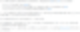
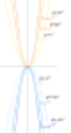
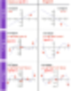

# 수학 공부 하다가 맛이 가는 이유
**Date:** 2026. 2. 1. 18:34
**Category:** 다이어리
**Original URL:** https://blog.naver.com/xpfkwh56/224167727839
---

​

1. 갑자기 집에 가고 싶음

​

이렇게 접근하면 어려워요

배울 것이 많을수록 **더더욱!**

​

제가 말하는 책만 읽다가

세월 다 보내는 주화입마가

이런 경우에 **자주** 나옵니다

​

**\*** **야생 공부는 야생 답게,**

**제도권 공부는 제도권 답게**

**​**

2. 사람마다 방법은 있지만,

제가 사용하는 방식 입니다

​

혹시 **물고기** 좋아하시나요?

​

자연산과 양식이 있는데,

양식과 자연산을 구분하는

​

간단한 방법이 하나 있습니다

**2.5kg 가 넘냐, 마냐** 입니다

​

3. 이 생선이라는 것이,

2.5kg 까지는 빨리 자라는데

​

2.5kg 부터는 먹는 사료값 대비

​

살이 붙는 속도가 늦어서

효율이 나쁘다고 합니다

​

물고기가 100원 들여서,

키우면 1,000원에 판다고 칠 때,

​

2.5kg 까지 키우는건 100원

3kg 까지 키우면 0.5kg 느는데

​

500원 들고, 막상 값어치 역시도

그 값을 받기 어렵다는 것이지요

**​**

**\* 100원 투자 → 2.5kg** **→** **1천원**

**추가 500원 투자** **→ 3kg → 1200원**

​

그래서 비즈니스 논리에 의해서,

​

업자들은 2.5kg 딱 맞게 키우고

3kg 짜리는 시장에 잘 안 나옵니다

​

그럼 3kg 짜리는 어떤 애들일까요?

​

양식장에서 도망가든가,

야생에서 살아남은 애들입니다

​

맛이 더 좋다든가 그런 건 모르겠지만,

차이가 있다고 느끼는 사람들도 있지만

​

수요/공급에 의해 일종의

사치품처럼 소비되는 셈이죠

​

**4. 그렇다면 이걸 인류는**

**어떻게 알아냈을까요?**

​

1 을 넣으니 2가 나온다

2 를 넣으니 3이 나온다

​

4를 넣으니 10이 나온다

​

즉, 제한된 단서로 더 많은

정보를 확인하기 위한 목적으로

아마 시작되지 않았을까 합니다

​

가장 쉬운 것은 **'해보는 겁니다'**

​

근데 해보면 그만이라고,

​

모든 것들을 대가리 박으면

머리통이 남아나지 않습니다

​

우주에 가보기 전까지 알 수 있나요?

모릅니다, 가봐야 아는 겁니다

​

그렇다고 **'그냥'** 가는 것은 다르죠

​

여러 어려운 표현들이 있지만,

그냥 약속에 불과합니다

​

일을 할 때, 자꾸 사람들끼리

서로 자의적인 언어를 쓰니까

​

그냥 통일된 걸로 하나 정합시다

하고 정한 것이므로, 만약 입에

​

잘 안 붙는다면 학자 할 것도 아니고

본인 나름대로 **'일단'** 시작해도 됩니다

​

젓가락질이 중요한 것은 아니니까요

​

5. 아무튼 뭔가 입력하고, 출력하고

그 관계를 알면 쓸모가 있겠는데?

​

까지 시작했으면 **절반은 온 겁니다**

​

을은 갑을 좋아하는 사람입니다

그래서 매일 호의를 베풀고 있습니다

​

**호의 1 입력 → 포지티브 +1 점**

​

잘하는 족족, 결과가 좋습니다

​

일반적으로 이런 상황에

을은 남자,

갑은 여자 입니다

​

피드백이 째깍째깍 나오고,

뭐만 했다하면 감사를 표하니

​

하는 남자도 신이 나고,

받는 여자도 행복합니다

​

1 → 1, 2 → 2, ...

30 → 28

​

**? 여기서부터 이상합니다**

​

포지티브 = 호의 \* 횟수

​

**이게 안 통하기**

**시작한 겁니다**

**​**

인간의 만족은 한계 효용이라고 하는,

일반칙이 잘 적용되는데 쉽게 말하면

​

처음에는 급격히 올라갔다가

점점 둔화하는 모양새를 말합니다

​

남자가 이상함을 느낀 것처럼,

여자도 이상함을 경험합니다

​

처음에는 이 놈이 나만 쳐다보고

카톡 5초 느리면 어디 뭐 병 걸린

사람처럼 집착하고 그랬었는데,

​

지금은 이상하게도 죽었나,

살았나 관심도 없습니다

​

두 사람은 그림을 그립니다

​

​

위로 볼록 → 최대값

아래로 볼록 → 최솟값

​

오늘도 많은 중딩들을 좌절케 하는

이차함수의 활용 문제가 이겁니다

​

1) 나중에, 남자 만나서 식기 전에

눈치껏 계산기 잘 쳐서 잘 챙겨라

​

2) 여자 만났을 때는, 싸하면 떠나라

​

그걸 알려주는 것이죠

​

남자가 주면 잘 받고, 누릴 때 누리고

시들해지면 다른 남자 찾는 것도 **함수**

​

여자가 처음에는 고마워하고 괜찮다가

갑자기 살찌고, 이상해지는 시점에 슬슬

환승 찾고, 갈아타는 것도 **함수** 입니다

​

근데 이게 **'딱'** 그렇던가요?

​

​

남녀 사이라는 것이 좋을 때도 있고,

어쩔 땐 좀 소원할 때도 있다가도

다시 사이가 좋아지고 그럴 겁니다

​

그럴 때마다, **'기울기'** 가 변합니다

​

1차식의 세계에 있는 사람은,

어장과 먹버를 피할 수 없습니다

​

2차식의 세계에 있는 사람은,

장기적인 관계를 모색할 수 없음

​

그러나, n차식의 세계에서 본다면

더 넓은 흐름에서 볼 수 있습니다

​

**잠깐, 딴 얘기지만 여기에서 만약**

**극한의 효율을 찾는다면 어떨까요?**

​

다른 애들은 저 남자한테, 저 여자한테

뽑아먹을 것이 조금 남아도 넘어가더라

​

근데 나는, 진짜 끝까지 다 빨아먹겠다

​

​

그게 **미분** 입니다

​

6. 한편, 변수가 달랑

1개인 경우도 거의 없습니다

​

호의 뿐만 아니라

존중도 있고, 성숙도도 있고,

타이밍도 있고 여러

복잡한 이야기가 많지요

​

이걸 **'알고'** 싶은 인간은

이걸 **'추가'** 합니다

​

y = ax + by + cz + ...

​

물고기 예시도 마찬가집니다

​

사료, 온도, 밀집도

​

이렇게 개별 영향 변수를 책정해서,

최적의 조합을 찾거나 탐구해서,

​

오늘은 대가리 한 번 박았지만,

내일은 덜 아프게 박자 하는 것이죸ㅋ

​

영어도 그렇고, 다 비슷합니다

​

배우라고 만든 것들은

학자가 되기에 어렵지,

​

써먹겠다고 하면 이유가 있음

​

세상에 많고 많은 널린 것들 중에서

서로 한 치 양보도 없이 다투고 싸워서

이건 남기자 해서 남긴 것들 입니다

​

누구를 위해서?

인류가 오늘의 나를 위해서